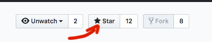

# dgs19 - Docker Getting Started 

---

## Course Description:
This course will explore Docker from the very basics of installation and function to real world use cases. 
We will talk about Docker architecture in order to provide a better understanding of how to manage Linux Containers using the Docker CLI. 

---

## Course Content:
- About the course
- Introduction to Docker
- Installation of Docker and other tools
- Command line structure - Basic Information
- Containers lifecycle (run, stop, rm)
- Docker Networking Basics
- Container Images - Docker Hub Registry
- Build Images - The Dockerfile Basics
- Persistent Data and Volumes
- Docker Compose: The Multi-Container Tool
- Introduction to Container Orchestration (Kubernetes and Docker Swarm)
- Other Resources

---

## Core Objectives:
- Introduce and Understand Linux Containers
- The basis of how Docker works
- How to install the Docker Community Edition
- How to manage image, containers, networks and volumes
- Build images using a Dockerfile
- Tag images and push them to Docker Hub
- Use Docker Compose to deploy Microservices
- Explore the Most Common Use Cases for Docker
- What is container orchestration

---
## Prerequisites:
- No paid software required
- PC (Mac/Windows/Linux) with local admin access to install Docker
- Linux basics such as shell terminal, ssh and package managers
- Understand the basics of web and database servers (how they typically communicate, IP's, ports etc.)
- Have a GitHub and Docker Hub account

---
 
 - If you found this repository to be helpful, you can say "like" by clicking the "Star" button. Thanks :)

--- 
