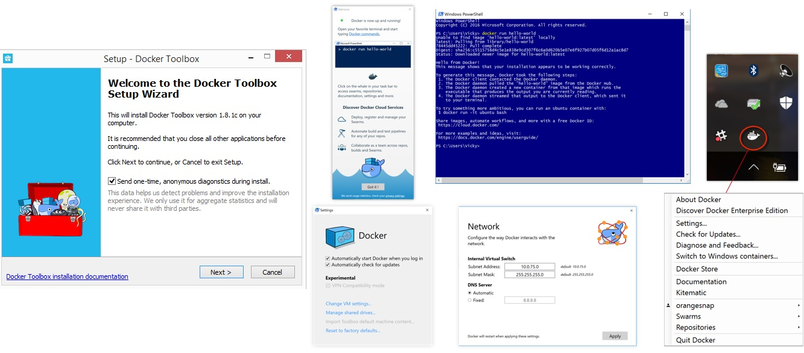
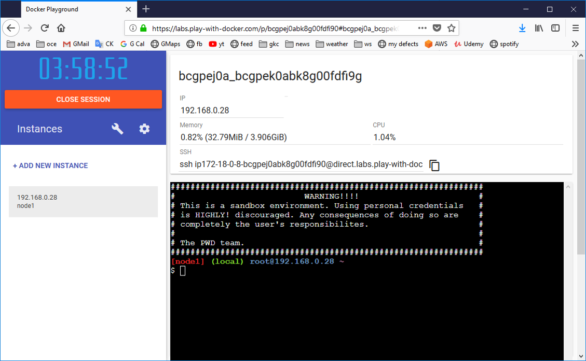

class: center, middle
# Section 3 - Installation of Docker
---

## Docker Installation (1)
 - Install Docker on Linux
    - `# curl -sSL https://get.docker.com/ | sh`
    
 - Install Docker on Windows (**Docker for Windows** – **Docker toolbox**)


---

## Docker Installation (2)
 - Free online Docker lab [Play with Docker](http://play-with-docker.com)
  


---

## Install Docker Toolbox on Windows

 - [Install Docker Toolbox on Windows](https://docs.docker.com/toolbox/toolbox_install_windows/)
 - [DockerToolbox.exe](https://github.com/docker/toolbox/releases)
 
---

## Install Docker on CentOS Linux
 - [Intall Docker on CentOS Linux](https://docs.docker.com/install/linux/docker-ce/centos/)
 - [Post-installation steps for Linux](https://docs.docker.com/install/linux/linux-postinstall/)

---

## Install Docker on CentOS Linux
 - The compete list of commands to install `Docker` and `docker-compose`

```console
# curl -sSL https://get.docker.com/ | sh
# systemctl enable docker
# systemctl start docker
# curl -L "https://github.com/docker/compose/releases/download/1.24.0/docker-compose-$(uname -s)-$(uname -m)" -o /usr/local/bin/docker-compose
# chmod +x /usr/local/bin/docker-compose
 
```
---

## Install Docker on CentOS Linux (2)
 - Optional setup bash auto completion  
 ```console
 # yum install -y bash-completion
 # curl -L https://raw.githubusercontent.com/docker/compose/1.24.0/contrib/completion/bash/docker-compose -o /etc/bash_completion.d/docker-compose
 ```

---

## CentOS 7 VM Setup
 - You can find the [CentOS-7-VM-Setup.pdf](https://github.com/gerassimos/dgs19/blob/master/resources/linux-vm-setup/CentOS-7-VM-Setup.pdf) guide in the resources directory (`resources/linux-vm-setup/CentOS-7-VM-Setup.pdf`)

---

## Other Tools
 - Visual Studio Code
 - MobaXterm
 - Putty
 - WinSCP
 - GitHub account
 - Docker Hub account 

