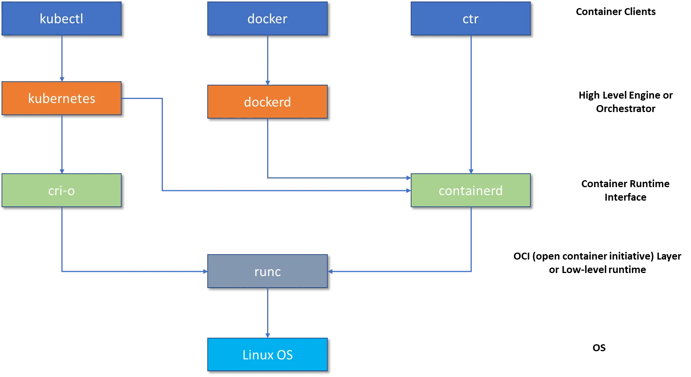
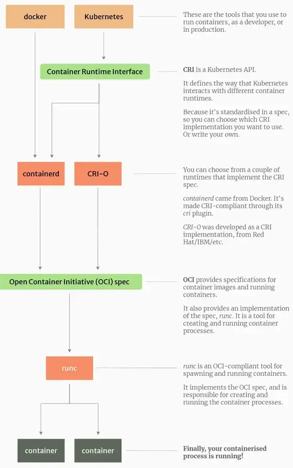

class: center, middle
# Section 4 - Command line structure - System Verification 
# 1 - First Docker commands 
---

## Verify the Docker Install (1)
 - Use the `docker version` command to display all version information
 - This is the first command to execute on a new system to verify the Docker installation

---
## Verify the Docker Install (2a)
```console
$ docker version
Client: Docker Engine - Community
 Version:           27.3.1
 API version:       1.47
 Go version:        go1.22.7
 Git commit:        ce12230
 Built:             Fri Sep 20 11:41:42 2024
 OS/Arch:           linux/arm64
 Context:           default
Server: Docker Engine - Community
 Engine:
  Version:          27.3.1
  API version:      1.47 (minimum version 1.24)
  Go version:       go1.22.7
  Git commit:       41ca978
  Built:            Fri Sep 20 11:40:28 2024
  OS/Arch:          linux/arm64
  Experimental:     false  
... <output truncated> ...

```

---

## Verify the Docker Install (2b)
```console
$ docker version
... <output truncated> ...
Server: Docker Engine - Community
 Engine:
  Version:          27.3.1
  API version:      1.47 (minimum version 1.24)
  Go version:       go1.22.7
  Git commit:       41ca978
  Built:            Fri Sep 20 11:40:28 2024
  OS/Arch:          linux/arm64
  Experimental:     false
 containerd:
  Version:          1.7.22
  GitCommit:        7f7fdf5fed64eb6a7caf99b3e12efcf9d60e311c
 runc:
  Version:          1.1.14
  GitCommit:        v1.1.14-0-g2c9f560
 docker-init:
  Version:          0.19.0
  GitCommit:        de40ad0
```

---

## Verify the Docker Install (3)
> Notes:
>  - From the output of the `docker version` command we can see the client and the server version.
>  - Remember that Docker is a client server application. 
>  - Ideally client and server versions should be the same but they don't have to be.
>  - We refer to Docker server also as **Docker engine** or **Docker daemon**. 
>  - The fact that I did get returned information from the server validates that I can talk to the server and that it's working properly.

---
## Docker vs Containerd vs RunC (1)

---
## Docker vs Containerd vs RunC (2)
 - Runc is a container runtime that provides a low-level interface for creating and running containers according to the Open Container Initiative (OCI) specification.
 - Containerd, on the other hand, is a higher-level container runtime that provides a complete environment for managing containers, including image management, container execution, and container lifecycle management.
 - Kubernetes old versions used Docker as a container runtime, but it has since moved to using containerd as the default container runtime.
 - [ref](https://medium.com/@bibhup_mishra/docker-vs-containerd-vs-runc-c39ffd4156fb) 
---
## Docker vs Containerd vs RunC (3)

---
## Docker vs Containerd vs RunC (4)
 - **Open Container Initiative (OCI)**: a set of standards for containers, describing the image format, runtime, and distribution
 - **Container Runtime Interface (CRI)** in Kubernetes: An API that allows you to use different container runtimes in Kubernetes.
 - [ref](https://vineetcic.medium.com/the-differences-between-docker-containerd-cri-o-and-runc-a93ae4c9fdac)
---
## docker info
 - Use the `docker info` command to display system-wide information


---


## docker info (2)
```console
# docker info
Containers: 5
 Running: 0
 Paused: 0
 Stopped: 5
Images: 24
Server Version: 18.05.0-ce
...
Swarm: inactive
... output truncated 
```

> Notes:  
> From the command output we can see:
>   - Number of containers (Running, Paused and Stopped)
>   - Number of images stored 
>   - The Swarm state (active inactive)

---

## Complete list of Docker commands (1)
 - To get the complete list of Docker commands type `docker` and hit `enter` 
 - The Docker COMMAND has 3 main sections:  
    1. Options
    2. Management Commands
    3. Commands

---
## Complete list of Docker commands  (2)
```console
$ docker

Usage:  docker COMMAND

Options:
  ...

Management Commands:
  container   Manage containers
  image       Manage images
  network     Manage networks
  ...

Commands:
  attach      Attach local standard input, output, and error streams to a running container
  build       Build an image from a Dockerfile
  
...
```

---


## Docker command format 

 - New format:
### `docker <mng-command> <command> [options]`

 - Old format (still working):
### `docker <command> [options]`
---

## Examples
### new command format
```console
# docker container run
# docker container ps
```
### old command format
```console
# docker run
# docker ps
```
> Notes:
> Docker is really focused on backwards compatibility. So the docker run will probably work forever; but new commands we get will use this docker command value. 

---

## Commands Summary
```console
# docker version
# docker info
# docker <Enter> => CLI documentation 
# docker <mng-command> <command>
# docker container run
# docker run
```
---

## Exercise
 - Ref:
 - D_S4_L1_First_Docker_commands_ex.md