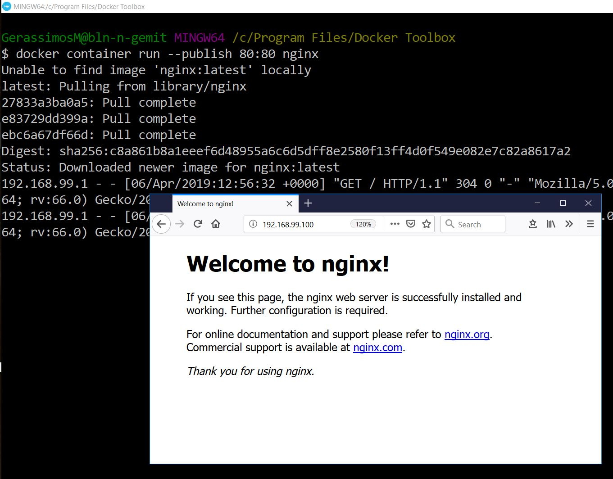
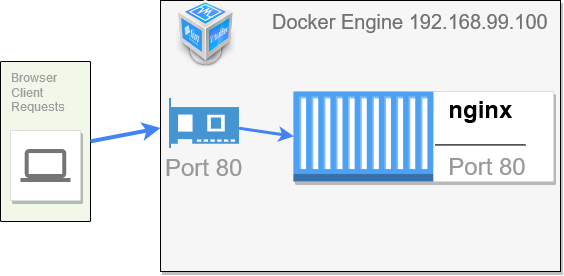
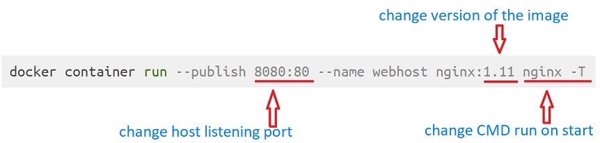

background-image: url(images/title-background-containers.jpg)
background-size: 100% 100%

<h3 style="margin-top: 500px;">
<span style="color:white">Section 5 - Containers lifecycle</span>
</h3>
  
---

class: center, middle
# Section 5 - Containers lifecycle
## 1 - Starting our first container 
---


## Difference between an image and a container. 
 - An  image consists of the **binaries**, **libraries** and **source code** and all together make up your application. 
 - The **container** is a running instance of that image.  
 - We can have many containers, all based on the same image. 
---
## Registries
 - We get all images from registries "repositories". 
 - Registries are kind of what GitHub is to source code. 
 - The default registry is `Docker Hub` but we could also setup a private registry   
 - https://hub.docker.com/
---

## Nginx 
 - In the following examples, we are going to use the Open Source **Nginx** web server. So we'll start our containers based on then Nginx image. 
---
## docker container run - nginx (1)
 - In the following example we will run `docker container run` command to start a new nginx container
 - New format:
```console 
# docker container run --publish 80:80 nginx
```
 - Old format:
```console 
# docker run --publish 80:80 nginx
```
---
## docker container run - nginx (2)


> Notes  
> Now from a browser we can access the nginx web server at the following URL http://docker-host:port. 
> In this example is: http://192.168.99.100/
---
## docker container run - nginx (3)
 - The Docker engine has performed the following actions:
   1. It downloaded image 'nginx' from Docker Hub
   2. It started a new container from that image
   3. It opened the port 80 on the host IP
   4. It routes that traffic to the container IP port 80


---

## docker container run - nginx (4)
>  - The process is running in the foreground.  
>  - The command is running in the foreground inside of our shell. 
>  - We do not have any more access to the command prompt.  
>  - Only the log messages of the running container are displayed.   
>  - Press **`<Ctrl-C>`** to stop the foreground process (container). This will send a stop signal to the process 1 running inside the container.
>  - Now we can access again the command prompt (but the nginx container is not running any more).
>  - Turning out that **`<Ctrl-C>`** does not work the same way on windows. It exits the foreground but leaves the container running in the background.
---
## docker container run - nginx (5)
 - Use the `-d` option to create a running container in "detach mode".
 - "detach mode" => Run container in background and print container ID.
```console 
# docker container run --publish 80:80 -d nginx
5cfee4add36fac28e1a553fb025760b806314f8975ca172abe1c4fa7864d0660
```
---
## docker container ls
 - Use the `docker container ls` command to list all running containers.  
 - New format 
```bash
# docker container ls
CONTAINER ID   IMAGE   COMMAND                  CREATED         STATUS         PORTS                NAMES
5cfee4add36f   nginx   "nginx -g 'daemon of…"   7 seconds ago   Up 6 seconds   0.0.0.0:80->80/tcp   keen_williams
```
 - Old format
```bash
# docker ps
```

> Note:    
> We can see the container ID listed is matching the container ID from the previous "docker container run" command.
---
## docker container stop
 - Use the `docker container stop` command to stop one or more running containers.
 
```console 
# docker container stop 5cf
5cf
```

> Note 1  
>  - The "docker container stop <container-ID>" command will stop the container but it will not remove it.
>  - For the container ID, we only have to type the first few digits, enough for it to be unique.
> 
> Note 2  
> - Use `docker container start <container-ID>` to start an existing stopped container. 
---
## List stopped container (1)
 - No container is listed from the `docker container ls` command.  
```bash
# docker container ls
CONTAINER ID   IMAGE   COMMAND   CREATED   STATUS   PORTS   NAMES
```

> Note:   
> We notice that nothing shows up.   
> The ls command only shows by default **running** containers  
---
## List stopped container (2)
 - Use the `--all` option to list all the created containers (running and stopped).
```bash
# docker container ls --all
CONTAINER ID   IMAGE   COMMAND    CREATED          STATUS                     PORTS   NAMES
5cfee4add36f   nginx   "nginx…"   16 minutes ago   Exited (0) 6 minutes ago           keen_williams
96563a69f990   nginx   "nginx…"   27 minutes ago   Created                            awesome_meitner
```
  
 - Why are there two container listed?  
 - The "docker container run" command always starts a *new* container.
---
## Container names  
 - From the output of the `docker container ls` command we can see that **random names** are assigned to the created containers.
 - If we do not specify a container name, then the Docker engine will assign a random name from a DB of names of notable hackers or scientists.
 - The container name is required to be unique as it is the container ID.
---
## Specify the container name (1)
 - Use the `--name` option to specify the name of the container.
```bash
# docker container run --publish 80:80 --detach --name webhost nginx
```
---
## Specify the container name (2)
 - List again all containers.
```console 
# docker container ls -a
CONTAINER ID   IMAGE   COMMAND    CREATED         STATUS                     PORTS                NAMES
3edc68a45029   nginx   "nginx…"   2 minutes ago   Up 2 minutes               0.0.0.0:80->80/tcp   webhost
e5089dbd5d82   nginx   "nginx…"   4 minutes ago   Exited (0) 3 minutes ago                        musing_pike
4bf7ab988ccd   nginx   "nginx…"   4 minutes ago   Exited (0) 4 minutes ago                        eager_lalande
```
 - From the output we can see that there are three containers.
 - The one we just started has the name *webhost*. The other two, that we previously started, stopped after 3 and 4 minutes respectively.
 - Since the `webhost` container is running in the foreground, we **can not** see the logs.
---
## docker container logs 
 - Use `docker container logs` to view the log of a container:
```console 
# docker container logs webhost
192.168.99.1 - - [06/Apr/2019:15:37:46 +0000] "GET / HTTP/1.1" 304 0 "-" "Mozilla/5.0 (Windows NT 10.0; Win64; x64; rv:66.0) Gecko/20100101 Firefox/66.0" "-"
192.168.99.1 - - [06/Apr/2019:15:37:46 +0000] "GET / HTTP/1.1" 304 0 "-" "Mozilla/5.0 (Windows NT 10.0; Win64; x64; rv:66.0) Gecko/20100101 Firefox/66.0" "-"
```
 - Use the "--follow" option to continuously tail the log messages:   
```console 
# docker container logs --follow webhost
192.168.99.1 - - [06/Apr/2019:15:37:46 +0000] "GET / HTTP/1.1" 304 0 "-" "Mozilla/5.0 (Windows NT 10.0; Win64; x64; rv:66.0) Gecko/20100101 Firefox/66.0" "-"
192.168.99.1 - - [06/Apr/2019:15:37:46 +0000] "GET / HTTP/1.1" 304 0 "-" "Mozilla/5.0 (Windows NT 10.0; Win64; x64; rv:66.0) Gecko/20100101 Firefox/66.0" "-"
```

> Note for the demo:     
> To see some logs messages, we should first generate some events by accessing the nginx home page (on http://192.168.99.100/) and press refresh a few times.

---
## docker container rm
 - Use `docker container rm` to remove (Delete) one or more containers:  
 - New format 
```console 
# docker container rm webhost
```
 - Old format 
```console 
# docker rm 
```
---
## docker container rm (2)
 - Delete the containers with a single command.  
 
```console
# docker container ls -a
CONTAINER ID   IMAGE   COMMAND    CREATED          STATUS                      PORTS                NAMES
3edc68a45029   nginx   "nginx…"   34 minutes ago   Up 34 minutes               0.0.0.0:80->80/tcp   webhost
e5089dbd5d82   nginx   "nginx…"   36 minutes ago   Exited (0) 35 minutes ago                        musing_pike
4bf7ab988ccd   nginx   "nginx…"   36 minutes ago   Exited (0) 36 minutes ago                        eager_lalande
 
# docker container rm 3ed e50 4bf
e50
4bf
Error response from daemon: You cannot remove a running container 3edc68a4502908df1db9b3679ca381e75c03d3d2a79ca61bec199c0561e75dff. Stop the container before attempting removal or force remove
```

> - We got an error.  
> - The first two conatainers were safely deleted. 
> - We cannot remove (delete) the third one for safety reasons.  
> - Docker will not allow to remove a container that is still running. 
---
 
## docker container rm (3)
 - Use the `--force` option to "Force" the removal of a running container (uses SIGKILL).
```bash
# docker container rm --force webhost
```
  
> Note:  
> We have to clean up the environment of this example by removing all the created containers.
---

## docker container run - review (1)


---

## docker container run - review (2)
 1. It looks for that image locally in image cache. It doesn't find anything.
 2. Then it looks in remote image repository (by default to Docker Hub).
 3. It downloads the latest version (nginx:latest by default).
 4. It creates new container based on that image and prepares to start.
 5. It gives a virtual IP to the conatainer on a private network inside docker engine.
 6. It opens up the port 80 on host and forwards to port 80 in container.
 7. It starts the container by using the CMD in the image Dockerfile.

---


## Commands Summary
```console
# new format 
docker container run --publish 80:80 nginx
<ctrl-C>
docker container run --publish 80:80 -d nginx
docker container ls
docker container stop 5cf
docker container ls
docker container ls --all 
docker container run --publish 80:80 --detach --name webhost nginx
docker container ps -a
docker container logs webhost
docker container rm 3ed e50 4bf
docker container rm --force webhost
```

---

## Exercise
 - Ref:
 - D_S5_L1_Starting_our_first_container_lab.md
