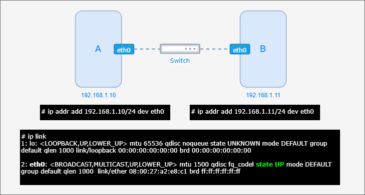

class: center, middle
# Section 6 - Docker Networking Basics
## 1 - Docker Network Concepts

---

## Overview
 - Learn the concepts around Docker virtual networks. 
 - Inspect a container IP address and see diagrams on how traffic goes in and out.

---

## Networking Concepts
 - TCP/IP model
 - IPv4 address
  
---
  
## TCP/IP model - 4 layer network model 
 - Layer 4 Application (https, ssh, smtp)
 - Layer 3 Transport (TCP/port and UDP/port) 
 - Layer 2 Network layer (IP address, ICMP control protocol `ping`)
 - Layer 1 Physical layer (wired Ethernet 802.3, wireless WLAN 802.11, MAC address)
  
---
## Switching

---

## IPv4 address (1)
  - host part
  - network part (subnet)  
  
  
 
  
---
  
## IPv4 address (1)


---

## IPv4 address (3)


---

## Docker Networks Defaults (1) 
### Batteries Included, But Removable
Many settings (such as network settings and others) are configured with specific default values from Docker but it is very easy to change them, for example: 
 - We can change the default bridge virtual network `docker0`.
 - We can change the default network `driver` of a custom virtual network.
 - etc...  
 
> Note1:  
> Do not worry if you do not understand what is a network `driver` yet.  We will cover the available network drivers in next lectures.
>
> Note2:  
> Some times the `docker0` virtual network is called `bridge` network, but **do not confuse** `bridge` is also the driver (network type) used by default for the Docker's virtual network.

---
## Docker Networks Defaults (2) 
### The default `docker0` virtual network 
 - By default, when a container is started, a virtual network interface `eth0` is created inside the container, connected to the **docker0** virtual network.
### NAT firewall
 - **Outbound traffic** (eg. access to the Internet) from the container goes through a NAT firewall.
 - **Inbound traffic** from external systems goes through the **port forwarding rules** that are defined with the `--publish` CLI option. 
  
---
  

## Network topology (1) - bridge network - diagram
<p style="text-align: center;">

</p>
  
---
  
## Network topology (1) - bridge network
 -  From the above diagram we can see that the physical network interface of the Docker host system is connected to the NAT firewall which by default will block all incoming traffic.
 - When a container is started, such as the Container #1 in the above diagram, it is by default connected to the `docker0` network which is connected to the host network interface through the NAT firewall.
 - Container #1 can access the internet (outside world) through the NAT firewall. Outbound traffic goes through a firewall MASQUERADE rule.
 - Any other container, such as Container #2 in the above diagram, connected on the `docker0` virtual network can communicate directly with the other containers connected on this virtual network.
 - There is no need to explicitly expose a port to access the service of a container from an other container on the same virtual network.
 - The `docker0` virtual network behaves like a layer 2 network switch.
  
---

## Network topology (2) - port forwarding - diagram
<p style="text-align: center;">

</p>

---

## Network topology (2) - port forwarding

 - Example: 

```terminal
docker container run --publish 80:80 --name web_server -d nginx
```
 - In this example the nginx container is started using the `--publish 80:80` option.
 - This will open port 80 on the physical network interface of the Docker host and will forward any traffic received on this port to the container virtual interface on port 80
 - Remember that the `--publish 80:80` option corresponds to `--publish HOST_PORT:CONTAINER_PORT`
 - Traffic incoming to the **HOST_PORT** `80` is forwarded into the **CONTAINER_PORT** `80`.


---

## Network topology (3a) - multiple virtual networks
<p style="text-align: center;">

</p>
---

## Network topology (3b) - multiple virtual networks

 - Multiple virtual networks (bridge type) can be created. 
 - Each virtual network will have its own unique name.
 - For example, in the above diagram a new virtual private network `net2` is used for a second application composed from an Apache "httpd" container and a MySQL container.
 - The Apache "httpd" container can access the MySQL container on port 3306 because they are connected on the same virtual network.
 - MySQL container is listening on port 3306 but this port is not exposed to the outside world
 - No other containers from other virtual networks or other clients outside the docker host can access the MySQL container
 

---

## Network topology (3c) - multiple virtual networks
 - In this example the Apache "httpd" container is started using the `--publish 8080:80` option. This will open port 8080 on the "physical" network interface of the Docker host and will forward any traffic request receive on port 8080 to the container virtual interface on port 80.
 - The container #1 from docker0 can communicate with the Apache "httpd" container through port 8080 of the physical network interface.
 - On the physical network it is not possible to use a port for more than one service.
 - In this example port 80 is already occupied from the port forwarding rule defined for the nginx container. So, the Apache "httpd" container cannot use this port and it uses port 8080 instead.
 - It is the best practice to create a dedicated virtual network to connect containers related to a specific application or service. 

---

## Container connected to multiple virtual networks (a)

<p style="text-align: center;">

</p>

---
## Container connected to multiple virtual networks (b)

 - One container can be also connected to two (or more) virtual networks. 
 - In this example 
   - front-end container WEB UI logic => connected to the *front-end network*
   - back-end container business logic => connected to the *front-end network* and the *back-end network*
   - db container => connected to the *back-end network*
 
> Note:    
> This network topology is like in the physical world, where we can have two physical network interfaces on a real computer connected to two different networks.  

---

## The built-in Network drivers 
Docker networking subsystem is pluggable using **drivers**. Remember that batteries are included but removable. Several drivers exist by default and provide core networking functionality:
 - bridge 
 - host
 - none
 - overlay

---

## Network driver - bridge 
 - The default network driver. 
 - If you don’t specify a driver when you create a network then the `bridge` driver is used by default.
---

## Network driver - host (1)
 - Host network `--network=host`
 - It is also possible for a container to be connected directly to the physical network of the host with use of the `--network host` option.
 - In this case, the virtual network is not used at all and there is no isolation between the host machine and the container.     
 - In general, it is  recommended not to use this type of network driver for security reasons, since in thiw case there is no network isolation.
 - For instance, if we run a container that runs a web server on port 80 using host networking, the web server is available on port 80 of the host machine.

---

 ## Network driver - host (2)
 - Example:
    - This could be the case of a special application such as a *redis cluster* where the containers that are part of the cluster require access to the physical network interface to work properly.
    - Ref: https://slidr.io/parisk/stateful-applications-on-docker-swarm#19 

---

## Network driver - none  
 - Network disable `--network=none`
 - We can also completely isolate a running container by disabling the networking stack with use of the `--network none` option 
 - Example:
   - This could be the case of a container executing operations only on the local file system, where there is no need for network access.

---

## Network driver - overlay (1)

<p style="text-align: center;">

</p>

---

## Network driver - overlay (2)
- Enable swarm container to communicate with each other over virtual networks that are spanning across multiple Docker systems in a Swarm cluster. 

---

## docker container port (1)
 - Use the `docker container port <container id|name>` to list port mappings (port forwarding rules): 

```terminal
# docker container run -p 80:80 --name web_server -d nginx

# docker container port web_server
80/tcp -> 0.0.0.0:80
```

---
## docker container port (2)

 - Remember that the `docker container ls` command will list the running container as well as the port mapping.

```terminal
# docker ps
CONTAINER ID  IMAGE  COMMAND                CREATED              STATUS         PORTS               NAMES
feaf47c89978  nginx  "nginx -g 'daemon of…" About a minute ago   5 minutes ago  0.0.0.0:80->80/tcp  web_server
```  

---

## Container's IP address (1)
 - By default when a container is created is connected to the default `docker0` network.  
 - These means also that a virtual network interface is created inside the container `eth0` and an IP address is assigned to it **automatically** through an internal **DHCP service** running on the Docker daemon.


---

## Container's IP address (2)
 - It is possible to display the IP address assigned to a container using the `docker inspect` command and format the output of the command by using the `--format` option.
 
```terminal
# docker container inspect --format '{{.NetworkSettings.IPAddress}}' web_server
172.17.0.2
```
> Note:  
> It is also possible to get into the container terminal and use the `ifconfig` or `ip a` command to display the IP address(es) of the container.
---

## Docker Host's IP address (1)
<p style="text-align: center;">

</p>

---

## Docker Host's IP address (2)
 - In case of the "Docker Toolbox":
   - The IP address of the Docker host network interface is displayed on the startup screen of the "Docker Quickstart terminal"
 - In case of Docker running natively on the linux system:   
   - You can display the IP address(es) of the Docker host network interface(es) using the `ip a` command
