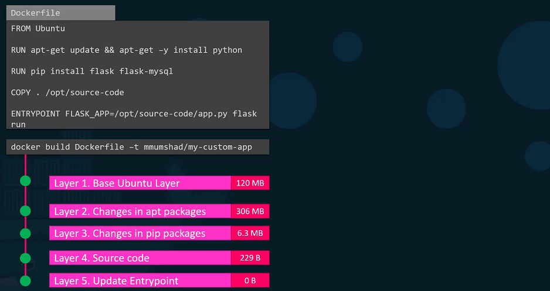
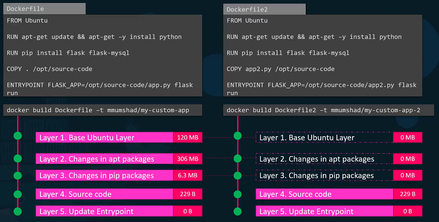
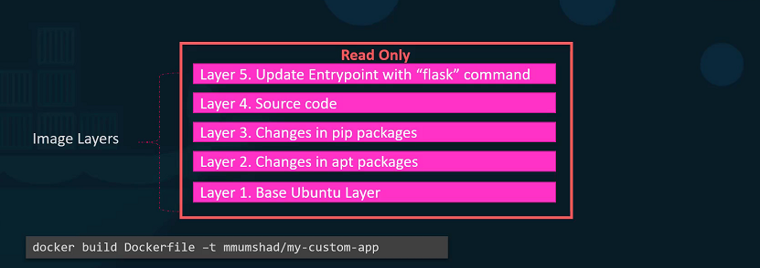
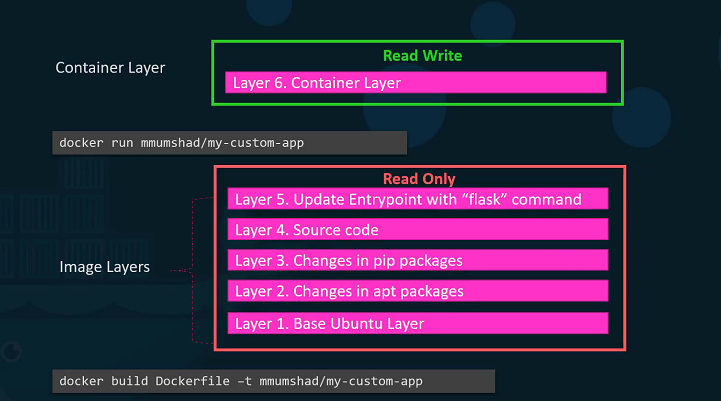
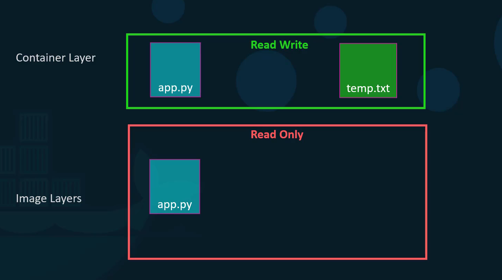

class: center, middle
# Section 7 - Storage in Docker
## Layered Architecture
---

## Filesystem
 - When we install Docker on a system, it creates this directory structures at `/var/lib/docker`.
  
```console
$ ls -1 /var/lib/docker/
...
containers
image
...
volumes
...

```
 - This is where Docker stores all its data by default.
 - We have multiple directories under it called containers, image, volumes and many others.
 
---

## Layered Architecture  
 - When docker builds images, it builds these in a **layered architecture**. 
 - **Each line** of instruction in the Dockerfile creates a **new layer** in the Docker image with just the changes from the previous layer.


---

## Layered Architecture 
 - As we can see in the previous image, 
 - layer-1 is the Ubuntu base layer, 
 - layer-2 install the packages, 
 - layer-3 install the python packages, 
 - layer-4 update the source code, 
 - layer-5 updates the entry point of the image. 
 
>Since each layer only stores the changes from the previous layer. It is reflected in the **size** as well.

---
## Layered Architecture - advantages
 - For better understanding the advantages of this layered architecture, Let's take a different Dockerfile, this is very similar to our first application. only source code and entry point is different to create this application.


---
## Layered Architecture - advantages
 - When image builds, docker **is not going to build first three layers** instead of it reuses the same three layers it built for the first application from the cache. 
 - Only creates the **last two layers** with the new sources and the new entry point.
 - This way, Docker builds images **faster** and **efficiently saves disk space**. 
 - This is also applicable, if you were to update your application code. Docker simply reuses all the previous layers from the cache and quickly rebuild the application image by updating the latest source code

---
## Layered Architecture - RO layers
 - Let's rearrange the layers bottom up so we can understand it better. 
 - All of these layers are created when we run the `docker build` command to form the final Docker image. 
 - Once the build is complete, we cannot modify the contents of these layers and so they are **read-only**  
 - we can only modify them by initiating a new build.


---
## Layered Architecture - Rw layer
 - Using the `docker run` command Docker creates a container based of these layers and creates a new **RW layer** on top of the image **RO layers**.


---
## Layered Architecture - Rw layer
 - The writeable layer is used to store data created by the container such as **log files** written by the applications, any **temporary files** generated by the container.


---
## Image layers - Recap
 - Images are made of **RO layers** created at **build time**.
 - Each layer is related to a **set of file system changes**.
 - When you run a Docker image to create a running container, Docker will create a new **RW layer** on top of the image.  
  
<center></center>

---
## Layered Architecture - Rw layer
 - The **same image layers** is shared by all containers created using this image.
<center></center>


> When the container is destroyed, this layer and all of the changes stored in it are also destroyed.
---
## Layered Architecture - Editing files on RW layer
 - If I will create a new file called temp.txt in the newly created container, this will be stored on the RW layer.
 - If we edit an existing file of the image a **new copy** is stored on the RW layer.  
  
<center></center>

---
## Layered Architecture - Rw layer

 - Let's take an example of our application code. Since we bake our code into the image, the code is part of the image and as such, its read-only. After running a container, what if I wish to modify the source code.
 - Yes, I can still modify this file, but before I saved the modified file, Docker automatically creates a copy of the file in the read-write layer and I will then be modifying a different version of the file in the read-write layer. All future modifications will be done on this copy of the file in the read-write layer. This is called copy-on-right mechanism.

---
## Storage drivers
 - Docker uses **storage drivers** to manage the **RO layers** of a Docker image and the **RW layer** of a container
 - Docker uses **volume drivers** to manage the persistent data of an application (Docker volumes)
 
<center></center>

---
## Storage drivers
 - Docker uses **storage drivers** to manage the contents of the *image layers* and the *writable container layer*. 
 - Each **storage driver** handles the implementation differently, but all drivers use stackable image layers and the **copy-on-write** (CoW) strategy.
 - Docker supports different types of **storage drivers** such as: **overlay2**, **aufs**, **devicemapper**, **btrfs** etc..
 - Recommended storage driver for Ubuntu, CentOS and RHEL is **overlay2**
 - [Recommended storage drivers](https://docs.docker.com/storage/storagedriver/select-storage-driver/#docker-engine---community)

---

## Kubernetes CSI - Container Storage Interface
 - Kubernetes use CSI (Container Storage Interface)
 - Kubernetes CSI ~ Docker Volume drivers
<center></center>
