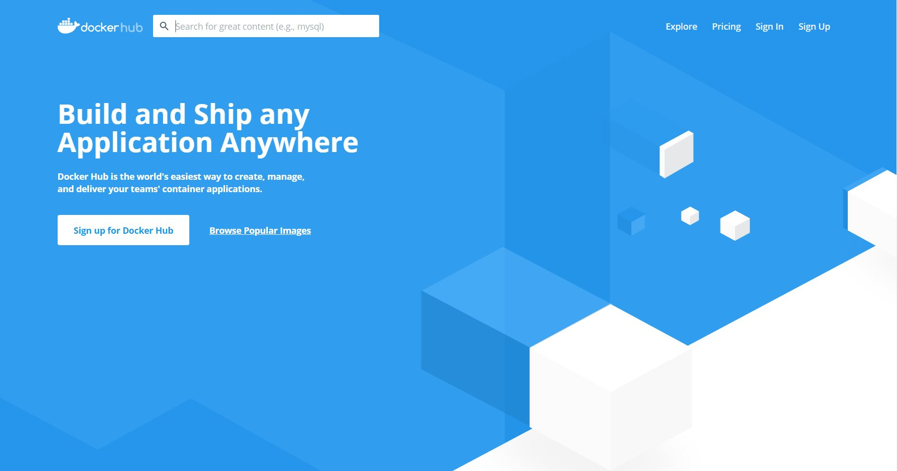
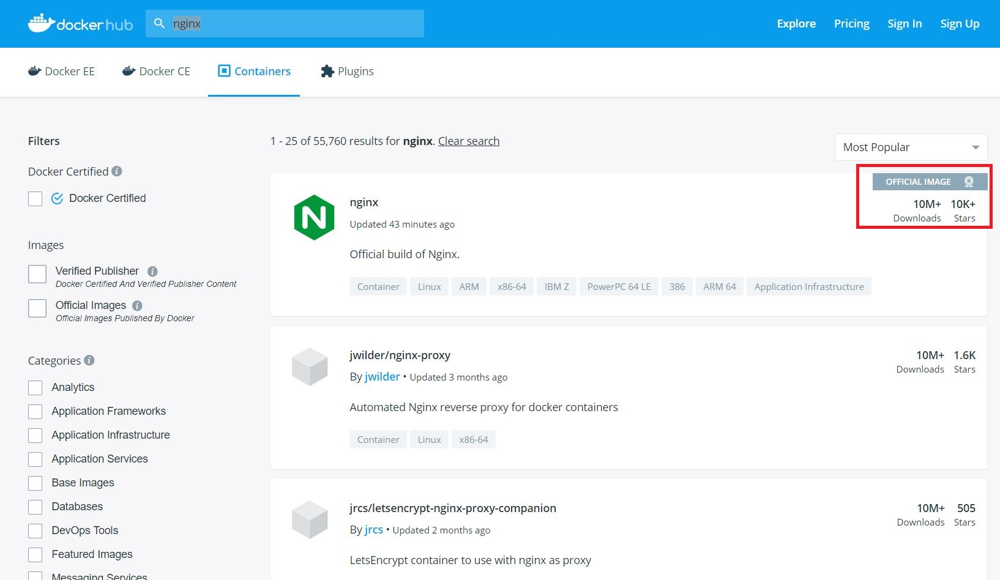
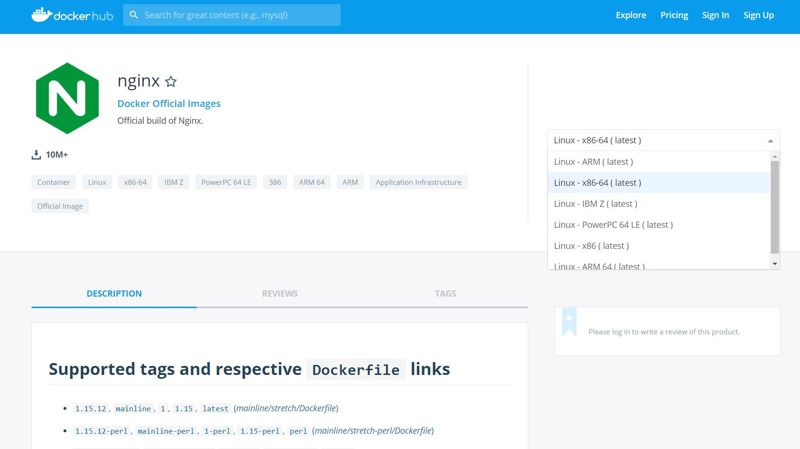

class: center, middle
# Section 7 - Container Images - Docker Hub Registry
## 2 The Docker Hub Registry

---

## overview 
 - Basics of Docker Hub (hub.docker.com)
 - Find Official and other good public images
 - Download images and basics of image tags
 
---

## Basics of Docker Hub (hub.docker.com)
 - https://hub.docker.com/
 
 
---

## Docker Hub - search images (1)
 - search nginx
 

---

## Docker Hub - search images (2)
 - Official images
 - Number of downloads and starts
  
 > Note: 
 > - The Repository name of an official image does not have the "account_name/" as the unofficial image has.
 > - When we publish an image to the docker hub, the repository name will be for example "gerassimos/nginx". The account name "gerassimos" will be part of the repository name.
 > - The "account_name" could be also the name of an organization.

---

## Docker Hub -  Official images
Ref:
https://docs.docker.com/docker-hub/official_images/

 - Docker, Inc. sponsors are a dedicated team that is responsible for reviewing and publishing all content in the Official Images. 
 - This team works in collaboration with upstream software maintainers, security experts and the broader Docker community.
 - Well tested 
 - Created from "Dockerfiles" obeying best practice rules
 - Provide good documentation
  
---

## Docker Hub -  nginx example


---
## Docker Hub -  nginx example
 - Image **tag** => information about a specific image version/variant. 
 - A version of an image can have more than one tag
 - Supported **tags** and respective Dockerfile links
   - 1.15.12, mainline, 1, 1.15, latest => are all versions of the same image 
   - 1.15.12-alpine, mainline-alpine, 1-alpine, 1.15-alpine, alpine 
 - How to use this image
 - Using environment variables and other configuration 
---


## docker pull nginx - latest
 - If you do not specify a `tag` then **latest** `tag` is used.

```terminal
# docker pull nginx
Using default tag: latest
latest: Pulling from library/nginx
Digest: sha256:e71b1bf4281f25533cf15e6e5f9be4dac74d2328152edf7ecde23abc54e16c1c
Status: Image is up to date for nginx:latest
```

> Notes: 
> - The **latest** is just a tag, there is no guarantee that will point to the newest version of the application that the image refers to.
> - The use of **latest** tag in production is an anti-pattern. 
> - Avoid the use of the **latest** tag. 
> - The docker client will check the "Digest: sha256" number to verify if the image is already available in the local cache. 

---

## docker pull nginx - specific tag
```terminal
# docker pull nginx:1.15.12
1.15.12: Pulling from library/nginx
Digest: sha256:e71b1bf4281f25533cf15e6e5f9be4dac74d2328152edf7ecde23abc54e16c1c
Status: Downloaded newer image for nginx:1.15.12

# docker image ls nginx
REPOSITORY  TAG       IMAGE ID       CREATED      SIZE
nginx       1.15.12   27a188018e18   9 days ago   109MB
nginx       latest    27a188018e18   9 days ago   109MB
```
> Note 1 
>  - Both the "nginx:latest" and "nginx:1.15.12" are pointing to the same image, they have the same "IMAGE ID"
>  - These aren't actually two different copies of 109MB images.
>  - Space occupied on disk will be 109MB for all nginx images with the same image ID.
>  - ### **In production we will always use a specific version.** 

---

## docker pull nginx - alpine version

```terminal
# docker image pull nginx:1.15.12-alpine
```
 - In this example we used the **1.15.12-alpine** tag. 
 - This is an image based on the alpine linux distribution, which is very small in size (5MB).

---

## GitHub repository
  - Go the the linked GitHub repository to see the related "Dockerfile" and understand how the image are built.

  - Example: 
  - https://github.com/nginxinc/docker-nginx/blob/master/mainline/stretch/Dockerfile

> Note: 
> Use the "Dockerfile" of the official images as a reference for best practice.

---

## Create your custom Nginx version
 - This is very similar to the model of GitHub, where they allow you to store open source software and you can fork other people's software.  
 - The same thing goes here.  You can use other people's images and make them your own.
