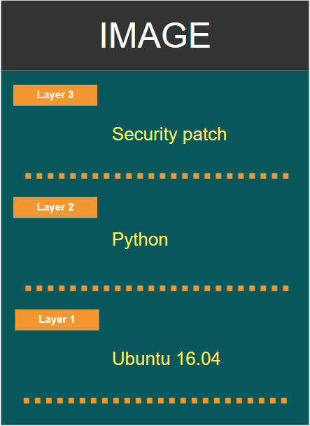

class: center, middle
# Section 7 - Container Images - Docker Hub Registry
## 3 Docker images - Local Cache
---

## Image layers (1)
 - What is an image layer?
 - When we use `docker pull`, we can see from the output of the command that the image is not a single big blob of data. 
```terminal
# docker pull mysql
Using default tag: latest
latest: Pulling from library/mysql
27833a3ba0a5: Already exists
864c283b3c4b: Already exists
5479aaef3d30: Already exists
9667974ee097: Pull complete
4ebb5e7ad6ac: Downloading [=============>   ] 17.14MB/88.99MB
021bd5074e22: Downloading [======>          ] 33.14MB/69.99MB
cce70737c123: Waiting
544ff12e028f: Waiting
```
  
---

## Image layers (2)

```terminal
# docker pull mysql
Using default tag: latest
latest: Pulling from library/mysql
27833a3ba0a5: Already exists
864c283b3c4b: Already exists
5479aaef3d30: Already exists
9667974ee097: Pull complete
4ebb5e7ad6ac: Downloading [=============>   ] 17.14MB/88.99MB
021bd5074e22: Downloading [======>          ] 33.14MB/69.99MB
cce70737c123: Waiting
544ff12e028f: Waiting
```

> - The image is composed from smaller pieces of data => **layers**.
> - Some of the layer "Already exists" on the local **cache** => No need to download this part
> - The images are designed using the **union file system** which concept is to make layers for a set of changes

---

## Image layers - Example
 - For an over-simplified example you could create a new image based on Ubuntu. This would be your first image's layer. 
 - Then, add the Python packages. This would be the second layer.
 - Finally, you could add a security patch. This would be the third layer.
 
 <center></center>
 
 
---

## docker image history (1)
 - Use the `docker image history` command to show the **build** history of an image.
 - Show **layers** of changes made on the image.
 ```terminal
 # docker image history nginx
IMAGE          CREATED       CREATED BY                                      SIZE  
27a188018e18   9 days ago    /bin/sh -c #(nop)  CMD ["nginx" "-g" "daemon…   0B
<missing>      9 days ago    /bin/sh -c #(nop)  STOPSIGNAL SIGTERM           0B
<missing>      9 days ago    /bin/sh -c #(nop)  EXPOSE 80                    0B
<missing>      9 days ago    /bin/sh -c ln -sf /dev/stdout /var/log/nginx…   22B
<missing>      9 days ago    /bin/sh -c set -x  && apt-get update  && apt…   54.1MB
<missing>      9 days ago    /bin/sh -c #(nop)  ENV NJS_VERSION=1.15.12.0…   0B
<missing>      9 days ago    /bin/sh -c #(nop)  ENV NGINX_VERSION=1.15.12…   0B
<missing>      4 weeks ago   /bin/sh -c #(nop)  LABEL maintainer=NGINX Do…   0B
<missing>      4 weeks ago   /bin/sh -c #(nop)  CMD ["bash"]                 0B
<missing>      4 weeks ago   /bin/sh -c #(nop) ADD file:4fc310c0cb879c876…   55.3MB
 ```
 
---

## docker image history (2) 

 - Every set of changes on the image file system is another layer.
 - Some layers may not change in terms of the file size => metadata (e.g EXPOSE 80 )
 - Every layer has a unique SHA number that identify the changes made.
 - Different images can have **common layers** => which means that for example:
   - Two custom images may have the same common base image such as **ubuntu**.
   - These two images will have a **common set of layers**, all related to the **common base image**.

---

## Image layers - Recap
 - Images are made of **RO layers** created at **build time**.
 - Each layer is related to a **set of file system changes**.
 - When you run a Docker image to create a running container, Docker will create a new **RW layer** on top of the image.  
  
<center></center>

---

## Container RW layer (1)


---

## Container RW layer (2)
 - The major difference between a container and an image is the top **writable layer**. 
 - All writes to the container that add new or modify existing data are stored in this writable layer. 
 - When the **container is deleted**, the writable layer is also deleted. The underlying image remains unchanged.
 - Because each container has its own writable container layer, and all changes are stored in this container layer, **multiple containers** can share access to the same underlying image and yet have their own data state. The diagram below shows multiple containers sharing the same Ubuntu 15.04 image.
 - [Ref Container and layers](https://docs.docker.com/storage/storagedriver/#container-and-layers)
 
---

## Storage drivers
 - Docker uses **storage drivers** to manage the contents of the *image layers* and the *writable container layer*. 
 - Each **storage driver** handles the implementation differently, but all drivers use stackable image layers and the **copy-on-write** (CoW) strategy.
 - Docker supports different types of **storage drivers** such as: **overlay2**, **aufs**, **devicemapper**, **btrfs** etc..
 - Recommended storage driver for Ubuntu, CentOS and RHEL is **overlay2**
 - [Recommended storage drivers](https://docs.docker.com/storage/storagedriver/select-storage-driver/#docker-engine---community)

---

## docker image inspect (1)
 - Use the `docker image inspect` command to display detailed information of an image.
 - This is the metadata of the image (Remember an image is made up of two parts,  the **binaries & dependencies** and the **metadata**).
 - Information included: ImageId, RepoTags, ExposePorts, Environment variables, CMD , Architecture, GraphDriver, etc...
  
---
 
## docker image inspect (2)
 
```terminal
# docker image inspect nginx
[
    {
        "Id": "sha256:27a188018e1847b312022b02146bb7ac3da54e96fab838b7db9f102c8c3dd778",
        "RepoTags": [
            "nginx:1.15",
            "nginx:1.15.12",
            "nginx:latest"
        ],
        ...
        "GraphDriver": {  ...   "Name": "overlay2" },
        ...
        "RootFS": {
            "Type": "layers",
            "Layers": [
                "sha256:5dacd731af1b0386ead06c8b1feff9f65d9e0bdfec032d2cd0bc03690698feda",
                "sha256:912ed487215b213aaad80bedb31484cab0b060de73d49bd1cfd9a550b7c2f11c",
                "sha256:fc4c9f8e7dacd81078d56e811c55ce1920688a91748bfbb2b98a5a9c316ff66c"
...
```

---

## docker image inspect (3) 

> Notes
> - The "GraphDriver" actually refer to the storage driver   
> - The `docker history` command shows the **build** history of an image **(list of changes)** which is not the strict list of layers such as the one reported from the `docker image inspect` command (list of changes #3)

