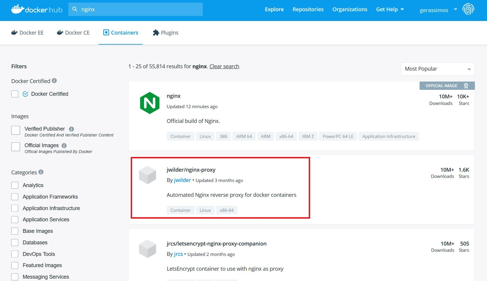
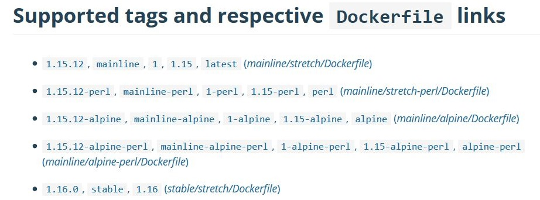
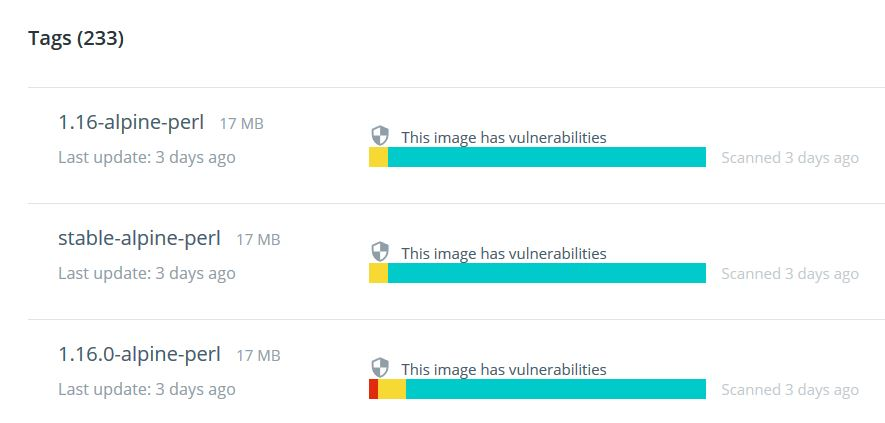
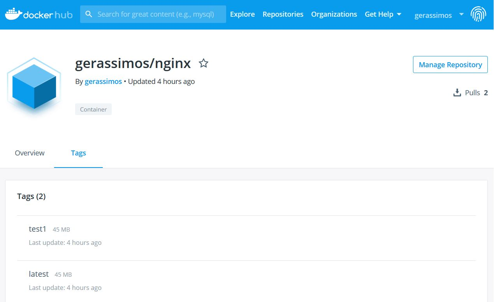
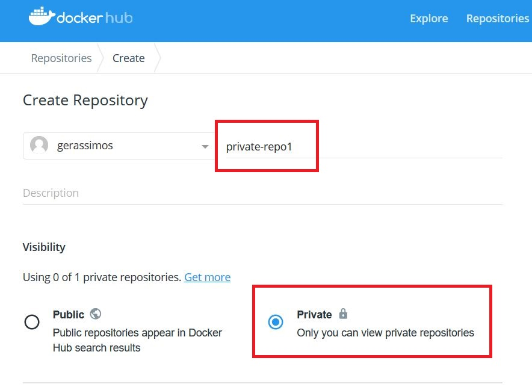

class: center, middle
# Section 7 - Container Images - Docker Hub Registry
## 4 Image Tagging and Pushing to Docker Hub

---

## nginx - Example (1)
- Example: search nginx on docker.hub


---

## nginx - Example (2)
 
 - From the search result we can see that there are other popular not official images displayed as :
 ### [user-name]/[repo-name]
 ### jwilder/nginx-proxy
 - How we actually refer to an image ??

---

## Image reference (1) 
  - Images don't actually have a **name** even though we refer to them while we are talking casually  

```terminal
 # docker image ls
REPOSITORY                    TAG         IMAGE ID       CREATED       SIZE
mysql                         latest      d72169616e20   2 days ago    443MB
nginx                         1.15        27a188018e18   10 days ago   109MB
nginx                         latest      27a188018e18   10 days ago   109MB
...
httpd                         2.4         0eba3d04566e   2 months ago  132MB
openjdk                       8u181-jdk   f2194a7e67df   3 months ago  624MB
jwilder/nginx-proxy           0.7.0       f445b41383ae   9 months ago  147MB
...
acme-registry:5000/nms-core   10.3.1      4a34e9dea800   4 hours ago   759MB
```

> Note:
> From the output of the command we can see that there is not a "name" column.

---

## Image reference (2)
- Except for the image ID, We have to refer to an image with three different pieces of information:  
  
### [registry-server-hostname]:[port]/[username]/REPOSITORY:TAG  

```console
docker pull nginx =>                 <== official image on Docker Hub
docker pull jwilder/nginx-proxy      <== public user image on Docker Hub
docker pull acme-registry:5000/nms-core <== image on private registry
```

- The default registry is `docker hub` and so can be omitted 

---

## Image reference (3)

  - The `repository` of non official images is composed from two parts, the `account-name` and the actual `repository name`, for example: 
  
```console
# docker pull jwilder/nginx-proxy:0.7.0
```

- Official Repositories live at the "root namespace" of the registry, so they do not need `account-name` in front of the repository name.

```console
# docker pull nginx
```

---

## Image TAG
 - The image **tag** is like a version and a branch as well.
 - There are also similarities between the image tag and the Git tag.
 - It's really just a pointer to a specific image commit.
---
## Image TAG (2) - (example nginx)
   
 
> Example: Form the *nginx* official image page we can see that: 
> - 1.15.12, mainline, 1, 1.15, latest => all refer to the exact same image 
> - **tag** is a way of referring an image (an alias) and may contain numbers and words 
 
---

## Image TAG (3) - (example nginx)


---
## Image TAG (4) - (example nginx)
 - 1.15.12, mainline, 1, 1.15, latest => all refer to the exact same image  
  
```terminal
# docker pull nginx
# docker pull nginx:1.15
# docker pull nginx:1.15.12
# docker pull nginx:mainline

# docker image ls nginx
REPOSITORY   TAG        IMAGE ID       CREATED       SIZE
nginx        1.15       27a188018e18   10 days ago   109MB
nginx        1.15.12    27a188018e18   10 days ago   109MB
nginx        latest     27a188018e18   10 days ago   109MB
nginx        mainline   27a188018e18   10 days ago   109MB
```

> Note:
> These tags are just labels that point to an actual image ID and we can have as many as we want.

---

## How to create a custom image
### There are 3 ways to create a Docker image: 
### 1. Use a **Dockerfile** to Build a custom image 
### 2. Re-tag an existing Docker image
### 3. Create a new image from a container
  
---

## docker image tag (1) 
 - Use the `docker image tag` command to create a tag TARGET_IMAGE that refers to SOURCE_IMAGE.
 - Usage: `docker image tag SOURCE_IMAGE[:TAG] TARGET_IMAGE[:TAG]`
 
Example:
```terminal
# docker image tag nginx gerassimos/nginx

# docker image ls
REPOSITORY         TAG       IMAGE ID       CREATED       SIZE
gerassimos/nginx   latest    27a188018e18   10 days ago   109MB
nginx              1.15      27a188018e18   10 days ago   109MB
nginx              1.15.12   27a188018e18   10 days ago   109MB
nginx              latest    27a188018e18   10 days ago   109MB
...
```
> Note that the *gerassimos/nginx* target image refers to a not official repository of the *gerassimos* account  
> The newly created image resides only in the local cache.

---
 
## docker image tag (2)

>  - The *first* image repository is the starting point, the source.  
>  - The *second* image repository is the new repository name that will be created, the target.  
>  - Optionally, we can specify a TAG. If we do not specify a TAG, then always the default is the *latest*.  
>  - We could also tag an old image (old version of software) with *latest*. This is why *latest* doesn't always mean *latest* version.
>  - Maybe *default* could be a better name instead of *latest*.  
>  - Generally you can trust that official image use the *latest* tag for the latest version of software.   
>  - The new image that has just been created have the same image ID as the source image and this is because they are actually referring to the same Docker image.  
>  - ### **This is a local image that does exist yet on Docker Hub.**  

---

## docker image push
 - I can upload the custom image that I have just created to the docker.hub registry by using the `docker image push` command.  
 - It is like a Git push.

```terminal
# docker push gerassimos/nginx
The push refers to repository [docker.io/gerassimos/nginx]
fc4c9f8e7dac: Preparing
912ed487215b: Preparing
5dacd731af1b: Preparing
denied: requested access to the resource is denied
```
> I will get an error `access denied` because I need to login first.

---

## docker login (1)
 - In order to upload an image to the Docker Hub registry you need to create an **Docker Hub account** first and then perform the `docker login` command from your Docker host.
 - By default we will login to the Docker Hub registry but we can override this step by using a private registry or any other registry. 

```console
# docker login
...
Username: gerassimos
Password:
...
Login Succeeded
```

---

## docker login (2)
- The password is stored unencrypted (although not in plain-text) in the `~/.docker/config.json` file.  

```console
# cat ~/.docker/config.json
{
        "auths": {
                "https://index.docker.io/v1/": {
                        "auth": "ZaBcDefgaBcDefgaBcDefga="
                }
        },
        "HttpHeaders": {
                "User-Agent": "Docker-Client/18.06.1-ce (linux)"
        }

```
> Note:
>  
>  - In production we may want to use more secure authentications procedures.  
>  - You can always perform a `docker logout` to remove/delete the authentication key from the `config.json` file.
---

## docker image push  
 - After successful login operation we can now `push` our custom image.
```terminal
# docker image push gerassimos/nginx
The push refers to repository [docker.io/gerassimos/nginx]
fc4c9f8e7dac: Mounted from library/nginx
912ed487215b: Mounted from library/nginx
5dacd731af1b: Mounted from library/nginx
latest: digest: sha256:c10f4146f30fda9f40946bc114afeb1f4e867877c49283207a08ddbcf1778790 size: 948
```

---

## docker image push


---

## docker image tag (other then *latest*)
 - In the following example we are going to specify a TAG (other than *latest*). 
 - Then we will **push** again.
  
```terminal
# docker image tag gerassimos/nginx  gerassimos/nginx:test1
# docker image ls 
REPOSITORY         TAG       IMAGE ID       CREATED       SIZE
gerassimos/nginx   latest    27a188018e18   11 days ago   109MB
gerassimos/nginx   test1     27a188018e18   11 days ago   109MB
nginx              1.15      27a188018e18   11 days ago   109MB
nginx              1.15.12   27a188018e18   11 days ago   109MB
nginx              latest    27a188018e18   11 days ago   109MB
nginx              mainline  27a188018e18   11 days ago   109MB
...
```

---

## docker image tag (other then *latest*)
 - Use the `docker image push` to upload the image to Docker Hub
  
```terminal
# docker image push gerassimos/nginx:test1
The push refers to repository [docker.io/gerassimos/nginx]
fc4c9f8e7dac: Layer already exists
912ed487215b: Layer already exists
5dacd731af1b: Layer already exists
test1: digest: sha256:c10f4146f30fda9f40946bc114afeb1f4e867877c49283207a08ddbcf1778790 size: 948
```

> Notice that the image layer is not actually uploaded because `Layer already exists`.

---


## docker image tag (other then *latest*) 


---

## docker image tag (other then *latest*)
### The result of this example is a *public* repository **gerassimos/nginx** containing two images:  
### - latest
### - test1

---

## Create a private repository (1)
 - With your regular Docker free account you are entitled to create also one private repository.
 - In this example we will create a **private** repository from the web UI and then we will `push` a custom image.  
 
---
 
 ## Create a private repository (2)
   
  
---
  
## Create a private repository (3)
```terminal
# docker image tag nginx gerassimos/private-repo1:test2
# docker image push gerassimos/private-repo1:test2
... 
test2: digest: sha256:c10f4146f30fda9f40946bc114afeb1f4e867877c49283207a08ddbcf1778790 size: 948
```
> Note:
> Private repositories allow you to keep container images private, either to your own account or within an organization or team.  
> [Ref: Private Repositories](https://docs.docker.com/docker-hub/repos/#private-repositories)

---

## Exercise
 - Ref:
 - [D_S7_L4_Image_Tagging_and-Pushing_to_Docker_Hub_ex.md](https://github.com/gerassimos/dgs19/blob/master/exercises/D_S7_L4_Image_Tagging_and-Pushing_to_Docker_Hub_ex.md)