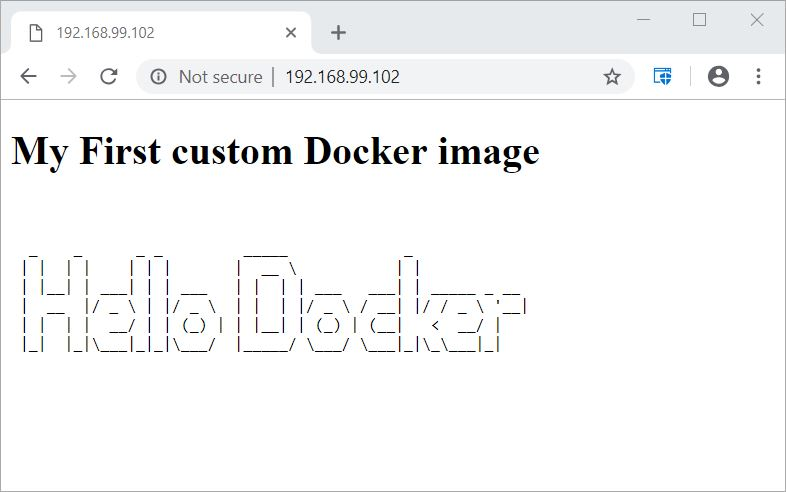
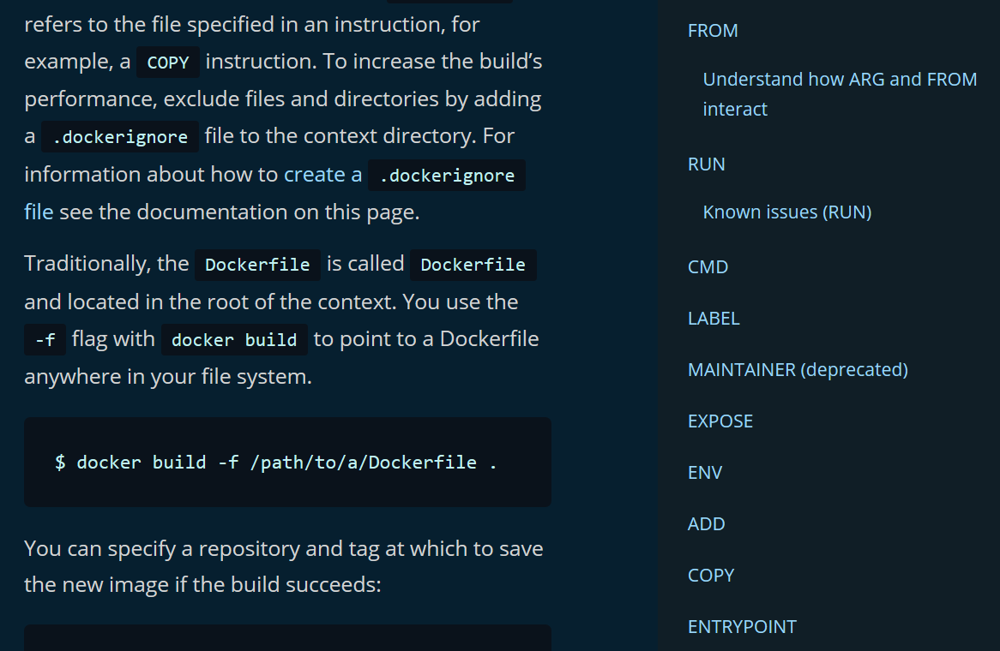

background-image: url(images/containers_legacy_app.jpg)
background-size: 100% 100%

<h3 style="margin-top: 500px;">
<span style="color:white">
Section 8 - Build Images - The Dockerfile Basics
</span>
</h3>
---

class: center, middle
# Section 8 - Build Images - The Dockerfile Basics
## Building Images - The Dockerfile Basics
---

## Dockerfile
 - The **Dockerfile** is a recipe for creating a Docker image.
 - It contains the **instructions** on how to build a Docker image.  
 - All official images on Docker Hub are created from Dockerfiles.
 - It is similar to a shell script.
 - The default file name is **Dockerfile** but you can use custom name as well by specifying the `--file` option.
 
---

## docker build
 - Use the `docker build` command to build an image from a **Dockerfile** and a **context**.
 - Usage:  docker build [OPTIONS] PATH 
 - The most common option is `-t` to specify a **Name** and optionally a tag in the *name:tag* format.
 - The `PATH` argument defines the **context** of the build, it is usually set to "." (current working directory) and by default will search for a file named **Dockerfile**.
   
---

## docker build example - extend nginx image (1)
- In the following example we are going to use the files that are available in the [resources/dockerfile-sample-1](https://github.com/gerassimos/dgs19/tree/master/resources/dockerfile-sample-1) directory to build a custom Docker image.
 
```terminal
cd resources/dockerfile-sample-1
# ls 
Dockerfile 
index.html
```
> There are 2 files available:
>  - The [Dockerfile](https://github.com/gerassimos/dgs19/blob/master/resources/dockerfile-sample-1/Dockerfile) which contains the instructions on how to build our custom image.
>  - The [index.html](https://github.com/gerassimos/dgs19/blob/master/resources/dockerfile-sample-1/index.html) file that will be copied in the custom image.

---

## docker build example - extend nginx image (3)
 - Execute the `docker build` command to build our custom Docker image based on nginx:
```terminal
# docker build -t nginx-with-custom-html .
Sending build context to Docker daemon  3.584kB
Step 1/3 : FROM nginx:latest
latest: Pulling from library/nginx
... 
Digest: sha256:df13abe416e37eb3db4722840dd479b00ba193ac6606e7902331dcea50f4f1f2
Status: Downloaded newer image for nginx:latest
 ---> f0b8a9a54136
Step 2/3 : WORKDIR /usr/share/nginx/html
 ---> Running in 7300b213f34c
Removing intermediate container 7300b213f34c
 ---> 3b6516f97aa2
Step 3/3 : COPY index.html index.html
 ---> 1951328eb0d9
Successfully built 1951328eb0d9
Successfully tagged nginx-with-custom-html:latest
```

---

## docker build example - extend nginx image (3b)
- Execute the `docker image ls` command to view the custom image that we have just created:
```terminal
# docker image ls
REPOSITORY               TAG       IMAGE ID       CREATED          SIZE
nginx-with-custom-html   latest    1951328eb0d9   27 seconds ago   133MB
nginx                    latest    f0b8a9a54136   3 days ago       133MB
...
```
 - By default the created image will be tagged as **latest**, since we did not specify any `TAG`
 
---
## docker build example - extend nginx image (4)
 - Execute the `docker container run` command to create a container from our custom image:
```terminal
# docker container run -p 80:80 --rm nginx-with-custom-html
```


---
## docker build example - extend nginx image (6)
 - Finally upload the custom image to the Docker Hub registry:  
 
```terminal
# docker image tag nginx-with-custom-html:latest gerassimos/nginx-with-custom-html:latest

# docker image ls
REPOSITORY                          TAG       IMAGE ID       CREATED         SIZE
gerassimos/nginx-with-custom-html   latest    1951328eb0d9   3 minutes ago   133MB
nginx-with-custom-html              latest    1951328eb0d9   3 minutes ago   133MB
nginx                               latest    f0b8a9a54136   3 days ago      133MB
...

# docker push gerassimos/nginx-with-custom-html:latest
7f31d0f5f5ee: Pushing [================>]  4.096kB
fc4c9f8e7dac: Pushing [==========================>]  3.584kB
912ed487215b: Preparing
5dacd731af1b: Preparing
```

---
## docker build - image layer (1) 

 - Each **Step** corresponds to a line in the **Dockerfile**.
 - Each **Step** will create an image layer that we can later refer to it by the hash number e.g. `---> c08899734c03`.
 - The image with all the related layers are stored to the **local cache**.  
 


---
## docker build - image layer (2)
 - The next time that the build process takes place, before actually executing every single step, it will search in the **local cache** if any related image layer already exists.
   
```terminal
# docker build -t nginx-with-custom-html .
Sending build context to Docker daemon  3.584kB
Step 1/3 : FROM nginx:latest
 ---> f0b8a9a54136
Step 2/3 : WORKDIR /usr/share/nginx/html
 ---> Using cache
 ---> 3b6516f97aa2
Step 3/3 : COPY index.html index.html
 ---> Using cache
 ---> 1951328eb0d9
Successfully built 1951328eb0d9
Successfully tagged nginx-with-custom-html:latest
...
```
---
 
## docker build - image layer (3)
 - During the build process the "Docker engine" will understand for which layers of the image is possible to use the build cache and when the build cache cannot be used because: 
   1. there are changes in the Dockerfile or 
   2. there are changes in the files that are included in the image.
 - During the build process we can see from the output `---> Using cache` when the cached is used. 
 
---

## docker build - image layer (4) 
 - The **order** of the instructions specified in the **Dockefile** is important.
 - Instructions that usually will cause a layer to change should be placed at the end of the **Dockefile**. 
 - For example, a command that adds our application code should be placed at the end of the **Dockefile** file, since it is the one that changes more often.
 - Instructions that usually build the same layer should be placed on the top.
  
---
## Dockerfile production example
 - The [Dockerfile](https://github.com/gerassimos/dgs19/blob/master/resources/dockerfile-sample-2/Dockerfile) of this example is available in the `resources` directory:  
 (`resources/dockerfile-sample-2/Dockerfile`)
 
---
 
## package manager
 - The base linux distribution defined in the **FROM** section of the *Dockerfile* determines the **package manager** that we can use to install additional software.
 - For example: 
   - `apt-get` is used from **Ubuntu** or **Debian** base images
   - `yum` is used from **CentOS** or **Fedora** base images
   - `apk` is used from **Alpine** base image

> The base images usually have a minimal set of packages installed, many tools such as `curl` could be missing.

---

## Dockerfile - On line documentation

### [docker docs/Dockerfile reference](https://docs.docker.com/engine/reference/builder/)


---

## LAB
 - Ref
 - D_S8_L3_Dockerize_a_Spring_Boot_application.md