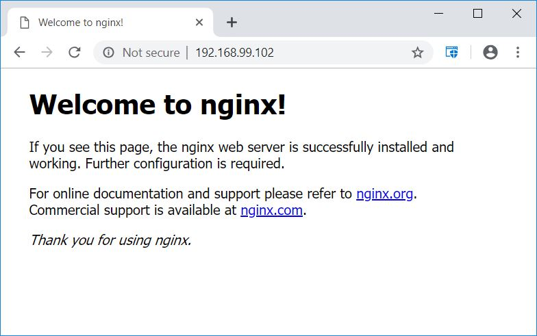

class: center, middle
# Section 8 - Build Images - The Dockerfile Basics
## 3 Extend Official Images
---

## docker build example - extend nginx image (1)
- In the following example we are going to use the files that are available in the `resources/dockerfile-sample-3` directory to build a custom Docker image.
 
```terminal
cd resources/dockerfile-sample-3
# ls 
Dockerfile 
index.html
```
> There are 2 files available:
>  - The **Dockerfile** which contains the instructions on how to build our custom image.
>  - THe *index.html* file that will be copied in the custom image.

---

## docker build example - extend nginx image (2)
### The [Dockerfile](../resources/dockerfile-sample-3/Dockerfile) of this example

---

## docker build example - extend nginx image (3a)
 - Lets see the default nginx index.html page before we  build our own custom nginx image: 
```terminal
# docker container run -p 80:80 --rm nginx
```
> Note that we have used the `--rm` option that will delete the container automatically once it is stopped.

---

## docker build example - extend nginx image (3b)


---

## docker build example - extend nginx image (3)
 - Execute the `docker build` command to build out custom nginx Docker image:
```terminal
# docker build -t nginx-with-custom-html .
Sending build context to Docker daemon  3.584kB
Step 1/3 : FROM nginx:latest
 ---> 27a188018e18
Step 2/3 : WORKDIR /usr/share/nginx/html
 ---> Using cache
 ---> ac75a6485581
Step 3/3 : COPY index.html index.html
 ---> 617ee5012490
```

---

## docker build example - extend nginx image (4)
 - Execute the `docker container run` command to create a container from our custom image:
```terminal
# docker container run -p 80:80 --rm nginx-with-custom-html
```


---

## docker build example - extend nginx image (5)
- Execute the `docker image ls` command to view the custom image that we have just created:
```terminal
# docker image ls
REPOSITORY                 TAG                 IMAGE ID            CREATED             SIZE
nginx-with-custom-html     latest              617ee5012490        5 minutes ago       109MB
gerassimos/private-repo1   test2               27a188018e18        12 days ago         109MB
nginx                      1.15                27a188018e18        12 days ago         109MB
nginx                      1.15.12             27a188018e18        12 days ago         109MB
nginx                      latest              27a188018e18        12 days ago         109MB
...
```

---

## docker build example - extend nginx image (5)
 - Finally upload the custom image to the Docker Hub registry:  
 
```terminal
# docker image tag nginx-with-custom-html:latest gerassimos/nginx-with-custom-html:latest

# docker image ls
REPOSITORY                          TAG                 IMAGE ID            CREATED             SIZE
gerassimos/nginx-with-custom-html   latest              617ee5012490        12 minutes ago      109MB
nginx-with-custom-html              latest              617ee5012490        12 minutes ago      109MB
...

# docker push gerassimos/nginx-with-custom-html:latest
7f31d0f5f5ee: Pushing [================>]  4.096kB
fc4c9f8e7dac: Pushing [==========================>]  3.584kB
912ed487215b: Preparing
5dacd731af1b: Preparing
```

---

## LAB
 - Ref
 - D_S8_L3_Extend_Official_Images_lab.md
