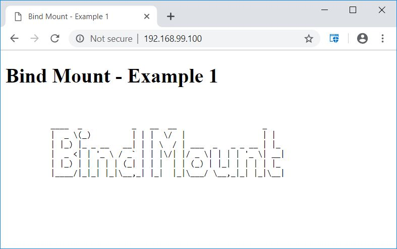
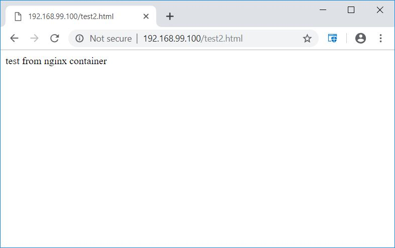

class: center, middle
# Section 9 - Persistent Data and Volumes
## 3 Persistent Data: Bind Mounting
---

## Bind Mounting - Overview
 
 - When we use a **bind mount**, a file or directory on the **host** machine is mounted into a **container**.
 - It **maps** an existing file or directory on the host to a container file or directory. 
 - The file or directory is referenced by the **absolute** or **relative** path on the host machine.
 - Basically just two locations pointing to the same file(s).
 - If you are bind mounting a file that already exist on both the host and the container file system, then the host file "wins".
 
> Notes  
> - Are **not managed** from Docker as they are the data volumes 
> - A Bind mount **cannot** be used in a Dockerfile.

---

## Bind Mounting - volume command
 - Bind Mounting are defined with the `--volume` or `-v` options as follow:  
### `-v <host_path>:<container_path>`  
 - On the left side of the colon there is the path defined on the docker host.  
 - On the right side of the colon there is the path defined on the container.  

>  
> The difference between a named volume and a bind mount is:
> - **Named volume** => On the left side of the colon a "simple" **name** is defined.
> - **Bind mount** => On the left side of the colon a host path is defined.

---

## Bind Mounting - example (0)
 - Example (Docker on linux)
```console  
docker container run -v /opt/mnt-dir:/path/container ...
```
  - /opt/mnt-dir => is on the Docker host side
  - /path/container => inside the container

 - Example (Docker toolbox on windows)
```console  
docker container run -v /c/Users/gerassimos/stuff:/path/container ... 
```

> This is a special case because a windows path is accessible from the Docker linux VM in a special **Virtual Box way**.  

---

## Bind mount - nginx example (1)
 - In the following example we are going to use the files that are available under the `resources/bind-mount-sample-1` directory to build a custom Docker image.

```terminal
# cd resources/bind-mount-sample-1
# ls 
html/

# ls html/
50x.html  index.html  index.html.bck.original

# docker container run -d -v $(pwd)/html:/usr/share/nginx/html -p 80:80 --name nginx nginx
```
> Note:  
> We use the `$(pwd)/html` instead of the host path => the `pwd` linux command will print the current working directory.  

---

## Bind mount - nginx example (2)
 - Access to custom index.html page from your docker host  
  


---

## Bind mount - nginx example (3)
 - While the nginx container is running we can:
   1. create a new file in the bind mount from the docker host
   2. create a new file in the bind mount from within the running container 
 - Verify that nginx can access all the files in the above step.

```terminal
# cd resources/bind-mount-sample-1
# echo "test from docker host" > html/test1.html
# ls html/
50x.html  index.html  index.html.bck.original  test1.html
  
# docker exec -it nginx bash
root@b9e701f0484f:/# echo "test from nginx container" > /usr/share/nginx/html/test2.html
root@b9e701f0484f:/# ls /usr/share/nginx/html/
50x.html  index.html  index.html.bck.original  test1.html  test2.html
```
---

## Bind mount - nginx example (4a)


---

## Bind mount - nginx example (4b)


---

## LAB
 - Ref:
 - D_S9_L3_Persistent_Data_LAB.md
