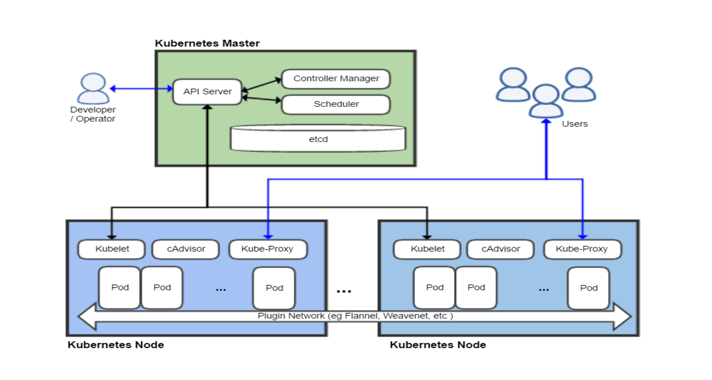

class: center, middle
# Section 11 - 
## 2 Introduction to Kubernetes

---

## Kubernetes  
 - Kubernetes is **the most popular** container orchestrator. 
 - Kubernetes is used to manage the **multi-node cluster** and the **deployment of containers**
 - Released by Google in 2015. It's now maintained by an open source community that Google is a part of
 - Runs on top of Docker (usually). 
    - The Default [container runtime] is Docker
    - Other container runtime can be used instead such as *containerd* and *lxd*  
 - Provides a set of API, CLI tools to manage containers across servers
    - One of the main CLI tool used to manage Kubernetes is **kubectl** (kube control)

---

## Options for running Kubernetes (1)
 ### 1. Cloud provider
 ### 2. Vendor *Distribution*
 ### 3. Manual Installation from packages
 
 - Kubernetes is **complex**, and **difficult** to set up and **configure**. 
 - Therefore, the best approach, is to use a solution that includes Kubernetes as a supported, maintained **component**    

---

## Options for running Kubernetes (Cloud provider)
 1. Cloud provider
    - Kubernetes is provided as a service. Each cloud provider has its own implementation of Kubernetes
    - Examples 
        - **AWS**  => EKS Amazon Elastic Kubernetes
        - **Azure** => AKS Azure Kubernetes Service
        - **DigitalOcean** => DigitalOcean Kubernetes
---

## Options for running Kubernetes (Vendor)
 2. Vendor *Distribution*
    - Most of the infrastructure vendors, that package their own Kubernetes *Distribution*
    - It is similar to the concept of **Linux distributions**
    - Can be "easily" installed on **private data centers**  
    - Examples
        - **Red Hat OpenShift**
        - **Docker Enterprise**
        - **Ubuntu Canonical**
        - **VMware Enterprise PKS**

---

## Options for running Kubernetes (Manual)
 3. Manual Installation from the *raw* GitHub upstream version Kubernetes
    - It is **complex** and **difficult** to set up and configure. 
    - It is generally recommended to **avoid** this type of installation unless you have a **dedicated team of experts**

---

## Why Kubernetes ?
 - It is important to understand if you really need to use an orchestrator and eventually which **type** of orchestration engine **(k8s - Swarm)** is best for your needs
 - Kubernetes is used very much from the industry but not always is the best **choice** 
 - Not every solution needs an orchestrator 
    - Some times Docker and docker-compose are enough
    
---

## Kubernetes vs Swarm
 - Kubernetes and Swarm are both container orchestrators based on Docker runtime 
 - Both are solid platforms with vendor backing
 - Swarm: **Easy** to deploy and manage 
 - Swarm: does NOT cover all use cases 
 - Kubernetes: **More features** and flexible   
 - Kubernetes: complex and difficult
 
---
 
## Swarm Advantages (1)
 - Swarm is a orchestration solution built inside Docker (no need to install any additional tool other that Docker) 
 - Follows 80/20 rule, 20% of features for 80% of use cases 
 - Has less features compared to Kubernetes that cover the majority of use cases 
 - Swarm Run anywhere;
    - Linux, Windows
    - Raspberry Pi
    - ARM 64bit, ARM 32bit etc...

---

## Swarm Advantages (2)    
 - Secure out-of-the-box
    - All nodes have mutual TLC authentication
    - The **control plan** is encrypted
    - Provides encrypted distributed DB (secrets)
 - Easier to use and troubleshoot  
 - Swarm is the **recommended starting point** if you want to learn an container orchestration solution
 - A small team of DevOps persons (even one person) could manage a swarm cluster 

---

## Kubernetes Advantages 
 - Kubernetes is **the most popular** orchestration solution  
 - Has the widest vendor support
 - Has the widest community 
 - Flexible: Cover widest set of use cases
 - A dedicated team of DevOps persons is needed to manage a Kubernetes cluster
 
---

## Kubernetes Terminology 
 - **k8s:** abbreviation for Kubernetes, the whole orchestration system  
 - **kubectl:** the main CLI tool to configure and manage apps 
 - **Node:** Single server in the Kubernetes cluster
 - **kubelet:** Kubernetes agent running on all nodes
 - **Control Plane:** (The master nodes) Set of containers that manage the cluster (~ Swarm manager nodes)

---
 
## Kubernetes Topology

---

## Kubernetes Installation options for local dev
 - **Docker Desktop** (Kubernetes is included as option) 
 - **Minikube** (Based on VirtualBox) 
    - Portable executable: `kubectl.exe minikube.exe`
 - **MicroK8S** for linux system `snap install microk8s --classic`
 
---

## Kubernetes In a Browser
 - [play-with-k8s](https://labs.play-with-k8s.com/)
 - [katacoda](https://www.katacoda.com/)
 
    