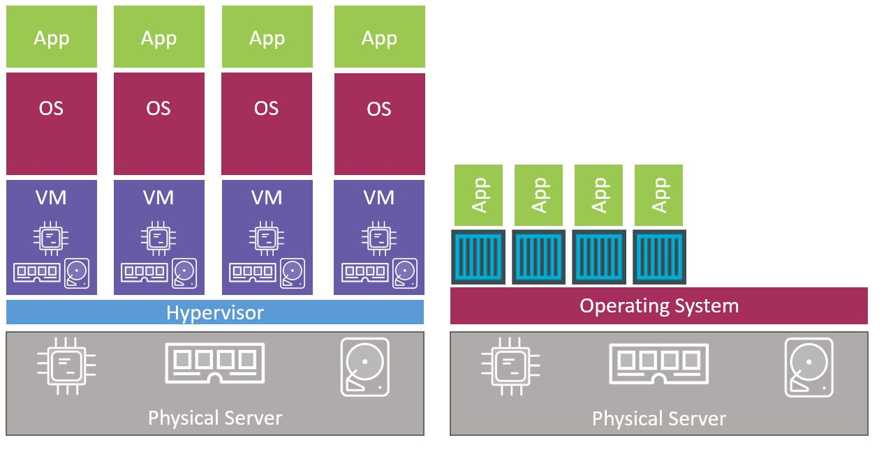
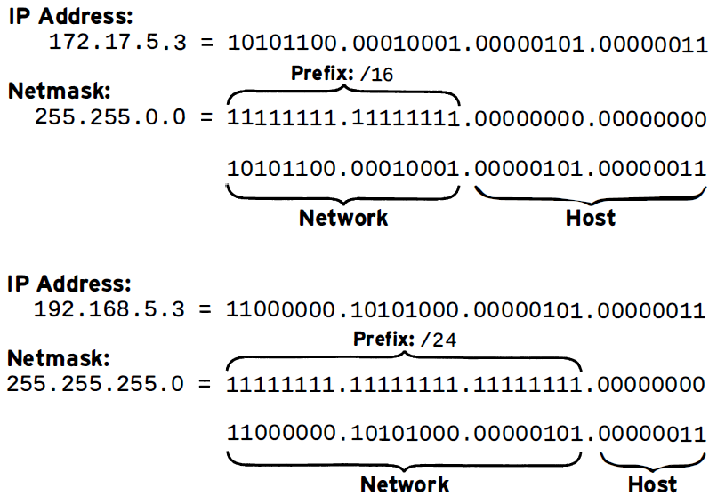
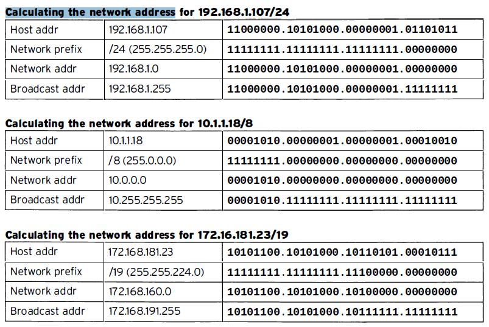
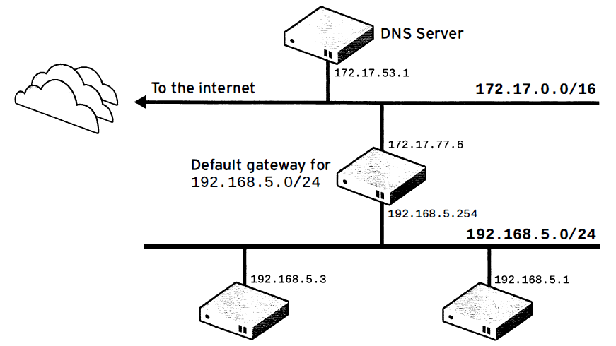
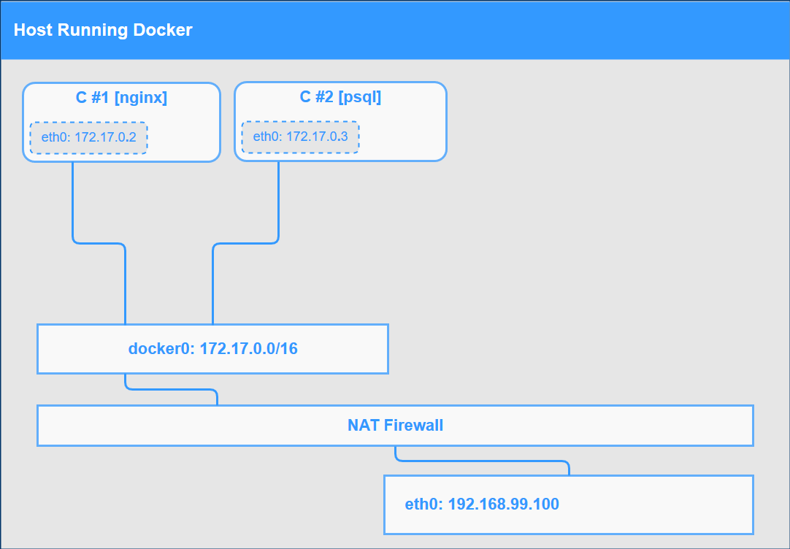
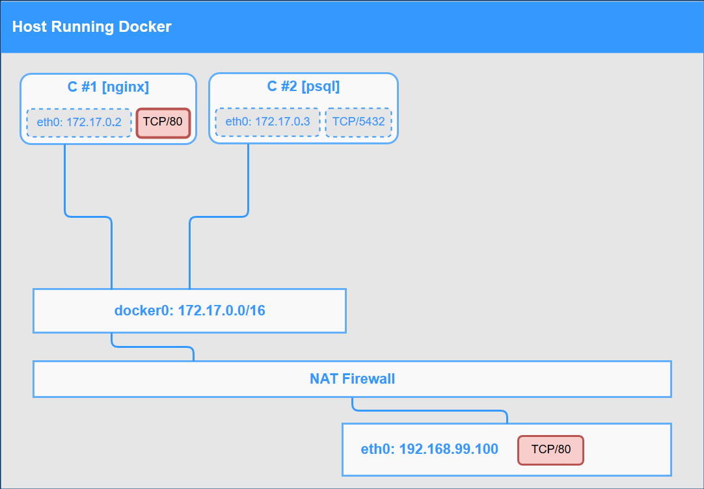
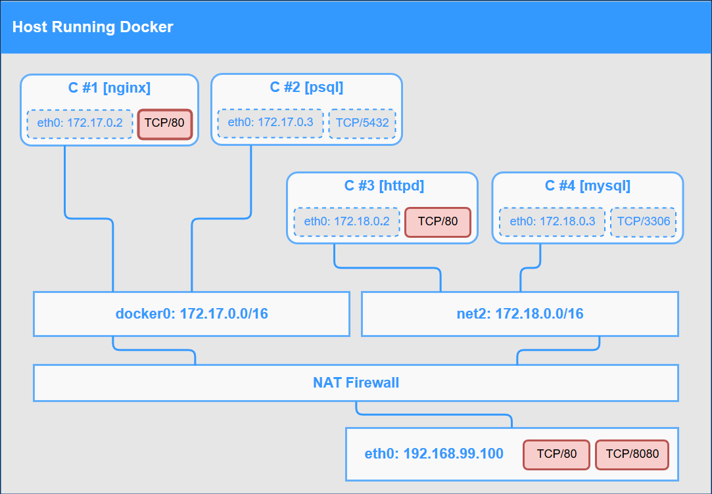
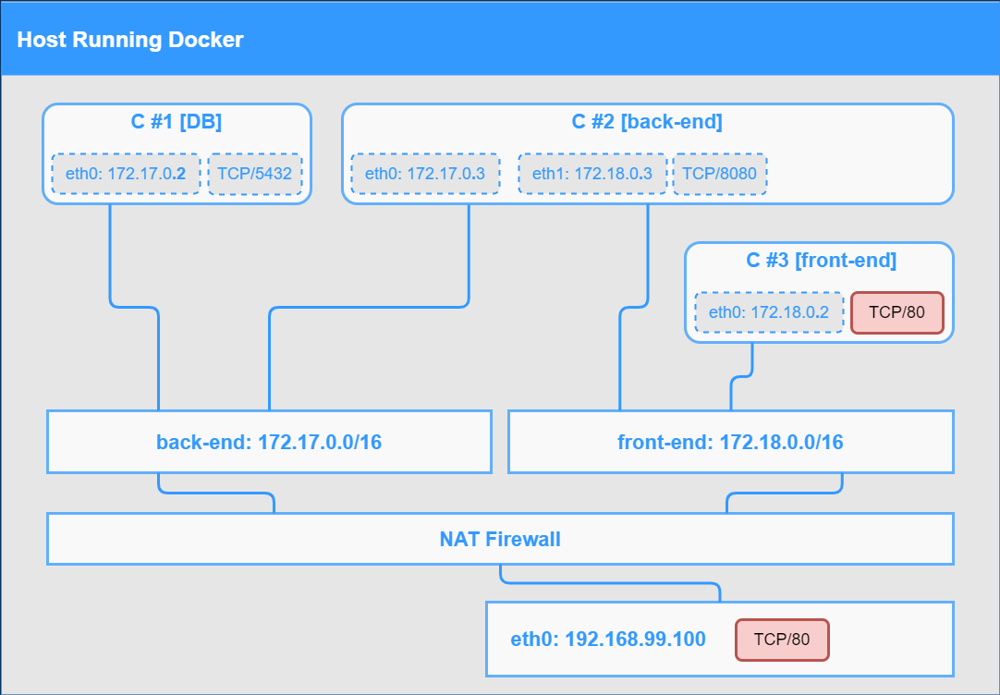
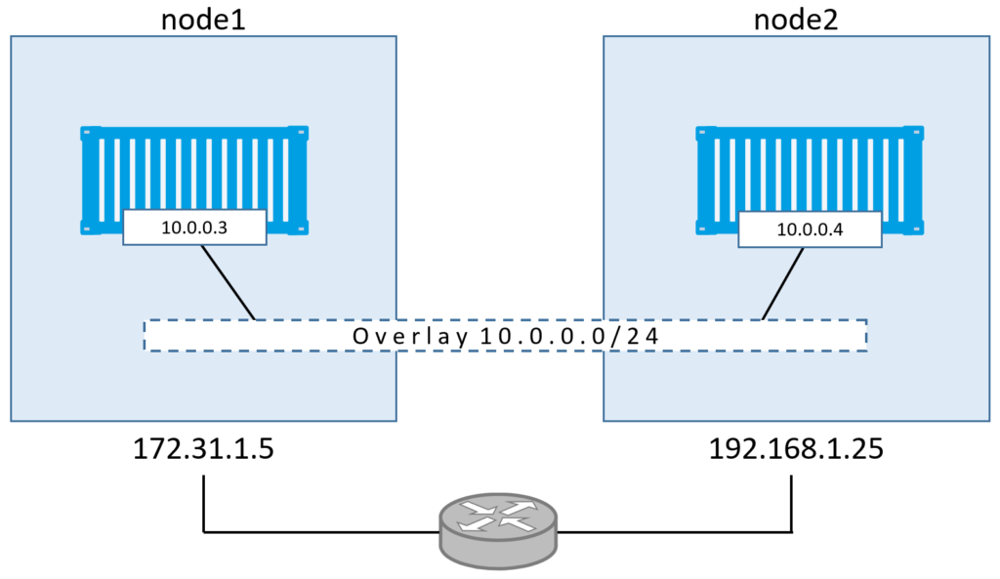
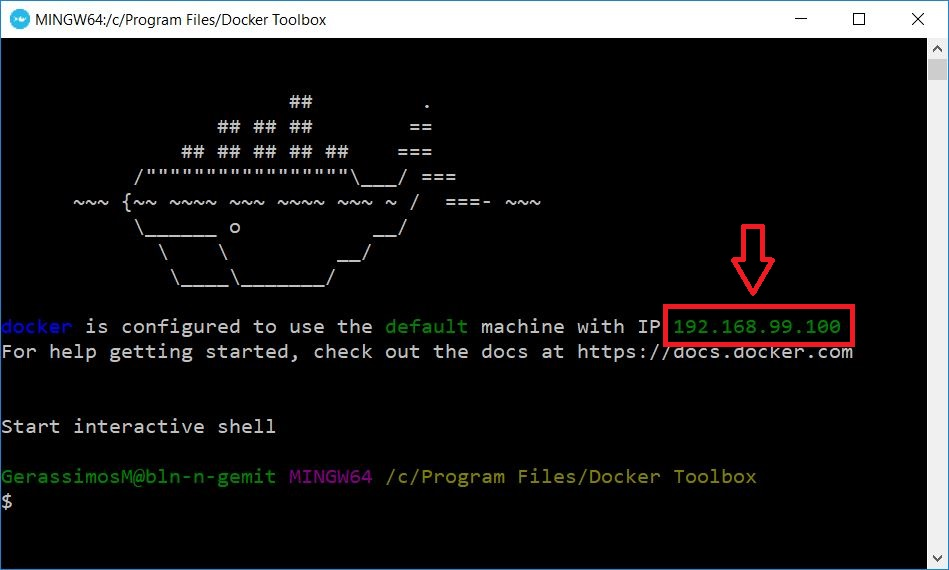

background-image: url(images/intro_first_slide.png)
background-size: 100% 100%
---
class: center, middle
# Section 1 - About the course
---

## Syllabus
- About the course
- Introduction to Docker
- Installation of Docker and other tools
- Command line structure - Basic Information
- Containers lifecycle (run, stop, rm)
- Docker Networking Basics
- Container Images - Docker Hub Registry
- Build Images - The Dockerfile Basics
- Persistent Data and Volumes
- Docker Compose: The Multi-Container Tool
- Other Resources
---

## Resources
 - pdf slides
 - Exercises and Hands-on Labs 
 - GitHub repository [dgs19](https://github.com/gerassimos/dgs19)
 - Slack Chat [slack-link](http://microservices-kpr4216.slack.com/)

---

## PC requirements (1)
### VT-x enabled 
 > This is a virtualization technology that should be enabled from the BIOS, if it is not already enabled

### Minimum Hardware
 - CPU: i3
 - Ram: 4Gb
 - HD: 20Gb free space
---

## PC requirements (2)
### Recommended Hardware
- CPU: i5
- Ram: 8Gb
- HD: 20Gb free space  
---
background-image: url(images/docker_logo_old_02.png)
background-size: 90% 
background-position: center
---

class: center, middle
# Section 2 - Introduction to Docker

---

## Docker concepts (What is Docker, Images and containers)

 - Docker is a platform to develop, deploy, and run applications with containers. The use of Linux containers to deploy applications is called containerization. Containers are not new, but their use for easily deploying applications is.
 - A container is created by running a Docker image. An image is an executable package that includes everything needed to run an application--the code, a runtime, libraries, environment variables, and configuration files.

---

## Virtual machines vs Docker containers


---

## The deployment problem 


---

## The deployment solution 


---

## Docker engine types (Linux Container vs Windows Container)
 - There are two types of Docker containers, Linux Container and Windows container.
 - It vital to understand that a running container shares the kernel of the host machine that is running on. This means that Linux containers requires Linux host and Windows containers requires Windows host
 - What about 
    - Docker for Windows / Docker toolbox 
    - Docker for MAC
   
 - Windows containers are very new. Only on late 2016 Microsoft announce native support for windows containers    
  
---
class: center, middle
# Section 3 - Installation of Docker
---

## Docker Installation (1)
 - Install Docker on Linux
    - `# curl -sSL https://get.docker.com/ | sh`
    
 - Install Docker on Windows (**Docker for Windows** – **Docker toolbox**)


---

## Docker Installation (2)
 - Free online Docker lab [Play with Docker](http://play-with-docker.com)
  


---

## Install Docker Toolbox on Windows

 - [Install Docker Toolbox on Windows](https://docs.docker.com/toolbox/toolbox_install_windows/)
 - [DockerToolbox.exe](https://github.com/docker/toolbox/releases)
 
---

## Install Docker on CentOS Linux
 - [Intall Docker on CentOS Linux](https://docs.docker.com/install/linux/docker-ce/centos/)
 - [Post-installation steps for Linux](https://docs.docker.com/install/linux/linux-postinstall/)

---

## Install Docker on CentOS Linux
 - The compete list of commands to install `Docker` and `docker-compose`

```console
# curl -sSL https://get.docker.com/ | sh
# systemctl enable docker
# systemctl start docker
# curl -L "https://github.com/docker/compose/releases/download/1.24.0/docker-compose-$(uname -s)-$(uname -m)" -o /usr/local/bin/docker-compose
# chmod +x /usr/local/bin/docker-compose
 
```
---

## Install Docker on CentOS Linux (2)
 - Optional setup bash auto completion  
 ```console
 # yum install -y bash-completion
 # curl -L https://raw.githubusercontent.com/docker/compose/1.24.0/contrib/completion/bash/docker-compose -o /etc/bash_completion.d/docker-compose
 ```

---

## CentOS 7 VM Setup
 - You can find the [CentOS-7-VM-Setup.pdf](https://github.com/gerassimos/dgs19/blob/master/resources/linux-vm-setup/CentOS-7-VM-Setup.pdf) guide in the resources directory (`resources/linux-vm-setup/CentOS-7-VM-Setup.pdf`)

---

## Other Tools
 - Visual Studio Code
 - MobaXterm
 - Putty
 - WinSCP
 - GitHub account
 - Docker Hub account 

  
---
class: center, middle
# Section 4 - Command line structure - System Verification 
# 1 - First Docker commands 
---

## Verify the Docker Install (1)
 - Use the `docker version` command to display all version information
 - This is the first command to execute on a new system to verify the Docker installation

---
## Verify the Docker Install (2)
```console
# docker version
Client:
 Version:       18.03.0-ce
 API version:   1.37
 Go version:    go1.9.4
 Git commit:    0520e24302
 Built: Fri Mar 23 08:31:36 2018
 OS/Arch:       windows/amd64
 Experimental:  false
 Orchestrator:  swarm

Server:
 Engine:
  Version:      18.05.0-ce
  API version:  1.37 (minimum version 1.12)
  Go version:   go1.10.1
  Git commit:   f150324
  Built:        Wed May  9 22:20:42 2018
  OS/Arch:      linux/amd64
```

---

## Verify the Docker Install (3)
> Notes:
>  - From the output of the `docker version` command we can see the client and the server version.
>  - Remember that Docker is a client server application. 
>  - Ideally client and server versions should be the same but they don't have to be.
>  - We refer to Docker server also as Docker engine or Docker daemon. 
>  - The fact that I did get returned information from the server validates that I can talk to the server and that it's working properly.


---
 

## docker info
 - Use the `docker info` command to display system-wide information


---


## docker info (2)
```console
# docker info
Containers: 5
 Running: 0
 Paused: 0
 Stopped: 5
Images: 24
Server Version: 18.05.0-ce
...
Swarm: inactive
... output truncated 
```

> Notes:  
> From the command output we can see:
>   - Number of containers (Running, Paused and Stopped)
>   - Number of images stored 
>   - The Swarm state (active inactive)

---

## Complete list of Docker commands (1)
 - To get the complete list of Docker commands type `docker` and hit `enter` 
 - The Docker COMMAND has 3 main sections:  
    1. Options
    2. Management Commands
    3. Commands

---
## Complete list of Docker commands  (2)
```console
$ docker

Usage:  docker COMMAND

Options:
  ...

Management Commands:
  container   Manage containers
  image       Manage images
  network     Manage networks
  ...

Commands:
  attach      Attach local standard input, output, and error streams to a running container
  build       Build an image from a Dockerfile
  
...
```

---


## Docker command format 

 - New format:
### `docker <command> <sub-command> [options]`

 - Old format (still working):
### `docker <command> [options]`
---

## Examples
### new command format
```console
# docker container run
# docker container ps
```
### old command format
```console
# docker run
# docker ps
```
> Notes:
> Docker is really focused on backwards compatibility. So the docker run will probably work forever; but new commands we get will use this docker command value. 

---

## Commands Summary
```console
# docker version
# docker info
# docker <Enter> => CLI documentation 
# docker <command> <sub-command>
# docker container run
# docker run
```
---

## Exercise
 - Ref:
 - D_S4_L1_First_Docker_commands_ex.md  
---
background-image: url(images/title-background-containers.jpg)
background-size: 100% 100%

<h3 style="margin-top: 500px;">
<span style="color:white">Section 5 - Containers lifecycle</span>
</h3>
  
---

class: center, middle
# Section 5 - Containers lifecycle
## 1 - Starting our first container 
---


## Difference between an image and a container. 
 - An  image consists of the **binaries**, **libraries** and **source code** and all together make up your application. 
 - The **container** is a running instance of that image.  
 - We can have many containers, all based on the same image. 
---
## Registries
 - We get all images from registries "repositories". 
 - Registries are kind of what GitHub is to source code. 
 - The default registry is `Docker Hub` but we could also setup a private registry   
 - https://hub.docker.com/
---

## Nginx 
 - In the following examples, we are going to use the Open Source **Nginx** web server. So we'll start our containers based on then Nginx image. 
---
## docker container run - nginx (1)
 - In the following example we will run `docker container run` command to start a new nginx container
 - New format:
```console 
# docker container run --publish 80:80 nginx
```
 - Old format:
```console 
# docker run --publish 80:80 nginx
```
---
## docker container run - nginx (2)


> Notes  
> Now from a browser we can access the nginx web server at the following URL http://docker-host:port. 
> In this example is: http://192.168.99.100/
---
## docker container run - nginx (3)
 - The Docker engine has performed the following actions:
   1. It downloaded image 'nginx' from Docker Hub
   2. It started a new container from that image
   3. It opened the port 80 on the host IP
   4. It routes that traffic to the container IP port 80


---

## docker container run - nginx (4)
>  - The process is running in the foreground.  
>  - The command is running in the foreground inside of our shell. 
>  - We do not have any more access to the command prompt.  
>  - Only the log messages of the running container are displayed.   
>  - Press **`<Ctrl-C>`** to stop the foreground process (container). This will send a stop signal to the process 1 running inside the container.
>  - Now we can access again the command prompt (but the nginx container is not running any more).
>  - Turning out that **`<Ctrl-C>`** does not work the same way on windows. It exits the foreground but leaves the container running in the background.
---
## docker container run - nginx (5)
 - Use the `-d` option to create a running container in "detach mode".
 - "detach mode" => Run container in background and print container ID.
```console 
# docker container run --publish 80:80 -d nginx
5cfee4add36fac28e1a553fb025760b806314f8975ca172abe1c4fa7864d0660
```
---
## docker container ls
 - Use the `docker container ls` command to list all running containers.  
 - New format 
```bash
# docker container ls
CONTAINER ID   IMAGE   COMMAND                  CREATED         STATUS         PORTS                NAMES
5cfee4add36f   nginx   "nginx -g 'daemon of…"   7 seconds ago   Up 6 seconds   0.0.0.0:80->80/tcp   keen_williams
```
 - Old format
```bash
# docker ps
```

> Note:    
> We can see the container ID listed is matching the container ID from the previous "docker container run" command.
---
## docker container stop
 - Use the `docker container stop` command to stop one or more running containers.
 
```console 
# docker container stop 5cf
5cf
```

> Note 1  
>  - The "docker container stop <container-ID>" command will stop the container but it will not remove it.
>  - For the container ID, we only have to type the first few digits, enough for it to be unique.
> 
> Note 2  
> - Use `docker container start <container-ID>` to start an existing stopped container. 
---
## List stopped container (1)
 - No container is listed from the `docker container ls` command.  
```bash
# docker container ls
CONTAINER ID   IMAGE   COMMAND   CREATED   STATUS   PORTS   NAMES
```

> Note:   
> We notice that nothing shows up.   
> The ls command only shows by default **running** containers  
---
## List stopped container (2)
 - Use the `--all` option to list all the created containers (running and stopped).
```bash
# docker container ls --all
CONTAINER ID   IMAGE   COMMAND    CREATED          STATUS                     PORTS   NAMES
5cfee4add36f   nginx   "nginx…"   16 minutes ago   Exited (0) 6 minutes ago           keen_williams
96563a69f990   nginx   "nginx…"   27 minutes ago   Created                            awesome_meitner
```
  
 - Why are there two container listed?  
 - The "docker container run" command always starts a *new* container.
---
## Container names  
 - From the output of the `docker container ls` command we can see that **random names** are assigned to the created containers.
 - If we do not specify a container name, then the Docker engine will assign a random name from a DB of names of notable hackers or scientists.
 - The container name is required to be unique as it is the container ID.
---
## Specify the container name (1)
 - Use the `--name` option to specify the name of the container.
```bash
# docker container run --publish 80:80 --detach --name webhost nginx
```
---
## Specify the container name (2)
 - List again all containers.
```console 
# docker container ls -a
CONTAINER ID   IMAGE   COMMAND    CREATED         STATUS                     PORTS                NAMES
3edc68a45029   nginx   "nginx…"   2 minutes ago   Up 2 minutes               0.0.0.0:80->80/tcp   webhost
e5089dbd5d82   nginx   "nginx…"   4 minutes ago   Exited (0) 3 minutes ago                        musing_pike
4bf7ab988ccd   nginx   "nginx…"   4 minutes ago   Exited (0) 4 minutes ago                        eager_lalande
```
 - From the output we can see that there are three containers.
 - The one we just started has the name *webhost*. The other two, that we previously started, stopped after 3 and 4 minutes respectively.
 - Since the `webhost` container is running in the foreground, we **can not** see the logs.
---
## docker container logs 
 - Use `docker container logs` to view the log of a container:
```console 
# docker container logs webhost
192.168.99.1 - - [06/Apr/2019:15:37:46 +0000] "GET / HTTP/1.1" 304 0 "-" "Mozilla/5.0 (Windows NT 10.0; Win64; x64; rv:66.0) Gecko/20100101 Firefox/66.0" "-"
192.168.99.1 - - [06/Apr/2019:15:37:46 +0000] "GET / HTTP/1.1" 304 0 "-" "Mozilla/5.0 (Windows NT 10.0; Win64; x64; rv:66.0) Gecko/20100101 Firefox/66.0" "-"
```
 - Use the "--follow" option to continuously tail the log messages:   
```console 
# docker container logs --follow webhost
192.168.99.1 - - [06/Apr/2019:15:37:46 +0000] "GET / HTTP/1.1" 304 0 "-" "Mozilla/5.0 (Windows NT 10.0; Win64; x64; rv:66.0) Gecko/20100101 Firefox/66.0" "-"
192.168.99.1 - - [06/Apr/2019:15:37:46 +0000] "GET / HTTP/1.1" 304 0 "-" "Mozilla/5.0 (Windows NT 10.0; Win64; x64; rv:66.0) Gecko/20100101 Firefox/66.0" "-"
```

> Note for the demo:     
> To see some logs messages, we should first generate some events by accessing the nginx home page (on http://192.168.99.100/) and press refresh a few times.

---
## docker container rm
 - Use `docker container rm` to remove (Delete) one or more containers:  
 - New format 
```console 
# docker container rm webhost
```
 - Old format 
```console 
# docker rm 
```
---
## docker container rm (2)
 - Delete the containers with a single command.  
 
```console
# docker container ls -a
CONTAINER ID   IMAGE   COMMAND    CREATED          STATUS                      PORTS                NAMES
3edc68a45029   nginx   "nginx…"   34 minutes ago   Up 34 minutes               0.0.0.0:80->80/tcp   webhost
e5089dbd5d82   nginx   "nginx…"   36 minutes ago   Exited (0) 35 minutes ago                        musing_pike
4bf7ab988ccd   nginx   "nginx…"   36 minutes ago   Exited (0) 36 minutes ago                        eager_lalande
 
# docker container rm 3ed e50 4bf
e50
4bf
Error response from daemon: You cannot remove a running container 3edc68a4502908df1db9b3679ca381e75c03d3d2a79ca61bec199c0561e75dff. Stop the container before attempting removal or force remove
```

> - We got an error.  
> - The first two conatainers were safely deleted. 
> - We cannot remove (delete) the third one for safety reasons.  
> - Docker will not allow to remove a container that is still running. 
---
 
## docker container rm (3)
 - Use the `--force` option to "Force" the removal of a running container (uses SIGKILL).
```bash
# docker container rm --force webhost
```
  
> Note:  
> We have to clean up the environment of this example by removing all the created containers.
---

## docker container run - review (1)


---

## docker container run - review (2)
 1. It looks for that image locally in image cache. It doesn't find anything.
 2. Then it looks in remote image repository (by default to Docker Hub).
 3. It downloads the latest version (nginx:latest by default).
 4. It creates new container based on that image and prepares to start.
 5. It gives a virtual IP to the conatainer on a private network inside docker engine.
 6. It opens up the port 80 on host and forwards to port 80 in container.
 7. It starts the container by using the CMD in the image Dockerfile.

---


## Commands Summary
```console
# new format 
docker container run --publish 80:80 nginx
<ctrl-C>
docker container run --publish 80:80 -d nginx
docker container ls
docker container stop 5cf
docker container ls
docker container ls --all 
docker container run --publish 80:80 --detach --name webhost nginx
docker container ps -a
docker container logs webhost
docker container rm 3ed e50 4bf
docker container rm --force webhost
```

---

## Exercise
 - Ref:
 - D_S5_L1_Starting_our_first_container_lab.md
  
---
class: center, middle
# Section 5 - Containers lifecycle
## 2 - Monitor & Inspect Containers
---
## Objective
### The objective is to understand how to monitor the running containers by using: 
- The `docker top` command to display the running processes of a container.
- The `docker stats` command to display a live stream (real time view) of container(s) resource usage statistics such as cpu%, memory, disk I/O and network I/O. 
- The `docker container inspect` command to display detailed information of a container such as meta-data, configuration etc.
---
## Commands overview
### `docker container top` => process list in one container
### `docker container inspect` => details of one container config
### `docker container stats` => performance stats for all containers
---
## Example (1)
 - In this example we will start two containers `nginx` and `mysql` in detach mode:  
```terminal 
# docker container run -d --name nginx nginx
# docker container run -d --name mysql -e MYSQL_RANDOM_ROOT_PASSWORD=true mysql
```

> Information about the environment variables that can be used with the mysql Docker image is available at the docker-hub registry:  
https://hub.docker.com/_/mysql 
  
---
## Example (2)  
 - Verify that the "nginx" and "mysql" containers are running:  
```terminal 
# docker container ls
CONTAINER ID   IMAGE   COMMAND                  CREATED         STATUS         PORTS                 NAMES
569f878a0712   mysql   "docker-entrypoint.s…"   21 seconds ago  Up 20 seconds  3306/tcp, 33060/tcp   mysql
082912c9a054   nginx   "nginx -g 'daemon of…"   22 seconds ago  Up 21 seconds  80/tcp                nginx
```
---

## docker container top
 - Use the `docker container top` command to display the running processes of each container:  
  
```console
# docker container top mysql
UID       PID     PPID    C   STIME   TTY   TIME         CMD
polkitd   15775   15761   1   06:56   ?     00:00:00     mysqld
                                                                                        
# docker container top nginx
UID   PID    PPID   C  STIME  TTY  TIME      CMD
root  15718  15704  0  06:56  ?    00:00:00  nginx: master process nginx -g daemon off;
101   15752  15718  0  06:56  ?    00:00:00  nginx: worker process
```

> Notes:  
>  - We can see that there are 2 processes running inside the nginx container.  
>  - With nginx, there's actually a master process and then it spawns worker processes based on the configuration.
>  - You can see that a container is more like a process (or more) running isolated in the host OS.  

---
## docker container inspect
 - Use the `docker container inspect` command to display detailed information of a container such as meta-data, configuration etc...  
  
```terminal
# docker container inspect nginx
[
    {
        "Id": "082912c9a0545c88ca60772f9b757f0173e6a53b674227892b3b64d228757297",
        "Created": "2019-04-09T03:56:57.415293403Z",
        "Path": "nginx",
        "Args": [
            "-g",
            "daemon off;"
        ],
...
```
> 
> The output of this command is a JSON array containing detailed information about the container.  

---
## docker stats
 - Use the `docker stats` command to display a live stream (real time view) of container(s) resource usage statistics.
The command supports *CPU*, *memory usage*, *memory limit*, and *network IO* metrics.  

```terminal
# docker stats
CONTAINER ID        NAME   CPU %  MEM USAGE / LIMIT       MEM %    NET I/O     BLOCK I/O      PIDS
569f878a0712        mysql  1.04%  374.4MiB / 3.701GiB     9.88%    729B / 0B   65MB / 679MB   37
082912c9a054        nginx  0.00%  1.359MiB / 3.701GiB     0.04%    729B / 0B   737kB / 0B     2
```

 
> The output of the `docker stats` command is a live stream (real time view). To exit from the real time view of the statistics press `<Ctrl-C>`.

---

## docker stats [container name|ID] 
 - We can specify the one or more container names (or ID) with the "docker stats" to limit the output to the specified container.
 - Example  
```terminal
# docker stats nginx
CONTAINER ID  NAME  CPU %  MEM USAGE / LIMIT    MEM %  NET I/O    BLOCK I/O    PIDS
082912c9a054  nginx 0.00%  1.359MiB / 3.701GiB  0.04%  729B / 0B  737kB / 0B   2
```

> Note:   
> These commands are not very helpful on a production environment, where there is a more complicated configuration with many containers running and, in case of cluster, more that one server to monitor. For production environment, tools such as **Prometheus** and **ELK** are used for monitoring and logging*. 

---
## Commands Summary
```terminal
docker container run -d --name nginx nginx  
docker container run -d --name mysql -e MYSQL_RANDOM_ROOT_PASSWORD=true mysql  
docker container ls  
docker container top mysql  
docker container top nginx  
docker container inspect mysql  
docker container stats --help  
docker container stats  
docker container ls  
```

---

## Exercise
 - Ref
 - D_S5_L2_Monitor_Containers_ex.md
  
---
class: center, middle
# Section 5 - Containers lifecycle
## 3 - Container Shell
---
## Overview - Getting a Shell Inside Containers
 1. `docker container run -it` => start new container interactively
 2. `docker container exec -it` => run additional command in existing container
 3. Default shell CMD of different Linux distributions in containers
---

## Start new container interactively
 - Use the `-it` options with the `docker run` command to get an interactive shell command prompt inside a container.
 - From Docker CLI help documentation

```console  
$ docker run --help
Usage:  docker run [OPTIONS] IMAGE [COMMAND] [ARG...]

Run a command in a new container
...
-i, --interactive                    Keep STDIN open even if not attached
...
-t, --tty                            Allocate a pseudo-TTY 

-t pseudo-TTY => simulates a real shell terminal like SSH does.
-i interactive => keep the STDIN channel open to input commands
```

> Note that the `-it` are two separate options.

---

## Example
 - Run `bash` command in nginx container.
```console
# docker container run -it --name proxy nginx bash
root@27056e1170d7:/#
```

> - The "-it" options are used to open an interactive terminal.
> - The "-name" option is used to set the name of the container.
> - After the image name, the `bash` argument is used to specify the COMMAND to execute inside the container. This will **override** the image default CMD.
> - The `bash` command will provide a shell prompt from which we can execute linux commands inside the container.
> - `nginx` default CMD [Dockerfile](https://github.com/nginxinc/docker-nginx/blob/master/stable/stretch/Dockerfile)  

```dockerfile
CMD ["nginx", "-g", "daemon off;"]
```

---

## Example (2a)

> From the container command line prompt `root@27056e1170d7:/#` we can see:  
> - The shell user is "root"  
> - The system hostname is "27056e1170d7", which is also the container ID.  
> - We can now execute commands as we could do from a regular system. 

---

## Example (2b)

 - For example we can list all files inside the container:

```console
root@27056e1170d7:/# ls -la
total 8
...
drwxr-xr-x   2 root root 4096 Mar 26 12:00 bin
drwxr-xr-x   2 root root    6 Feb  3 13:01 boot
drwxr-xr-x   5 root root  360 Apr  8 06:35 dev
drwxr-xr-x   1 root root   66 Apr  8 06:35 etc
drwxr-xr-x   2 root root    6 Feb  3 13:01 home
...
```

---
## Example (3)

> From here we can perform all kind of administrative task such as:
> - change config files
> - download and install packages from the internet etc...

 - Use the `exit` command to exit from the container shell:
```console  
root@27056e1170d7:/# exit
exit
[root@<docker-host>] #
```

> This will return back to the host shell prompt. 

---

## Example (4a)
 - Verify if the nginx "proxy" is still running.

```console
# docker container ls -a
CONTAINER ID   IMAGE   COMMAND  ... STATUS         PORTS       NAMES
27056e1170d7   nginx   "bash"   ... Exited (0)…                proxy
515d82f84f9e   mysql   "…"      ... Up 2 minutes   3306/tcp…   mysql
1b76d91c5f77   nginx   "nginx…" ... Up 3 minutes   80/tcp      nginx
```

> After exiting the bash shell, the container "proxy" is not running.  Why ?


---

## Example (4b)
 - The **default** command for an nginx container is to run the nginx program itself. We changed that default program to actually be `bash`, giving us the shell prompt. 
 - When we exited the shell, the container stopped. 
 - Because the main application (PID=1 "default command") running inside the container is `bash`, exiting the bash shell will stop the main `bash` process ((PID=1). 

---

## container shell  
 - One of the most important operations is to access the shell of the container and execute Linux commands.
 - Note that there is **no need** to have an ssh server running inside the container to actually access the shell prompt of the container. 
 - Docker CLI will provide access to the container shell.

---

## Full linux distribution containers 
 - In the following example we will use a full linux distribution such as Ubuntu to run a container.

```console 
# docker container run -it --name ubuntu ubuntu
...
Status: Downloaded newer image for ubuntu:latest
root@1da52b3057f6:/#
```

> Note that the default CMD of the ubuntu image is bash, so we do not need to specify it.   
> Ref: [Dockerfile](https://github.com/tianon/docker-brew-ubuntu-core/blob/bfd753a747344ff1c6838a2c91ff0606e936f0d0/disco/Dockerfile)

```dockerfile
...
CMD ["/bin/bash"]
```

---

## typical operations (1)
 - We will go through some typical operations performed within an ubuntu system.
 - We will use the package manager to install the `curl` tool.

```console 
root@1da52b3057f6:/# apt-get update
Get:1 http://security.ubuntu.com/ubuntu bionic-security InRelease [88.7 kB]
...
  
root@1da52b3057f6:/# apt-get install -y curl
...
Setting up curl (7.58.0-2ubuntu3.6) ...
...
```
> Note that the `curl` tool is not available in the ubuntu image because to keep the image small in size a minimal number of tools have been installed 

---

## typical operations (2b)  
 - In this example, the ubuntu running container has a curl installed and we can use it as we would do on a local machine.  

```console 
root@1da52b3057f6:/# curl google.com
<HTML>  
...  
</HTML>  
root@1da52b3057f6:/#
```
---
## typical operations (3)

 - Exit the ubuntu shell:

```console 
root@1da52b3057f6:/# exit
exit
[root@<docker-host>] #
```

> This will **stop** the ubuntu container.

---

## typical operations (4)

 - Verify which container is running and which is stopped.

```console
# docker container ls
CONTAINER ID   IMAGE   COMMAND  ... STATUS          PORTS      NAMES
515d82f84f9e   mysql   "…"      ... Up 26 minutes   3306/tcp…  mysql
1b76d91c5f77   nginx   "nginx…" ... Up 27 minutes   80/tcp     nginx
```

> ubuntu container is not running since we exited from the bash shell **the default application**. 

---

## typical operations (5)
 - Use the `docker container ls -a` command to list stopped containers.
  
```console 
# docker container ls -a
CONTAINER ID  IMAGE   COMMAND     ... STATUS          PORTS       NAMES
1da52b3057f6  ubuntu  "/bin/bash" ... Exited (0)…                 ubuntu
27056e1170d7  nginx   "bash"      ... Exited (0)…                 proxy
515d82f84f9e  mysql   "…"         ... Up 29 minutes   3306/tcp…   mysql
1b76d91c5f77  nginx   "nginx…"    ... Up 30 minutes   80/tcp      nginx
```

> If we start the specific ubuntu container (`ID="1da52b3057f6"`) again, then this container will have curl tool installed on it. But if we create a new container from the ubuntu image (docker container run ubuntu), that different container will not have the curl tool installed on.
---

## docker container exec 
 - Use the `docker container exec` command to get shell prompt of a running container 
 - In the following examples we have two running containers mysql and nginx:

 ```console
# docker container ls
CONTAINER ID   IMAGE   COMMAND                  CREATED             STATUS              PORTS                 NAMES
515d82f84f9e   mysql   "docker-entrypoint.s…"   About an hour ago   Up About an hour    3306/tcp, 33060/tcp   mysql
1b76d91c5f77   nginx   "nginx -g 'daemon of…"   About an hour ago   Up About an hour    80/tcp                nginx
```

> The "docker container exec" command can be used to execute any command inside a container.

---

## docker container exec - example mysql (1)
 - Use the "docker container exec" command to access the shell prompt of the mysql running container.

```console
# docker container exec -it mysql bash
root@515d82f84f9e:/#
```

> - The `-it` options are used to open an interactive terminal.  
> - "mysql" is the name of the container (or the ID) on which we want to execute the command.  
> - `bash` is the command to execute in the container.  
> - This will create a new process inside the container related to the `bash` command.  
> - The shell user of the mysql container is the "root" user. 
> - The system hostname of the container is the "515d82f84f9e", which is also the container ID.  

---

## docker container exec - example mysql (2)
 - Use the `ps aux` command to see the processes running inside the container.
```console
root@515d82f84f9e:/# ps aux
USER       PID %CPU %MEM    VSZ   RSS TTY      STAT START   TIME COMMAND
mysql        1  1.0 10.2 1345576 395896 ?      Ssl  08:01   0:45 mysqld
root       180  0.0  0.0  18172  2100 pts/0    Ss   09:13   0:00 bash
root       496  0.0  0.0  36624  1584 pts/0    R+   09:15   0:00 ps aux
```

> Note that the "ps" command is not included any more in the official mysql image by default.  
> To install the ps command:

```console
# apt-get update
# apt-get install procps
```

---

## docker container exec - example mysql (3)
 - Exit the bash shell and verify the container status.

```console 
# exit
exit
# docker container ls
CONTAINER ID   IMAGE   COMMAND                  CREATED             STATUS              PORTS                 NAMES
515d82f84f9e   mysql   "docker-entrypoint.s…"   About an hour ago   Up About an hour    3306/tcp, 33060/tcp   mysql
1b76d91c5f77   nginx   "nginx -g 'daemon of…"   About an hour ago   Up About an hour    80/tcp                nginx
```

> - The mysql container **is still running** because the exit command did not stop the **default** (main) application running.
> - The **default** main application running inside a container has **PID = 1**.
> - In this example the application with PID = 1 is actually the mysqld daemon.  
> - The `docker container exec` command actually runs an additional process on an existing running container.

---

## docker container exec - example mysql (4)
 - Docker use Linux namespaces to provide isolation for running processes
 - A process might have the apparent PID 1 inside a container, but if we examine it from the host system, it would have an ordinary PID

```console
# docker container top mysql
UID       PID    PPID    C   STIME    TTY   TIME       CMD
polkitd   3729   3713    1   12:53    ?     00:00:05   mysqld

# ps aux | grep mysql
polkitd   3729  0.9 38.9 1366564 394964 ?      Ssl  12:53   0:08 mysqld

# docker container exec mysql  ps aux
USER       PID %CPU %MEM    VSZ   RSS TTY      STAT START   TIME COMMAND
mysql        1  0.9 38.9 1366564 394964 ?      Ssl  09:53   0:07 mysqld
root       493  0.0  0.1  36624  1528 ?        Rs   10:06   0:00 ps aux
``` 

---

## Alpine Linux (1)
 - Alpine is a Linux distribution designed to be very small in size. It's actually only 5MB.

```console 
# docker pull alpine
# docker image ls
REPOSITORY  TAG        IMAGE ID       CREATED        SIZE
mysql       latest     7bb2586065cd   12 days ago    477MB
nginx       latest     2bcb04bdb83f   12 days ago    109MB
ubuntu      latest     94e814e2efa8   3 weeks ago    88.9MB
alpine      latest     5cb3aa00f899   4 weeks ago    5.53MB
```

> - We used the "docker pull" command to download the latest alpine image from the docker.hub registry.  
> - We used the "docker image ls" to list all images available in the local cache.
> - Do not worry, we will cover Docker images in depth in the next section.

---

## Alpine Linux (2)
- The Alpine Linux distribution comes with its own package manager "apk".
- The "bash" shell is not available in the alpine image. 

```console
# docker container run -it alpine bash
docker: Error response from daemon: OCI runtime create failed: container_linux.go:348: starting container process caused "exec: \"bash\": executable file not found in $PATH": unknown.

Result:
\"bash\": executable file not found 
```

> The alpine image is so minimal that does not contain the `bash` shell. Instead, it contains the `sh` shell, which is not fully featured as Bash is.

---

## Alpine shell
 - Use the `sh` command to get access to the alpine shell.

```console
# docker container run -it alpine sh
/ #
```

---

## Exercise
 - Ref:
 - D_S5_L3_Container_Shell_ex.md
  
---
class: center, middle
# Section 6 - Docker Networking Basics
## 1 - Docker Network Concepts

---

## Overview
 - Learn the concepts around Docker virtual networks. 
 - Inspect a container IP address and see diagrams on how traffic goes in and out.

---

## Networking Concepts
 - TCP/IP model
 - IPv4 address
  
---
  
## TCP/IP model - 4 layer network model 
 - Layer 4 Application (https, ssh, smtp)
 - Layer 3 Transport (TCP/port and UDP/port) 
 - Layer 2 Network layer (IP address, ICMP control protocol `ping`)
 - Layer 1 Physical layer (wired Ethernet 802.3, wireless WLAN 802.11, MAC address)
  
---

## IPv4 address (1)
  - host part
  - network part (subnet)  
  
  
 
  
---
  
## IPv4 address (1)


---

## IPv4 address (3)


---

## Docker Networks Defaults (1) 
### Batteries Included, But Removable
Many settings (such as network settings and others) are configured with specific default values from Docker but it is very easy to change them, for example: 
 - We can change the default bridge virtual network `docker0`.
 - We can change the default network `driver` of a custom virtual network.
 - etc...  
 
> Note1:  
> Do not worry if you do not understand what is a network `driver` yet.  We will cover the available network drivers in next lectures.
>
> Note2:  
> Some times the `docker0` virtual network is called `bridge` network, but **do not confuse** `bridge` is also the driver (network type) used by default for the Docker's virtual network.

---
## Docker Networks Defaults (2) 
### The default `docker0` virtual network 
 - By default, when a container is started, a virtual network interface `eth0` is created inside the container, connected to the **docker0** virtual network.
### NAT firewall
 - Outbound traffic (eg. access to the Internet) from the container goes through a NAT firewall.
 - Inbound traffic from external systems goes through the port forwarding rules that are defined with the `--publish` CLI option. 
  
---
  

## Network topology (1) - bridge network - diagram
<p style="text-align: center;">

</p>
  
---
  
## Network topology (1) - bridge network
 -  From the above diagram we can see that the physical network interface of the Docker host system is connected to the NAT firewall which by default will block all incoming traffic.
 - When a container is started, such as the Container #1 in the above diagram, it is by default connected to the `docker0` network which is connected to the host network interface through the NAT firewall.
 - Container #1 can access the internet (outside world) through the NAT firewall. Outbound traffic goes through a firewall MASQUERADE rule.
 - Any other container, such as Container #2 in the above diagram, connected on the `docker0` virtual network can communicate directly with the other containers connected on this virtual network.
 - There is no need to explicitly expose a port to access the service of a container from an other container on the same virtual network.
 - The `docker0` virtual network behaves like a layer 2 network switch.
  
---

## Network topology (2) - port forwarding - diagram
<p style="text-align: center;">

</p>

---

## Network topology (2) - port forwarding

 - Example: 

```terminal
docker container run --publish 80:80 --name web_server -d nginx
```
 - In this example the nginx container is started using the `--publish 80:80` option.
 - This will open port 80 on the physical network interface of the Docker host and will forward any traffic received on this port to the container virtual interface on port 80
 - Remember that the `--publish 80:80` option corresponds to `--publish HOST_PORT:CONTAINER_PORT`
 - Traffic incoming to the **HOST_PORT** `80` is forwarded into the **CONTAINER_PORT** `80`.


---

## Network topology (3a) - multiple virtual networks
<p style="text-align: center;">

</p>
---

## Network topology (3b) - multiple virtual networks

 - Multiple virtual networks (bridge type) can be created. 
 - Each virtual network will have its own unique name.
 - For example, in the above diagram a new virtual private network `net2` is used for a second application composed from an Apache "httpd" container and a MySQL container.
 - The Apache "httpd" container can access the MySQL container on port 3306 because they are connected on the same virtual network.
 - MySQL container is listening on port 3306 but this port is not exposed to the outside world
 - No other containers from other virtual networks or other clients outside the docker host can access the MySQL container
 

---

## Network topology (3c) - multiple virtual networks
 - In this example the Apache "httpd" container is started using the `--publish 8080:80` option. This will open port 8080 on the "physical" network interface of the Docker host and will forward any traffic request receive on port 8080 to the container virtual interface on port 80.
 - The container #1 from docker0 can communicate with the Apache "httpd" container through port 80 of the physical network interface.
 - On the physical network it is not possible to use a port for more than one service.
 - In this example port 80 is already occupied from the port forwarding rule defined for the nginx container. So, the Apache "httpd" container cannot use this port and it uses port 8080 instead.
 - It is the best practice to create a dedicated virtual network to connect containers related to a specific application or service. 

---

## Container connected to multiple virtual networks (a)

<p style="text-align: center;">

</p>

---
## Container connected to multiple virtual networks (b)

 - One container can be also connected to two (or more) virtual networks. 
 - In this example 
   - front-end container WEB UI logic => connected to the *front-end network*
   - back-end container business logic => connected to the *front-end network* and the *back-end network*
   - db container => connected to the *back-end network*
 
> Note:    
> This network topology is like in the physical world, where we can have two physical network interfaces on a real computer connected to two different networks.  

---

## The built-in Network drivers 
Docker networking subsystem is pluggable using **drivers**. Remember that batteries are included but removable. Several drivers exist by default and provide core networking functionality:
 - bridge 
 - host
 - none
 - overlay

---

## Network driver - bridge 
 - The default network driver. 
 - If you don’t specify a driver when you create a network then the `bridge` driver is used by default.
---

## Network driver - host (1)
 - Host network `--network=host`
 - It is also possible for a container to be connected directly to the physical network of the host with use of the `--network host` option.
 - In this case, the virtual network is not used at all and there is no isolation between the host machine and the container.     
 - In general, it is  recommended not to use this type of network driver for security reasons, since in thiw case there is no network isolation.
 - For instance, if we run a container that runs a web server on port 80 using host networking, the web server is available on port 80 of the host machine.

---

 ## Network driver - host (2)
 - Example:
    - This could be the case of a special application such as a *redis cluster* where the containers that are part of the cluster require access to the physical network interface to work properly.
    - Ref: https://slidr.io/parisk/stateful-applications-on-docker-swarm#19 

---

## Network driver - none  
 - Network disable `--network=none`
 - We can also completely isolate a running container by disabling the networking stack with use of the `--network none` option 
 - Example:
   - This could be the case of a container executing operations only on the local file system, where there is no need for network access.

---

## Network driver - overlay (1)

<p style="text-align: center;">

</p>

---

## Network driver - overlay (2)
- Enable swarm container to communicate with each other over virtual networks that are spanning across multiple Docker systems in a Swarm cluster. 

---

## docker container port (1)
 - Use the `docker container port <container id|name>` to list port mappings (port forwarding rules): 

```terminal
# docker container run -p 80:80 --name web_server -d nginx

# docker container port web_server
80/tcp -> 0.0.0.0:80
```

---
## docker container port (2)

 - Remember that the `docker container ls` command will list the running container as well as the port mapping.

```terminal
# docker ps
CONTAINER ID  IMAGE  COMMAND                CREATED              STATUS         PORTS               NAMES
feaf47c89978  nginx  "nginx -g 'daemon of…" About a minute ago   5 minutes ago  0.0.0.0:80->80/tcp  web_server
```  

---

## Container's IP address (1)
 - By default when a container is created is connected to the default `docker0` network.  
 - These means also that a virtual network interface is created inside the container `eth0` and an IP address is assigned to it automatically through an internal DHCP service running on the Docker daemon.


---

## Container's IP address (2)
 - It is possible to display the IP address assigned to a container using the `docker inspect` command and format the output of the command by using the `--format` option.
 
```terminal
# docker container inspect --format '{{.NetworkSettings.IPAddress}}' web_server
172.17.0.2
```
> Note:  
> It is also possible to get into the container terminal and use the `ifconfig` or `ip a` command to display the IP address(es) of the container.
---

## Docker Host's IP address (1)
<p style="text-align: center;">

</p>

---

## Docker Host's IP address (2)
 - In case of the "Docker Toolbox":
   - The IP address of the Docker host network interface is displayed on the startup screen of the "Docker Quickstart terminal"
 - In case of Docker running natively on the linux system:   
   - You can display the IP address(es) of the Docker host network interface(es) using the `ip a` command
  
---
class: center, middle
# Section 6 - Docker Networking Basics
## 2 - Docker Network CLI commands

---

## Objectives
 - Practice the commands for controlling docker networks

---
## Commands overview
- Show networks - `docker network ls`
- Inspect a network - `docker network inspect`
- Create a network - `docker network create --driver`
- Connect a container to a network - `docker network connect`
- Disconnect a container from a network - `docker network disconnect`
---


## Example 
- We will create a nginx container "web_server" to use it as a reference for this lecture.
 
```terminal
docker container run --publish 80:80 --name web_server -d nginx
```

---

## docker network ls
 - Use `docker network ls` command to list all networks that have been created on a Docker host
 ```terminal
# docker network ls
NETWORK ID          NAME       DRIVER     SCOPE
31b82a12c304        bridge     bridge     local
b0897e090893        host       host       local
3163420f3967        none       null       local
```
> Note: 
> - Remember that sometime the `bridge` network is called `docker0`.
> - If we do not specify any network when we create a container, then the default `bridge` network is used.
> - The `bridge` (docker0) network is using the `bridge` driver.
> - The `bridge` driver is the default network driver when => container on a bridge network go through the NAT firewall to the physical  network.

---

## docker network inspect
- Use  `docker network inspect` to display detailed information of a network. 

```terminal
docker network inspect bridge
    {
        "Name": "bridge", ...
        "Subnet": "172.17.0.0/16",   
        "Gateway": "172.17.0.1" ...
        "Containers": {
            "e67416da3c6306e5353f3579827ec98dd2800c1514c6f778525f6a391b2c79f7": {
                "Name": "web_server",
                "EndpointID": "20f643a0412a83f624e0395f7ff7516d8535252376c189e64fa8098cf7696cad",
                "MacAddress": "02:42:ac:11:00:02",
                "IPv4Address": "172.17.0.2/16", ...
```
> - We can see also the "Subnet": "172.17.0.0/16" and the default "Gateway": "172.17.0.1" use to route out to the physical network.
> - In the "Containers" section we can see that there is a container "web_server" connected to this network and that the IP address is "172.17.0.2/16" . 

---


## Network driver - host (example) (1)
- The host network `--network host` is a special network that skips the virtual networking of Docker and attaches the container directly to the host interface.
- If you use the host network driver for a container, that container’s network stack is not isolated from the Docker host. 
- In this case, there NO protection from the NAT firewall that seats in the front of the virtual networks.
- For instance, if you run a container which binds to port 80 and you use host networking, the container’s application will be available on port 80 on the host’s IP address.
- There is better network performance, since there are not any virtual layers present. 
- There are special applications that require access to the physical network interface. 

---

## Network driver - host (example) (2)
 - Create a container with network `host` driver.

```terminal
# docker container run --network host --name web_server_2 -d nginx
```

> Note: 
> In this example nginx will open port 80 on the physical network interface of the Docker host..
> If port 80 on the Docker host is already occupied, then the nginx container will not be successfully started. 

---

## Network driver - none  (example)
- If you want to completely disable the networking stack on a container, you can use the `--network none` flag when starting the container. Within the container only the loopback device is created. The following example illustrates this.

```terminal
# docker container run --network none  alpine  ip a
1: lo: <LOOPBACK,UP,LOWER_UP> mtu 65536 qdisc noqueue state UNKNOWN qlen 1
    link/loopback 00:00:00:00:00:00 brd 00:00:00:00:00:00
    inet 127.0.0.1/8 scope host lo
       valid_lft forever preferred_lft forever
```  

> Notice that no eth0 is created.

---

## docker network create
 - create a user-defined bridge network 

```terminal
# docker network create my_app_net
8b3050f27566f4f4e5bb01136e81fddef1b4516b5bb143d7e2f412b33c3f5b7e

# docker network ls
NETWORK ID          NAME          DRIVER      SCOPE
31b82a12c304        bridge        bridge      local
b0897e090893        host          host        local
8b3050f27566        my_app_net    bridge      local
3163420f3967        none          null        local
```  

> Note: 
> The new network is created with a driver of bridge because this is the default driver.

---

## docker network create (2)
 -  The next available subnet is automatically assigned to the new user-defined bridge network. 

```terminal
$ docker network inspect my_app_net
...
   "Subnet": "172.18.0.0/16",
...
```
> Note: 
>  - The "172.18.0.0/16" subnet is created and the default one is "172.17.0.0/16" 
>  - All these settings can be changed 

---

## docker network create (3)
 -  create a  user-defined network with specific driver

```terminal
# docker network create --driver bridge my-bridge-network
```

 - The `--driver` option accepts `bridge` or `overlay` which are the built-in network drivers
 - If we have installed a third party network driver, you can specify that DRIVER here also (like Weave).

---

## docker network create (4) 
 - create a user-defined network with specific options

```terminal
# docker network create --help

Options:
      --attachable           Enable manual container attachment
 ...
  -d, --driver string        Driver to manage the Network (default "bridge")
      --gateway strings      IPv4 or IPv6 Gateway for the master subnet
      --ingress              Create swarm routing-mesh network
      --internal             Restrict external access to the network
      --ip-range strings     Allocate container ip from a sub-range
      --ipam-driver string   IP Address Management Driver (default "default")
      --ipam-opt map         Set IPAM driver specific options (default map[])
      --ipv6                 Enable IPv6 networking
      --label list           Set metadata on a network

```
> From the CLI documentation we can view all possible options that can be used for more advanced scenarios.

---

## Connect a container to a user-defined network (1)
 - We can use the `--network` option to connect a container to a user-defined network.

```terminal
# docker container run -d --name new_nginx --network my_app_net nginx
```

---

## Connect a container to a user-defined network (2)
 - Verify that the new_nginx container is connected to the `my_app_net` network.

```terminal
# docker network inspect my_app_net
[
 ...
        "Containers": {
            "c1442972be77395c41f86a42d358814816be8a1ce2436bb56a804abdb3ea8e05": {
                "Name": "new_nginx",
                "EndpointID": "66287cf5d53fc15bc25c7647993b545d92db6673b8f4c3dc48c05d6c46f5c9e8",
                "MacAddress": "02:42:ac:12:00:02",
                "IPv4Address": "172.18.0.2/16",
                "IPv6Address": ""
            }
        },
...
```

> Note:  
> The IP address of the new_nginx container is "172.18.0.2"

---

## Connect/Disconnect a container to a user-defined network
 - We don't have to start new containers, just like with the physical network where we can unplug and re-plug in Ethernet devices, we can also do the same with existing networks and existing containers.
 - When we connect a container to a new network, then a new NIC is dynamically created

---

## docker network connect (1)
 - Use `docker network connect` to connect a container to a network.
 - We can connect a container by name or by ID. Once connected, the container can communicate with other containers in the same network.

---

## docker network connect (2)

```terminal
# docker network connect my_app_net web_server
# docker container inspect web_server
[
    {
        "Id": "080b0a6e30ced4745d73a95324e5ba74183ef49462ef0cc69a6b5b46b9264005", ...
            "Networks": {
                "bridge": { ...
                    "Gateway": "172.17.0.1",
                    "IPAddress": "172.17.0.2",
                    "IPPrefixLen": 16, ...
                },
                "my_app_net": { ...
                    "Gateway": "172.18.0.1",
                    "IPAddress": "172.18.0.3", ...
```

> Notes: 
> We can see that the "web_server" container has two IP addresses **172.17.0.2** and **172.18.0.3** related to the two different virtual networks that the container is connected to (bridge and my_app_net).

---

## docker network disconnect
- Use the `docker network disconnect` command to disconnect a container from a network.

```terminal
# docker network disconnect my_app_net web_server
# docker container inspect web_server
...
```

---

## Docker Networks: Default Security
 - In the physical world where we create virtual machines and hosts in a network, we often overexpose the ports and networking on our application servers.  
 - With Docker `bridge` virtual network, you only expose the ports on a host for which you specifically use  the `--publish` option. 

---

## Exercise
 - Ref:
 - D_S6_L2_Docker_Network_CLI_commands_ex.md
  
---
class: center, middle
# Section 6 - Docker Networking Basics
## 3 - Docker Network DNS

---
## Overview
Understand how containers communicate using dynamic DNS rather than IP addresses.

---

## Docker Networks: DNS
- The Docker daemon implements an **embedded DNS server** which provides built-in service discovery for any container created.
- Docker uses the **container name** as the **DNS name**.
- DNS is a very important service, because we cannot rely on the IP address of the containers, since they are dynamic.
- After a container is created, we should no rely on the container IP address because it can be changed (e.x. in case the container is restarted due to a failure). 
- Static IPs and using IPs for talking to containers is an anti-patern.
- Avoid using IP addresses. Use only container names.
---

## Example 
```terminal
# docker network create my_app_net
# docker container run -d --name new_nginx --network my_app_net nginx
# docker container run --network my_app_net alpine ping -c3  web_server
PING web_server (172.18.0.2): 56 data bytes
64 bytes from 172.18.0.2: seq=0 ttl=64 time=0.070 ms
64 bytes from 172.18.0.2: seq=1 ttl=64 time=0.196 ms
64 bytes from 172.18.0.2: seq=2 ttl=64 time=0.255 ms
```

 > Notes:  
 > - Any user-defined bridge network, such as the `my_app_net`, has the DNS service available.
 > - So, in this example we can use the container name "web_server" to test the DNS resolution. 
---
## DNS server not running on the default bridge network 
 - The DNS service is **DISABLE** on the default bridge (docker0) network.
 - In the default bridge network we can use the `--link` option for name resolution.  
 - It is always better to use a custom network instead of the `--link` option.
 - Later we will see how to use docker-compose to create containers and how in this case custom networks are automatically created.

---

## LAB
 - Ref:
 - D_S6_L3_Docker_Network_DNS_lab.md
  
---
background-image: url(images/containers_02.jpg)
background-size: 100% 100%

<h3 style="margin-top: 500px;">
<span style="color:white">
Section 7 - Container Images
</span>
</h3>
---

class: center, middle
# Section 7 - Container Images 
## 1 - About Docker Images 
---

## What is in an Image (1)
 - Application binaries and dependencies (e.g app.jar + JRE:8)
 - Metadata about the image data (such as ports, volumes etc...)
 - Official Definition: Docker images are the basis of containers. An Image is an ordered collection of root filesystem changes and the corresponding execution parameters for use within a container runtime. 
 - Ref: https://docs.docker.com/glossary/?term=image
 
> - A container is created by running a Docker image. 
> - An image is used to create a container as a java class is used to create an object instance
  
---

## What is in an Image (2) 
 - Inside the image there is not a complete O.S. (No kernel, No kernel modules such as drivers etc)
 - The host provides the kernel. The host kernel is "shared" across all the containers.  
 - Inside the image are just the binaries of your application.
 - The main difference between a container and a VM is that container is more like a process.
 - Images size can be:
   - Small as one file (your app binary), as a java jar binary
   - Big as a full Ubuntu distribution with Apache, PHP and more ...
   - Very big including also the desktop environment 
  
---
class: center, middle
# Section 7 - Container Images - Docker Hub Registry
## 2 The Docker Hub Registry

---

## overview 
 - Basics of Docker Hub (hub.docker.com)
 - Find Official and other good public images
 - Download images and basics of image tags
 
---

## Basics of Docker Hub (hub.docker.com)
 - https://hub.docker.com/
 
 
---

## Docker Hub - search images (1)
 - search nginx
 

---

## Docker Hub - search images (2)
 - Official images
 - Number of downloads and starts
  
 > Note: 
 > - The Repository name of an official image does not have the "account_name/" as the unofficial image has.
 > - When we publish an image to the docker hub, the repository name will be for example "gerassimos/nginx". The account name "gerassimos" will be part of the repository name.
 > - The "account_name" could be also the name of an organization.

---

## Docker Hub -  Official images
Ref:
https://docs.docker.com/docker-hub/official_images/

 - Docker, Inc. sponsors are a dedicated team that is responsible for reviewing and publishing all content in the Official Images. 
 - This team works in collaboration with upstream software maintainers, security experts and the broader Docker community.
 - Well tested 
 - Created from "Dockerfiles" obeying best practice rules
 - Provide good documentation
  
---

## Docker Hub -  nginx example


---
## Docker Hub -  nginx example
 - Image **tag** => information about a specific image version/variant. 
 - A version of an image can have more than one tag
 - Supported **tags** and respective Dockerfile links
   - 1.15.12, mainline, 1, 1.15, latest => are all versions of the same image 
   - 1.15.12-alpine, mainline-alpine, 1-alpine, 1.15-alpine, alpine 
 - How to use this image
 - Using environment variables and other configuration 
---


## docker pull nginx - latest
 - If you do not specify a `tag` then **latest** `tag` is used.

```terminal
# docker pull nginx
Using default tag: latest
latest: Pulling from library/nginx
Digest: sha256:e71b1bf4281f25533cf15e6e5f9be4dac74d2328152edf7ecde23abc54e16c1c
Status: Image is up to date for nginx:latest
```

> Notes: 
> - The **latest** is just a tag, there is no guarantee that will point to the newest version of the application that the image refers to.
> - The use of **latest** tag in production is an anti-pattern. 
> - Avoid the use of the **latest** tag. 
> - The docker client will check the "Digest: sha256" number to verify if the image is already available in the local cache. 

---

## docker pull nginx - specific tag
```terminal
# docker pull nginx:1.15.12
1.15.12: Pulling from library/nginx
Digest: sha256:e71b1bf4281f25533cf15e6e5f9be4dac74d2328152edf7ecde23abc54e16c1c
Status: Downloaded newer image for nginx:1.15.12

# docker image ls nginx
REPOSITORY  TAG       IMAGE ID       CREATED      SIZE
nginx       1.15.12   27a188018e18   9 days ago   109MB
nginx       latest    27a188018e18   9 days ago   109MB
```
> Note 1 
>  - Both the "nginx:latest" and "nginx:1.15.12" are pointing to the same image, they have the same "IMAGE ID"
>  - These aren't actually two different copies of 109MB images.
>  - Space occupied on disk will be 109MB for all nginx images with the same image ID.
>  - ### **In production we will always use a specific version.** 

---

## docker pull nginx - alpine version

```terminal
# docker image pull nginx:1.15.12-alpine
```
 - In this example we used the **1.15.12-alpine** tag. 
 - This is an image based on the alpine linux distribution, which is very small in size (5MB).

---

## GitHub repository
  - Go the the linked GitHub repository to see the related "Dockerfile" and understand how the image are built.

  - Example: 
  - https://github.com/nginxinc/docker-nginx/blob/master/mainline/stretch/Dockerfile

> Note: 
> Use the "Dockerfile" of the official images as a reference for best practice.

---

## Create your custom Nginx version
 - This is very similar to the model of GitHub, where they allow you to store open source software and you can fork other people's software.  
 - The same thing goes here.  You can use other people's images and make them your own.
  
---
class: center, middle
# Section 7 - Container Images - Docker Hub Registry
## 3 Docker images - Local Cache
---

## Image layers (1)
 - What is an image layer?
 - When we use `docker pull`, we can see from the output of the command that the image is not a single big blob of data. 
```terminal
# docker pull mysql
Using default tag: latest
latest: Pulling from library/mysql
27833a3ba0a5: Already exists
864c283b3c4b: Already exists
5479aaef3d30: Already exists
9667974ee097: Pull complete
4ebb5e7ad6ac: Downloading [=============>   ] 17.14MB/88.99MB
021bd5074e22: Downloading [======>          ] 33.14MB/69.99MB
cce70737c123: Waiting
544ff12e028f: Waiting
```
  
---

## Image layers (2)

```terminal
# docker pull mysql
Using default tag: latest
latest: Pulling from library/mysql
27833a3ba0a5: Already exists
864c283b3c4b: Already exists
5479aaef3d30: Already exists
9667974ee097: Pull complete
4ebb5e7ad6ac: Downloading [=============>   ] 17.14MB/88.99MB
021bd5074e22: Downloading [======>          ] 33.14MB/69.99MB
cce70737c123: Waiting
544ff12e028f: Waiting
```

> - The image is composed from smaller pieces of data => **layers**.
> - Some of the layer "Already exists" on the local **cache** => No need to download this part
> - The images are designed using the **union file system** which concept is to make layers for a set of changes

---

## Image layers - Example
 - For an over-simplified example you could create a new image based on Ubuntu. This would be your first image's layer. 
 - Then, add the Python packages. This would be the second layer.
 - Finally, you could add a security patch. This would be the third layer.
 
 <center></center>
 
 
---

## docker image history (1)
 - Use the `docker image history` command to show the history of an image.
 - Show **layers** of changes made on the image.
 ```terminal
 # docker image history nginx
IMAGE          CREATED       CREATED BY                                      SIZE  
27a188018e18   9 days ago    /bin/sh -c #(nop)  CMD ["nginx" "-g" "daemon…   0B
<missing>      9 days ago    /bin/sh -c #(nop)  STOPSIGNAL SIGTERM           0B
<missing>      9 days ago    /bin/sh -c #(nop)  EXPOSE 80                    0B
<missing>      9 days ago    /bin/sh -c ln -sf /dev/stdout /var/log/nginx…   22B
<missing>      9 days ago    /bin/sh -c set -x  && apt-get update  && apt…   54.1MB
<missing>      9 days ago    /bin/sh -c #(nop)  ENV NJS_VERSION=1.15.12.0…   0B
<missing>      9 days ago    /bin/sh -c #(nop)  ENV NGINX_VERSION=1.15.12…   0B
<missing>      4 weeks ago   /bin/sh -c #(nop)  LABEL maintainer=NGINX Do…   0B
<missing>      4 weeks ago   /bin/sh -c #(nop)  CMD ["bash"]                 0B
<missing>      4 weeks ago   /bin/sh -c #(nop) ADD file:4fc310c0cb879c876…   55.3MB
 ```
 
---

## docker image history (2) 

 - Every set of changes on the image file system is another layer.
 - Some layers may not change in terms of the file size => metadata (e.g EXPOSE 80 )
 - Every layer has a unique SHA number that identify the changes made.
 - Different images can have common layers => which means that for example:
   - Two custom images may have the same common base image such as "ubuntu".
   - These two images will have a common set of layers, all related to the common base image.

---

## Image layers - Recap
 - Images are made of RO layers created at build time.
 - Each layer is related to a set of file system changes.
 - When you run a Docker image to create a running container, Docker will create a new RW layer on top of the image.  
  
<center></center>

---

## Container RW layer (1)


---

## Container RW layer (2)
 - The major difference between a container and an image is the top writable layer. 
 - All writes to the container that add new or modify existing data are stored in this writable layer. 
 - When the container is deleted, the writable layer is also deleted. The underlying image remains unchanged.
 - Because each container has its own writable container layer, and all changes are stored in this container layer, multiple containers can share access to the same underlying image and yet have their own data state. The diagram below shows multiple containers sharing the same Ubuntu 15.04 image.
 - [Ref Container and layers](https://docs.docker.com/storage/storagedriver/#container-and-layers)
 
---

## Storage drivers
 - Docker uses **storage drivers** to manage the contents of the *image layers* and the *writable container layer*. 
 - Each **storage driver** handles the implementation differently, but all drivers use stackable image layers and the **copy-on-write** (CoW) strategy.
 - Docker supports different types of **storage drivers** such as: overlay2, aufs, devicemapper, btrfs etc..
 - Recommended storage driver for Ubuntu, CentOS and RHEL is **overlay2**
 - [Recommended storage drivers](https://docs.docker.com/storage/storagedriver/select-storage-driver/#docker-engine---community)

---

## docker image inspect (1)
 - Use the `docker image inspect` command to display detailed information of an image.
 - This is the metadata of the image (Remember an image is made up of two parts,  the "binaries & dependencies" and the "metadata").
 - Information included: ImageId, RepoTags, ExposePorts, Environment variables, CMD , Architecture, GraphDriver, etc...
  
---
 
## docker image inspect (2)
 
```terminal
# docker image inspect nginx
[
    {
        "Id": "sha256:27a188018e1847b312022b02146bb7ac3da54e96fab838b7db9f102c8c3dd778",
        "RepoTags": [
            "nginx:1.15",
            "nginx:1.15.12",
            "nginx:latest"
        ],
        ...
        "GraphDriver": {  ...   "Name": "overlay2" },
        ...
        "RootFS": {
            "Type": "layers",
            "Layers": [
                "sha256:5dacd731af1b0386ead06c8b1feff9f65d9e0bdfec032d2cd0bc03690698feda",
                "sha256:912ed487215b213aaad80bedb31484cab0b060de73d49bd1cfd9a550b7c2f11c",
                "sha256:fc4c9f8e7dacd81078d56e811c55ce1920688a91748bfbb2b98a5a9c316ff66c"
...
```

---

## docker image inspect (3) 

> Notes
> - The "GraphDriver" actually refer to the storage driver   
> - The `docker history` command shows the build history of an image (list of changes #10) which is not the strict list of layers such as the one reported from the `docker image inspect` command (list of changes #3)

  
---

class: center, middle
# Section 7 - Container Images - Docker Hub Registry
## 4 Image Tagging and Pushing to Docker Hub

---

## nginx - Example (1)
- Example: search nginx on docker.hub


---

## nginx - Example (2)
 
 - From the search result we can see that there are other popular not official images displayed as :
 ### [user-name]/[repo-name]
 ### jwilder/nginx-proxy
 - How we actually refer to an image ??

---

## Image reference (1) 
  - Images don't actually have a **name** even though we refer to them while we are talking casually  

```terminal
 # docker image ls
REPOSITORY                    TAG         IMAGE ID       CREATED       SIZE
mysql                         latest      d72169616e20   2 days ago    443MB
nginx                         1.15        27a188018e18   10 days ago   109MB
nginx                         latest      27a188018e18   10 days ago   109MB
...
httpd                         2.4         0eba3d04566e   2 months ago  132MB
openjdk                       8u181-jdk   f2194a7e67df   3 months ago  624MB
jwilder/nginx-proxy           0.7.0       f445b41383ae   9 months ago  147MB
...
acme-registry:5000/nms-core   10.3.1      4a34e9dea800   4 hours ago   759MB
```

> Note:
> From the output of the command we can see that there is not a "name" column.

---

## Image reference (2)
- Except for the image ID, We have to refer to an image with three different pieces of information:  
  
### [registry-server-hostname]:[port]/[username]/REPOSITORY:TAG  

```console
docker pull nginx =>                 <== official image on Docker Hub
docker pull jwilder/nginx-proxy      <== public user image on Docker Hub
docker pull acme-registry:5000/nms-core <== image on private registry
```

- The default registry is `docker hub` and so can be omitted 

---

## Image reference (3)

  - The `repository` of non official images is composed from two parts, the `account-name` and the actual `repository name`, for example: 
  
```console
# docker pull jwilder/nginx-proxy:0.7.0
```

- Official Repositories live at the "root namespace" of the registry, so they do not need `account-name` in front of the repository name.

```console
# docker pull nginx
```

---

## Image TAG
 - The image **tag** is like a version and a branch as well.
 - There are also similarities between the image tag and the Git tag.
 - It's really just a pointer to a specific image commit.
---
## Image TAG (2) - (example nginx)
   
 
> Example: Form the *nginx* official image page we can see that: 
> - 1.15.12, mainline, 1, 1.15, latest => all refer to the exact same image 
> - **tag** is a way of referring an image (an alias) and may contain numbers and words 
 
---

## Image TAG (3) - (example nginx)


---
## Image TAG (4) - (example nginx)
 - 1.15.12, mainline, 1, 1.15, latest => all refer to the exact same image  
  
```terminal
# docker pull nginx
# docker pull nginx:1.15
# docker pull nginx:1.15.12
# docker pull nginx:mainline

# docker image ls nginx
REPOSITORY   TAG        IMAGE ID       CREATED       SIZE
nginx        1.15       27a188018e18   10 days ago   109MB
nginx        1.15.12    27a188018e18   10 days ago   109MB
nginx        latest     27a188018e18   10 days ago   109MB
nginx        mainline   27a188018e18   10 days ago   109MB
```

> Note:
> These tags are just labels that point to an actual image ID and we can have as many as we want.

---

## How to create a custom image
### There are 3 ways to create a Docker image: 
### 1. Use a **Dockerfile** to Build a custom image 
### 2. Re-tag an existing Docker image
### 3. Create a new image from a container
  
---

## docker image tag (1) 
 - Use the `docker image tag` command to create a tag TARGET_IMAGE that refers to SOURCE_IMAGE.
 - Usage: `docker image tag SOURCE_IMAGE[:TAG] TARGET_IMAGE[:TAG]`
 
Example:
```terminal
# docker image tag nginx gerassimos/nginx

# docker image ls
REPOSITORY         TAG       IMAGE ID       CREATED       SIZE
gerassimos/nginx   latest    27a188018e18   10 days ago   109MB
nginx              1.15      27a188018e18   10 days ago   109MB
nginx              1.15.12   27a188018e18   10 days ago   109MB
nginx              latest    27a188018e18   10 days ago   109MB
...
```
> Note that the *gerassimos/nginx* target image refers to a not official repository of the *gerassimos* account  
> The newly created image resides only in the local cache.

---
 
## docker image tag (2)

>  - The *first* image repository is the starting point, the source.  
>  - The *second* image repository is the new repository name that will be created, the target.  
>  - Optionally, we can specify a TAG. If we do not specify a TAG, then always the default is the *latest*.  
>  - We could also tag an old image (old version of software) with *latest*. This is why *latest* doesn't always mean *latest* version.
>  - Maybe *default* could be a better name instead of *latest*.  
>  - Generally you can trust that official image use the *latest* tag for the latest version of software.   
>  - The new image that has just been created have the same image ID as the source image and this is because they are actually referring to the same Docker image.  
>  - ### **This is a local image that does exist yet on Docker Hub.**  

---

## docker image push
 - I can upload the custom image that I have just created to the docker.hub registry by using the `docker image push` command.  
 - It is like a Git push.

```terminal
# docker push gerassimos/nginx
The push refers to repository [docker.io/gerassimos/nginx]
fc4c9f8e7dac: Preparing
912ed487215b: Preparing
5dacd731af1b: Preparing
denied: requested access to the resource is denied
```
> I will get an error `access denied` because I need to login first.

---

## docker login (1)
 - In order to upload an image to the Docker Hub registry you need to create an **Docker Hub account** first and then perform the `docker login` command from your Docker host.
 - By default we will login to the Docker Hub registry but we can override this step by using a private registry or any other registry. 

```console
# docker login
...
Username: gerassimos
Password:
...
Login Succeeded
```

---

## docker login (2)
- The password is stored unencrypted (although not in plain-text) in the `~/.docker/config.json` file.  

```console
# cat ~/.docker/config.json
{
        "auths": {
                "https://index.docker.io/v1/": {
                        "auth": "ZaBcDefgaBcDefgaBcDefga="
                }
        },
        "HttpHeaders": {
                "User-Agent": "Docker-Client/18.06.1-ce (linux)"
        }

```
> Note:
>  
>  - In production we may want to use more secure authentications procedures.  
>  - You can always perform a `docker logout` to remove/delete the authentication key from the `config.json` file.
---

## docker image push  
 - After successful login operation we can now `push` our custom image.
```terminal
# docker image push gerassimos/nginx
The push refers to repository [docker.io/gerassimos/nginx]
fc4c9f8e7dac: Mounted from library/nginx
912ed487215b: Mounted from library/nginx
5dacd731af1b: Mounted from library/nginx
latest: digest: sha256:c10f4146f30fda9f40946bc114afeb1f4e867877c49283207a08ddbcf1778790 size: 948
```

---

## docker image push


---

## docker image tag (other then *latest*)
 - In the following example we are going to specify a TAG (other than *latest*). 
 - Then we will **push** again.
  
```terminal
# docker image tag gerassimos/nginx  gerassimos/nginx:test1
# docker image ls 
REPOSITORY         TAG       IMAGE ID       CREATED       SIZE
gerassimos/nginx   latest    27a188018e18   11 days ago   109MB
gerassimos/nginx   test1     27a188018e18   11 days ago   109MB
nginx              1.15      27a188018e18   11 days ago   109MB
nginx              1.15.12   27a188018e18   11 days ago   109MB
nginx              latest    27a188018e18   11 days ago   109MB
nginx              mainline  27a188018e18   11 days ago   109MB
...
```

---

## docker image tag (other then *latest*)
 - Use the `docker image push` to upload the image to Docker Hub
  
```terminal
# docker image push gerassimos/nginx:test1
The push refers to repository [docker.io/gerassimos/nginx]
fc4c9f8e7dac: Layer already exists
912ed487215b: Layer already exists
5dacd731af1b: Layer already exists
test1: digest: sha256:c10f4146f30fda9f40946bc114afeb1f4e867877c49283207a08ddbcf1778790 size: 948
```

> Notice that the image layer is not actually uploaded because `Layer already exists`.

---


## docker image tag (other then *latest*) 


---

## docker image tag (other then *latest*)
### The result of this example is a *public* repository **gerassimos/nginx** containing two images:  
### - latest
### - test1

---

## Create a private repository (1)
 - With your regular Docker free account you are entitled to create also one private repository.
 - In this example we will create a **private** repository from the web UI and then we will `push` a custom image.  
 
---
 
 ## Create a private repository (2)
   
  
---
  
## Create a private repository (3)
```terminal
# docker image tag nginx gerassimos/private-repo1:test2
# docker image push gerassimos/private-repo1:test2
... 
test2: digest: sha256:c10f4146f30fda9f40946bc114afeb1f4e867877c49283207a08ddbcf1778790 size: 948
```
> Note:
> Private repositories allow you to keep container images private, either to your own account or within an organization or team.  
> [Ref: Private Repositories](https://docs.docker.com/docker-hub/repos/#private-repositories)

---

## Exercise
 - Ref:
 - [D_S7_L4_Image_Tagging_and-Pushing_to_Docker_Hub_ex.md](https://github.com/gerassimos/dgs19/blob/master/exercises/D_S7_L4_Image_Tagging_and-Pushing_to_Docker_Hub_ex.md)  
---
background-image: url(images/containers_legacy_app.jpg)
background-size: 100% 100%

<h3 style="margin-top: 500px;">
<span style="color:white">
Section 8 - Build Images - The Dockerfile Basics
</span>
</h3>
---

class: center, middle
# Section 8 - Build Images - The Dockerfile Basics
## 1 Building Images - The Dockerfile Basics
---
## Dockerfile
 - The **Dockerfile** is a recipe for creating a Docker image.
 - It contains the instructions on how to build a Docker image.  
 - All official images on Docker Hub are created from Dockerfiles.
 - It is similar to a shell script.
 - The default file name is **Dockerfile** but you can use custom name as well by specifying the `--file` option.
 
---


## Dockerfile example
 - The [Dockerfile](../resources/dockerfile-sample-1/Dockerfile) of this example is available in the `resources` directory:  
 (`resources/dockerfile-sample-1/Dockerfile`)
 
---
 
## package manager
 - The base linux distribution defined in the **FROM** section of the *Dockerfile* determines the **package manager** that we can use to install additional software.
 - For example: 
   - **apt-get** is used from *Ubuntu* or *Debian* base images
   - **yum** is used from *CenOS* or *Fedora* base images
   - *apk* is used from *Alpine* base image

> The base images usually have a minimal set of packages installed, many tools such as `curl` could be missing.

---

## Dockerfile - On line documentation

### [Dockerfile reference](https://docs.docker.com/engine/reference/builder/)
  
---
class: center, middle
# Section 8 - Build Images - The Dockerfile Basics
## 2 Build Docker Images
---

## docker build
 - Use the `docker build` command to build an image from a **Dockerfile** and a **context**.
 - Usage:  docker build [OPTIONS] PATH 
 - The most common option is `-t` to specify a Name and optionally a tag in the *name:tag* format.
 - The `PATH` argument defines the context of the build, it is usually set to "." (current working directory) and by default will search for a file named **Dockerfile**.
   
---

## docker build - example (1a)
 - In the following example we are going to use the official nginx Dockerfile, available in the `resources/dockerfile-sample-2` directory, to build a custom image:  
 
```terminal
# cd resources/dockerfile-sample-2/
# ls
Dockerfile

# docker build -t custom_nginx .
Sending build context to Docker daemon  6.144kB
Step 1/9 : FROM debian:stretch-slim
 ---> c08899734c03
Step 2/9 : LABEL maintainer="NGINX Docker Maintainers <docker-maint@nginx.com>"
 ---> Using cache
 ---> c0199fd74028
Step 3/9 : ENV NGINX_VERSION 1.15.12-1~stretch
 ---> Using cache
 ---> e15a5d67a4e9
... 
```

---

## docker build - example (1b)

 - Each **Step** corresponds to a line in the **Dockerfile**.
 - Each **Step** will create an image layer that we can later refer to it by the hash number e.g. `---> c08899734c03`.
 - The image with all the related layers are stored to the local cache.  
 - The next time that the build process takes place, before actually executing every single step, it will search in the local cache if any related image layer already exists.
 - During the build process the "Docker engine" will understand for which layers of the image is possible to use the build cache and when the build cache cannot be used because: 
   - there are changes in the Dockerfile or 
   - there are changes in the files that are included in the image.
 - During the build process we can see from the output `---> Using cache` when the cached is used. 

---

## docker build - example (2a)
 - In the following example we will edit the **Dockerfile** to expose an additional TCP port `8080` and then we will perform the build process again to see which built layers are taken from the cache and which ones are created again.
 - We expect the build process to be much faster that the first time since most of the layer already exists in the cache from the build process of the first example. 

```terminal
# vim Dockerfile
...
EXPOSE 80 8080
...
```

---

## docker build - example (2b)
 - Notes:   
   - The fact the we expose port `8080` does not actually mean that any service will be listening to that port.  
   - By exposing port 8080 we just allow the container to receive request on this port but, since there is no application listening on this port, nothing will happen.
 
---

## docker build - example (2c)

```terminal
# docker build -t custom_nginx .
...
Step 7/9 : EXPOSE 80 8080
 ---> Running in 705cb071e800
Removing intermediate container 705cb071e800
 ---> c44320477981
...
```
 - The cache memory was used for all steps until `Step 7`.
 - At this point cache is invalidated and all remaining layers are re-builded.
 
---

## Dockerfile - order of the commands 
 - The order of the instructions specified in the **Dockefile** is important.
 - Instructions that usually will cause a layer to change should be placed at the end of the **Dockefile**. 
 - For example, a command that adds our application code should be placed at the end of the **Dockefile** file, since it is the one that changes more often.
 - Instructions that usually build the same layer should be placed on the top.
  
---

## docker image default tag - *latest*
 - By default the created image will be tagged as **latest**
```terminal
# docker image ls
REPOSITORY                 TAG                 IMAGE ID            CREATED             SIZE
custom_nginx               latest              916effbcb643        5 minutes ago       109MB
nginx                      1.15                27a188018e18        12 days ago         109MB
gerassimos/nginx           latest              27a188018e18        12 days ago         109MB
gerassimos/nginx           test1               27a188018e18        12 days ago         109MB
...
```
  
---
class: center, middle
# Section 8 - Build Images - The Dockerfile Basics
## 3 Extend Official Images
---

## docker build example - extend nginx image (1)
- In the following example we are going to use the files that are available in the `resources/dockerfile-sample-3` directory to build a custom Docker image.
 
```terminal
cd resources/dockerfile-sample-3
# ls 
Dockerfile 
index.html
```
> There are 2 files available:
>  - The **Dockerfile** which contains the instructions on how to build our custom image.
>  - THe *index.html* file that will be copied in the custom image.

---

## docker build example - extend nginx image (2)
### The [Dockerfile](../resources/dockerfile-sample-3/Dockerfile) of this example

---

## docker build example - extend nginx image (3a)
 - Lets see the default nginx index.html page before we  build our own custom nginx image: 
```terminal
# docker container run -p 80:80 --rm nginx
```
> Note that we have used the `--rm` option that will delete the container automatically once it is stopped.

---

## docker build example - extend nginx image (3b)


---

## docker build example - extend nginx image (3)
 - Execute the `docker build` command to build out custom nginx Docker image:
```terminal
# docker build -t nginx-with-custom-html .
Sending build context to Docker daemon  3.584kB
Step 1/3 : FROM nginx:latest
 ---> 27a188018e18
Step 2/3 : WORKDIR /usr/share/nginx/html
 ---> Using cache
 ---> ac75a6485581
Step 3/3 : COPY index.html index.html
 ---> 617ee5012490
```

---

## docker build example - extend nginx image (4)
 - Execute the `docker container run` command to create a container from our custom image:
```terminal
# docker container run -p 80:80 --rm nginx-with-custom-html
```


---

## docker build example - extend nginx image (5)
- Execute the `docker image ls` command to view the custom image that we have just created:
```terminal
# docker image ls
REPOSITORY                 TAG                 IMAGE ID            CREATED             SIZE
nginx-with-custom-html     latest              617ee5012490        5 minutes ago       109MB
gerassimos/private-repo1   test2               27a188018e18        12 days ago         109MB
nginx                      1.15                27a188018e18        12 days ago         109MB
nginx                      1.15.12             27a188018e18        12 days ago         109MB
nginx                      latest              27a188018e18        12 days ago         109MB
...
```

---

## docker build example - extend nginx image (5)
 - Finally upload the custom image to the Docker Hub registry:  
 
```terminal
# docker image tag nginx-with-custom-html:latest gerassimos/nginx-with-custom-html:latest

# docker image ls
REPOSITORY                          TAG                 IMAGE ID            CREATED             SIZE
gerassimos/nginx-with-custom-html   latest              617ee5012490        12 minutes ago      109MB
nginx-with-custom-html              latest              617ee5012490        12 minutes ago      109MB
...

# docker push gerassimos/nginx-with-custom-html:latest
7f31d0f5f5ee: Pushing [================>]  4.096kB
fc4c9f8e7dac: Pushing [==========================>]  3.584kB
912ed487215b: Preparing
5dacd731af1b: Preparing
```

---

## LAB
 - Ref
 - D_S8_L3_Extend_Official_Images_lab.md
  
---
class: center, middle
# Section 9 - Persistent Data and Volumes
## 1 Persistent Data
---

## Section Overview
 - Defining the problem of persistent data
 - Key concepts of containers: immutable, ephemeral
 - Data Volumes
 - Bind Mounts
 - LAB
 
---

## Container Lifetime & Persistent Data
 - Containers are usually **immutable** and **ephemeral**
 - **immutable infrastructure**: only re-deploy containers, never change
 - This is the ideal scenario but what about databases or unique data?
 - Docker gives us features to ensure these "separation of concerns". 
   - It is known as "persistent data"
 - Two ways: Volumes and Bind Mounts
   - Volumes: make special location outside of container UFS
   - Bind Mounts: link container path to host path
   
---

## Containers: immutable & ephemeral (1)
 - Containers are usually **immutable** and **ephemeral** =>
 - **immutable** => Containers do not change (e.g. we usually don't update the binaries included)
 - **ephemeral** => Containers are temporary/disposable (e.g. to use an updated version of the application we delete the old container and we re-create a new one from an updated image)
 - This is not a limitation of the containers but a design goal, a best best practice.

---

## Containers: immutable & ephemeral (2)

- This is the concept of the **immutable infrastructure**, where we do not change the application components once they are running. If an upgrade operation must be performed, then new container are re-created.  
- The main benefits of the **immutable infrastructure** are:
    - Reliability
    - Consistency
    - Changes are reproducible

---

## What about unique data?
 - What about the unique data produced by an application? 
    - Databases or
    - Anything else that an application will store to a file
 - The containers should not contain *unique data* mixed with the application binaries. 
    - This is known as **separation of concerns**  
 - Docker provides us with two solutions to preserve *unique data*:
   1. Data Volumes
   2. Bind Mounts

---

## Data Volumes
 - Volumes are created and managed from Docker
 - Volumes are the preferred mechanism for persisting data generated by containers. 
 - Volumes contents exist outside the lifecycle of a given container.
 - When a Docker container is destroyed, it’s entire file system is destroyed too. So if we want to keep this data, it is necessary to use Docker volumes.
 - The container sees it like a local file path.
 - Docker volumes are attached to containers during a `docker run` command by using the `-v` option. 

---

## Bind Mounts
 - A bind mount is a file or folder created by the user.
 - A bind mount is a file or folder available on the Docker host filesystem, mounted into a running container. 
 - The main difference a *bind mount* has from a *volume* is that since it can exist anywhere on the host filesystem, processes outside of Docker can also modify it.
 - Bind mounts have limited functionality compared to volumes.
 - The container sees it like a local file path.
 - Docker volumes are attached to containers during a `docker run` command by using the `-v` option. 

---

## Volumes


---

## Container data  
 - Because we stopped the container or restarted the host, it doesn't mean that the container's file changes are lost
 - Only when we remove the container, the container's data are deleted. 

  
---
class: center, middle
# Section 9 - Persistent Data and Volumes
## 2 Persistent Data: Volumes

---

## Volume in Dockerfile
 - A **VOLUME** can be also defined in a **Dockerfile**.

```dockerfile
FROM debian
...
VOLUME /path/to/data-dir
...
```
  
 - The *Dockerfile* of official images is good reference to see how *volumes* are used.
 
---
 
## Example - mysql (1a)
 - https://hub.docker.com/_/mysql
 - https://github.com/docker-library/mysql/blob/26380f33a0fcd07dda35e37516eb24eaf962845c/5.7/Dockerfile 

```dockerfile
FROM debian:stretch-slim
...
VOLUME /var/lib/mysql
...
```

---

## Example - mysql (1b)
 
 - `/var/lib/mysql` => The MySQL "data directory". The MySQL "data directory" (a.k.a., "datadir") is the area where the Retain database would be stored
 - `VOLUME /var/lib/mysql` => When we start a new container, a new *volume* with the content of the `/var/lib/mysql` directory will be created.
 - Any file created in the `/var/lib/mysql` directory will be preserved even after the container is deleted. 
 - The contents of the `volume` can be delete only "manually" by executing the related `docker volume delete` command. 

---

## Example - mysql (2)
 - We can also see information about the *volume* by inspecting the mysql docker image: 
```terminal
# docker image pull mysql:5.7
# docker image inspect mysql:5.7
...
 "Volumes": {
                "/var/lib/mysql": {}
            },
...
```
---

## Example - mysql (3a)
 - Create and inspect a mysql container:  

```console
# docker container run -d -e MYSQL_ALLOW_EMPTY_PASSWORD=true --name mysql mysql:5.7
# docker container inspect mysql
"Mounts": [
            {
                "Type": "volume",
                "Name": "b256cc6cc11f6392d44db73f1b24e2925e7063dcc479701a5e6ef2a6a1a48e0d",
                "Source": "/var/lib/docker/volumes/b256cc6cc11f6392d44db73f1b24e2925e7063dcc479701a5e6ef2a6a1a48e0d/_data",
                "Destination": "/var/lib/mysql",
                "Driver": "local",
                 ...
            }
        ],
        "Config": {
...
"Volumes": {
                "/var/lib/mysql": {}
            },
...
```

---

## Example - mysql (3b)

 - From the output of the inspect command we can see the location of the volume:  
   - in the host file system and => Source: `/var/lib/docker/volumes/b25.../` 
   - in the container file system  => Destination: `/var/lib/mysql`

---

## Example - mysql (4)
 - Use the `docker volume ls` command to list the volumes available on a Docker host:

```terminal
# docker volume ls
DRIVER              VOLUME NAME
local               b256cc6cc11f6392d44db73f1b24e2925e7063dcc479701a5e6ef2a6a1a48e0d
```
> Note:  
> The volume created from the mysql container is listed 

---

## Example - mysql (5)
 - Use `docker volume insect` command to see detailed information about a volume
```terminal
# docker volume inspect b256cc6cc11f6392d44db73f1b24e2925e7063dcc479701a5e6ef2a6a1a48e0d
...
        "CreatedAt": "2019-05-01T20:37:23+03:00",
        "Driver": "local",
        "Labels": null,
        "Mountpoint": "/var/lib/docker/volumes/b256cc6cc11f6392d44db73f1b24e2925e7063dcc479701a5e6ef2a6a1a48e0d/_data",
        "Name": "b256cc6cc11f6392d44db73f1b24e2925e7063dcc479701a5e6ef2a6a1a48e0d",
        "Options": null,
        "Scope": "local"
...
```

> Note: From the output of the `docker volume inspect` command we cannot see which container is using this volume. 

---

## Example - mysql (6)
 - On a linux host we could actually navigate to the volume location (/var/lib/docker/volumes/b25.../_data") and access the files that have been created from the container.
 - On a Windows/MAC host running Docker toolbox we "cannot" do this because the file system of linux VM running the Docker daemon is not accessible (Note: This actually is NOT completely true).

---

 ## Example - mysql (7)
 - Delete the mysql container and verify that the volume is preserved: 
```terminal
# docker container stop mysql
# docker container rm mysql
# docker volume ls
DRIVER              VOLUME NAME
local               b256cc6cc11f6392d44db73f1b24e2925e7063dcc479701a5e6ef2a6a1a48e0d
```

> *Note:*  
> It is not very user friendly handling volumes with such long names (IDs)  
> The solution to this problem are the **Named Volumes**

---

## Named Volumes
 - **Named Volume** => Friendly way to assign volume to container
 - Use the `--volume` or `-v` option to defined a named volume. 
### `-v <volume_name>:<container_path>`

---

## Example mysql - Named Volume
```terminal
# docker container run -v mysql-db:/var/lib/mysql -d -e MYSQL_ALLOW_EMPTY_PASSWORD=true --name mysql mysql:5.7
...

# docker volume ls
DRIVER              VOLUME NAME
local               b256cc6cc11f6392d44db73f1b24e2925e7063dcc479701a5e6ef2a6a1a48e0d
local               mysql-db
```

> Note:  
> We can see that the new volume has a friendly name **mysql-db**.

---

## Example mysql - Named Volume (2a)
 - Inspect the mysql container:
```terminal
# docker container inspect mysql
...
 "Mounts": [
            {
                "Type": "volume",
                "Name": "mysql-db",
                "Source": "/var/lib/docker/volumes/mysql-db/_data", 
                "Destination": "/var/lib/mysql",
                "Driver": "local",
                "Mode": "z",
                "RW": true,
                "Propagation": ""
            }
...
```
---

## Example mysql - Named Volume (2b)
 - Inspect the named volume *mysql-db*:
```terminal
# docker volume inspect mysql-db
[
    {
        "CreatedAt": "2019-05-01T21:27:12+03:00",
        "Driver": "local",
        "Labels": null,
        "Mountpoint": "/var/lib/docker/volumes/mysql-db/_data",
        "Name": "mysql-db",
        "Options": null,
        "Scope": "local"
    }
]
```
> Note:  
> The name volume is created at a specific "predictable" location `/var/lib/docker/volumes/mysql-db/_data`.

---

## Example mysql - Named Volume (3a)
 - Use an existing volume with a new container. 
 - In this example we will delete the mysql container and create a new mysql2 container specifying the existing named volume "mysql-db".  

```console
docker container rm -f mysql # <== The "-f" option \
    is used to force the removal of a running container

docker container run -d -e MYSQL_ALLOW_EMPTY_PASSWORD=true --name mysql2 -v mysql-db:/var/lib/mysql  mysql:5.7
```

---

## Example mysql - Named Volume (3b)
 - Inspect the mysql2 container:

```console
# docker container inspect mysql2
...
 "Mounts": [
            {
                "Type": "volume",
                "Name": "mysql-db",
                "Source": "/var/lib/docker/volumes/mysql-db/_data", 
                "Destination": "/var/lib/mysql",
                "Driver": "local",
                "Mode": "z",
                "RW": true,
                "Propagation": ""
            }
...

```

> *Note:* All data created from mysql container are preserved and available from mysql2 container.

---

## docker volume create (1)
 - "Empty" named volumes can be also created with `docker volume create` command ahead of time. 
 - We can then configure a container to use it.

```terminal
# docker volume create --help

Usage:  docker volume create [OPTIONS] [VOLUME]

Create a volume

Options:
  -d, --driver string   Specify volume driver name (default "local")
      --label list      Set metadata for a volume
  -o, --opt map         Set driver specific options (default map[])
```
---

## docker volume create (2)


- The main reason we may want to create a volume is because this is the only way to specify a different volume **driver**.  
- In this case we can use the `--driver` option to specify a volume driver other that the default one ("local").
- An example of a very common third party volume driver is **REX-Ray**.
> **REX-Ray** driver can be used to access storage such as an Amazon EBS storage. 
  
---
class: center, middle
# Section 9 - Persistent Data and Volumes
## 3 Persistent Data: Bind Mounting
---

## Bind Mounting - Overview
 
 - When we use a bind mount, a file or directory on the host machine is mounted into a container. 
 - The file or directory is referenced by its full or relative path on the host machine. 
 - By contrast, when a volume is used, a new directory is created within Docker’s storage directory on the host machine and Docker manages this directory.
 - It maps a host file or directory to a container file or directory.
 - Basically just two locations pointing to the same file(s).
 - If you are bind mounting a file that already exist on both the host and the container file system, then the host file "wins".
 - A Bind mount **cannot** be used in a Dockerfile.

---

## Bind Mounting - volume command
 - Bind Mounting are defined with the `--volume` or `-v` options as follow:  
### `-v <host_path>:<container_path>`  
 - On the left side of the colon there is the path defined on the docker host.  
 - On the right side of the colon there is the path defined on the container.  

>  
> The difference between a named volume and a bind mount is:
> - **Named volume** => On the left side of the colon a "simple" **name** is defined.
> - **Bind mount** => On the left side of the colon a host path is defined.

---

## Bind Mounting - example (0)
 - Example (Docker on linux)
```console  
docker container run -v /opt/mnt-dir:/path/container ...
```
  - /opt/mnt-dir => is on the Docker host side
  - /path/container => inside the container

 - Example (Docker toolbox on windows)
```console  
docker container run -v /c/Users/gerassimos/stuff:/path/container ... 
```

> This is a special case because a windows path is accessible from the Docker linux VM in a special "Virtual Box" way.  

---

## Bind mount - nginx example (1)
 - In the following example we are going to use the files that are available under the `resources/bind-mount-sample-1` directory to build a custom Docker image.

```terminal
# cd resources/bind-mount-sample-1
# ls 
html/

# ls html/
50x.html  index.html  index.html.bck.original

# docker container run -d -v $(pwd)/html:/usr/share/nginx/html -p 80:80 --name nginx nginx
```
> Note:  
> We use the `$(pwd)/html` instead of the host path => the `pwd` linux command will print the current working directory.  

---

## Bind mount - nginx example (2)
 - Access to custom index.html page from your docker host  
  


---

## Bind mount - nginx example (3)
 - While the nginx container is running we can:
   1. create a new file in the bind mount from the docker host
   2. create a new file in the bind mount from within the running container 
 - Verify that nginx can access all the files in the above step.

```terminal
# cd resources/bind-mount-sample-1
# echo "test from docker host" > html/test1.html
# ls html/
50x.html  index.html  index.html.bck.original  test1.html
  
# docker exec -it nginx bash
root@b9e701f0484f:/# echo "test from nginx container" > /usr/share/nginx/html/test2.html
root@b9e701f0484f:/# ls /usr/share/nginx/html/
50x.html  index.html  index.html.bck.original  test1.html  test2.html
```
---

## Bind mount - nginx example (4a)


---

## Bind mount - nginx example (4b)


---

## LAB
 - Ref:
 - D_S9_L3_Persistent_Data_LAB.md
  
---
class: center, middle
# Section 10 - Docker Compose
## 1 Docker Compose - Introduction
---

## Overview of Docker Compose (1)
 - docker-compose is a tool for defining and running multiple containers on a Docker host.
 - A YAML file is used to configure the containers. 
 - With a single command `docker-compose up`, you create and start all the containers defined in your yml file.

---

## Overview of Docker Compose (2) 
 - YAML file is used to define:
   - containers
   - networks
   - volumes
 - docker-compose is mainly used for development purposes. 
 - The yml files can be used on a production environment with Docker Swarm. 
 - docker-compose.yml is the default filename but any file name can be used with `docker-compose -f`. 

---

## Documentation pages
### - https://docs.docker.com/compose/
### - https://docs.docker.com/compose/overview/
### - https://docs.docker.com/compose/compose-file/

---

## Docker Compose - Example (1a)
```yml
version: '3.6'
# same as 
# docker run -p 8080:80 --name nginx nginx

services:
  nginx:
    image: 
      nginx
    ports:
      - "8080:80"
```
---
## Docker Compose - Example (1b)

```console 
# cd resources/compose-sample-1
# docker-compose up

# docker container ls
CONTAINER ID   IMAGE   COMMAND       CREATED         STATUS         PORTS                  NAMES
94bd5ee203f4   nginx   "nginx -g…"   2 minutes ago   Up 2 minutes   0.0.0.0:8080->80/tcp   composesample1_nginx_1

$ docker network ls
NETWORK ID     NAME                     DRIVER    SCOPE
9f7a65b273f0   bridge                   bridge    local
8acc86631a77   composesample1_default   bridge    local
b0897e090893   host                     host      local
3163420f3967   none                     null      local
```

---

## Docker Compose - Example (2) 
 - docker-compose file for example 2:  
 - [docker-compose.yml](../resources/compose-sample-2/docker-compose.yml)

 
  
---
