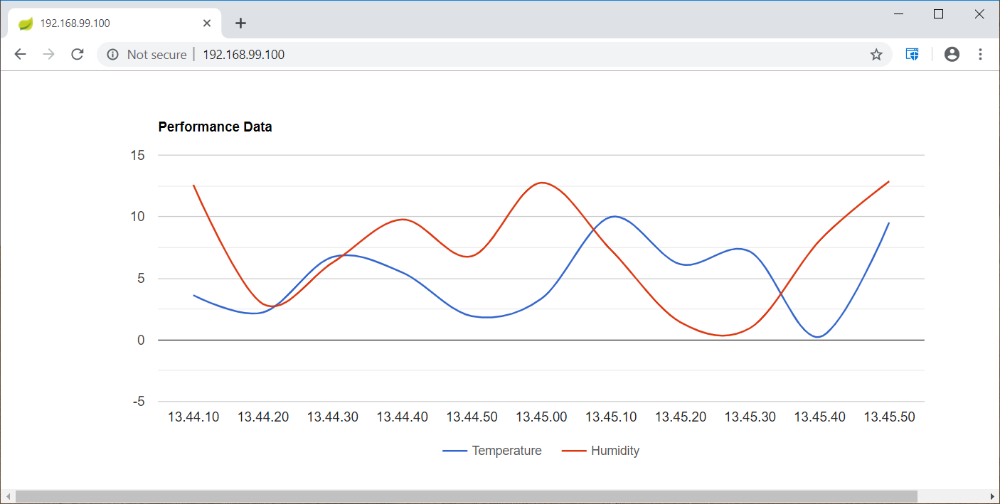

class: center, middle
# Section 10 - Docker Compose
## 2 Docker Compose - Basic Commands - LAB

---

## Prerequisites:
 - Docker Hub account
 - Docker clean environment
 - Docker Compose binary is installed   
 
## Objective:
 - In this LAB you are going to deploy a multi-container application *iot-c* with the use of `Docker Compose`
 - Use a `docker-compose.yml` file to define the services, networks and volumes required to deploy the *iot-c* application   
  
## Key points:
 - The *iot-c* application is compose from 3 services:
    1. The **collector** service simulates the collection of performance data from IoT devices such as temperature/humidity sensors  
    2. The **collector-ui** service is the front end Web UI for the collector service.
    3. The **postgres-db** service is the DB where the performance data are stored
 - Define 3 services related to the following docker images:
    1. dgs19/iot-collector:0.0.1
    2. dgs19/iot-collector-ui:0.0.1
    3. postgres:10
 - Define 2 networks `iotc-db` and `iotc-ui`
    1. The `iotc-db` network is used to connect the **collector** and the **postgres-db** containers
    2. The `iotc-ui` network is used to connect the **collector** and the **collector-ui** containers
 - Define the `db-data` named volume 
    1. This volume is used from  the **postgres-db** container to to preserve the DB data  
 - Define the TCP ports used for the network communication
    1. TCP port 8092 is used from the **collector** service to expose the REST Endpoints. This port should **NOT** be accessible from the outside world 
    2. TCP port 8093 is used from the **collector-ui** service to serve the index.html web page. This should be accessible from the outside world on port 80     
    3. TCP port 5432 is used from the **postgres-db** service. This port should **NOT** be accessible from the outside world
 - Define the environment variables for each service. Use the online documentation on Docker-Hub to understand how to set the environment variables
   1. Hint for the **collector** service
   ```console
         LOG_LEVEL: DEBUG
         DB_HOST: postgres-db
   ```
   2. Hint for the **collector-ui** service
   ```console
         LOG_LEVEL: DEBUG
         COLLECTOR_HOST_NAME: collector
   ```
   3. Hint for the **postgres-db** service
   ```console
          POSTGRES_USER: iotc
          POSTGRES_PASSWORD: iotc
          POSTGRES_DB: iotc
   ```
 - Use the `docker-compose up` to deploy the application
 - From a Web browser access the URL http://<DOCKER_HOST>    
   
## Solution
 - The `docker-compose.yml` file:
 ```yml
version: '3.6'
services:
  postgres-db:
    image: postgres:10
    networks:
      - iotc-db
    environment:
      POSTGRES_USER: ${DB_USER:-iotc}
      POSTGRES_PASSWORD: ${DB_PASSWORD:-iotc}
      POSTGRES_DB: ${DB_NAME:-iotc}
#    ports:
#      - "5432:5432"
    healthcheck:
      test: ["CMD-SHELL", "pg_isready -U ${DB_USER:-iotc} || exit false"]
      interval: 10s
      timeout: 10s
      retries: 3
      start_period: 20s
    volumes:
      - db-data:/var/lib/postgresql/data

  collector:
    image: dgs19/iot-collector:0.0.1
    networks:
      - iotc-db
      - iotc-ui
    environment:
      LOG_LEVEL: DEBUG
      DB_HOST: postgres-db
#      DB_PORT: 5432
#      DB_NAME: ${DB_USER:-iotc}
#      DB_USER: ${DB_USER:-iotc}
#      DB_PASSWORD: ${DB_PASSWORD:-iotc}
#    ports:
#      - "8092:8092"

  collector-ui:
    image: dgs19/iot-collector-ui:0.0.1
    networks:
      - iotc-ui
    environment:
      LOG_LEVEL: DEBUG
      COLLECTOR_HOST_NAME: collector
#      COLLECTOR_HOST_PORT: 8092
    ports:
      - "80:8093"

networks:
  iotc-db:
  iotc-ui:

volumes:
  db-data:

 ```
 - To deploy the application:
 ```console
# docker-compose up
...
 ```
 - From a Web browser access the URL http://<DOCKER_HOST>
 