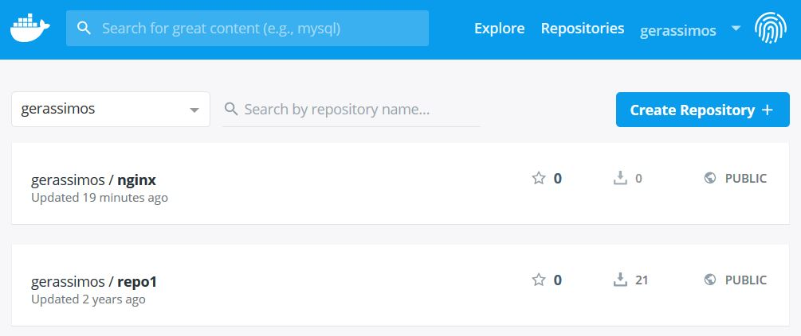

# Section 7 - Container Images - Docker Hub Registry
## 4 Image Tagging and Pushing to Docker Hub - Exercise

---

Prerequisites:
 - Docker Hub account
 - Docker clean environment 
 
---

## Exercise 1

 1. Pull the `nginx` (latest) image from Docker hub 
 2. Use the `docker image tag` command and your Docker hub account name to create a your nginx Docker image from the official latest nginx Docker image
 3. Use the `docker login` command to Log in to the Docker Hub registry
 4. Use the `docker image push` command to upload the image to Docker Hub.
 5. From the Docker Hub web UI verify that your nginx Docker image has been successfully created. 
 
---
 
## Exercise 1 Solution
 1. Pull the `nginx` (latest) image from Docker hub 
```console
# docker pull nginx

# docker image ls nginx
REPOSITORY   TAG        IMAGE ID       CREATED       SIZE
...
nginx        latest     27a188018e18   10 days ago   109MB
...
``` 

 2. Use the `docker image tag` command and your Docker hub account name to create a your nginx Docker image from the official latest nginx Docker image  
 In the following example the *gerassimos* Docker account is used, you should specify your Docker Hub account
 
```console
# docker image tag nginx gerassimos/nginx
# docker image ls
REPOSITORY         TAG       IMAGE ID       CREATED       SIZE
gerassimos/nginx   latest    27a188018e18   10 days ago   109MB
nginx              latest    27a188018e18   10 days ago   109MB
... 
``` 
 
 3. Use the `docker login` command to Log in to the Docker Hub registry
```console
# docker login
...
Username: gerassimos
Password:
...
Login Succeeded 
``` 

 - View the content of the `~/.docker/config.json` file to verify the result of the `docker login` command
```console  
# cat ~/.docker/config.json
{
        "auths": {
                "https://index.docker.io/v1/": {
                        "auth": "Z**********************"
                }
        },
        "HttpHeaders": {
                "User-Agent": "Docker-Client/18.06.1-ce (linux)"
        }

``` 

 4. Use the `docker image push` command to upload the image to Docker Hub.
```console
# docker image push gerassimos/nginx
...

``` 
 
 5. From the Docker Hub web UI verify that your nginx Docker image has been successfully created.
   

