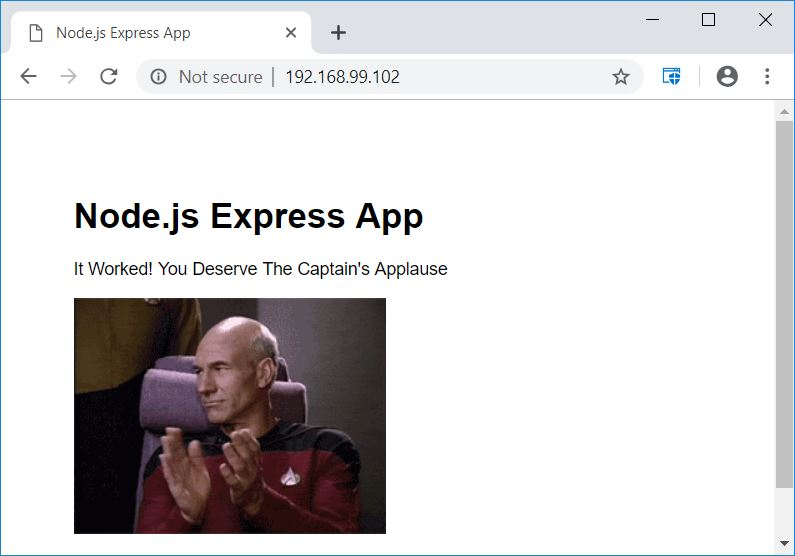

class: center, middle
# Section 8 - Build Images - The Dockerfile Basics
## 3 Extend Official Images - LAB

---


## Objective:
 - In this LAB you are going to build your own image from a **Dockerfile**.

## Key points:
 - Sometimes you may not know which is the language or the packages used to build an application but nevertheless you should find your way to "Dockerize" it.
 - In order to find the base image to start with, you need to search for official images or even not official images that fullfill your needs and read the Dockerfile to understand how this is working and then how you can build on it.
 - In this LAB you will take an existing Node.js application and will "Dockerize" it. 
 - Note that you don't actually have to know anything about Node.js, other than it is a web application.
 - The goals are: 
    - Implement a **Dockerfile** to build an image. 
    - Test the image => create a container and verify that everything is working.
    - Upload `push` the image to the Docker Hub registry.
    - Delete the local image and run it again using the image available on Docker Hub.
 - Note that it is not common to get a correct Dockerfile on the first time. So, this will be an iterative process, i.e. build and test over and over, until you get the desired result. 
 - For this LAB use as starting point the `dockerfile-assignment/Dockerfile` file from the GitHub repository. In this file you will find detailed instructions on how to build the image.
 - The base image must be an node 6.x image based on alpine linux.
 - The expected result is that you're actually able to access the web application from your browser by using the IP address of the host running Docker (e.g. http://192.168.99.100).
 - Tag your image and push to your Docker Hub (free) account.
 - Remove your image from local cache, run it again from Docker Hub. This will actually re-download the image, so you can verify that everything is working as expected.

## Solution

### step 1
  - Implement the **Dockerfile**.
  - Detailed instructions are available in the `dockerfile-assignment/Dockerfile`.
  - The Solution **Dockerfile** is also available in the `dockerfile-assignment/Dockerfile_Solution`

 - Ref:.
 - Official Node.js Docker image:
 - https://hub.docker.com/_/node/

### step 2
  - Build the image:
 ```terminal
 # docker build -t node_app -f Dockerfile .
 ```

### step 3a
 - Run the image: 
```terminal
# docker  container run --rm -p 80:3000 node_app
```

### step 3b
 - Verify that you can access the web application from your browser.
 - Note: Remember to use the IP address of your Docker Host (e.g 192.168.99.100)


### step 4
 - Re-tag the image for the upload `push` operation on Docker Hub.
 - Note that you need to use the username of your (free) Docker Hub account. 
 
```terminal
# docker tag node_app gerassimos/node_app
# docker image ls
REPOSITORY                          TAG                 IMAGE ID            CREATED             SIZE
gerassimos/node_app                 latest              959e1b0ed21a        9 minutes ago       66.6MB
node_app                            latest              959e1b0ed21a        9 minutes ago       66.6MB
...
``` 
### step 5
 - Push to Docker Hub:
```terminal
# docker push gerassimos/node_app
The push refers to repository [docker.io/gerassimos/node_app]
8f84acb939e7: Pushed
86cd623c4405: Pushing [================>]  10.41MB
...
``` 
### step 6 
 - Remove the local image:
```terminal
# docker image rm node_app:latest
``` 
### step 7
 - Run again using the online Docker Hub image:  
```terminal
# docker container run --rm -p 80:3000 gerassimos/node_app
``` 
