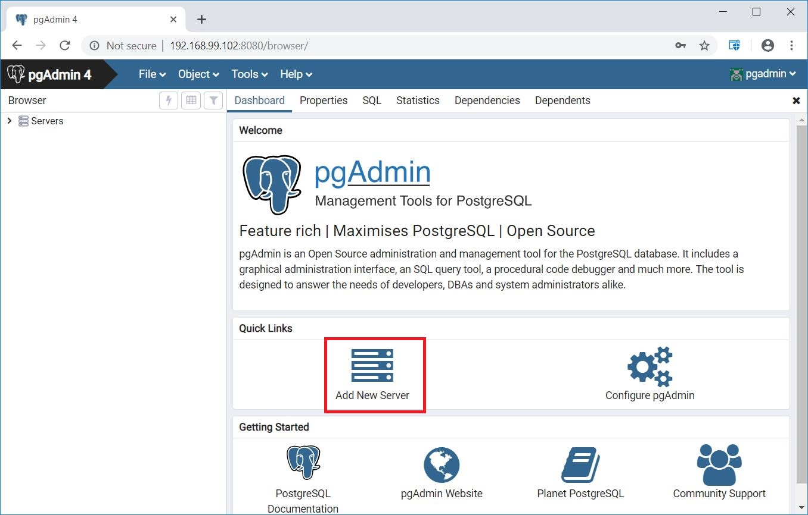
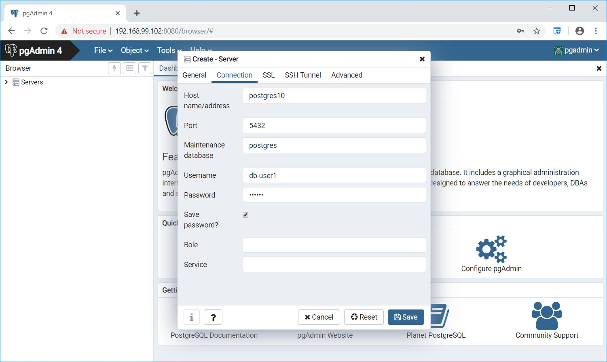
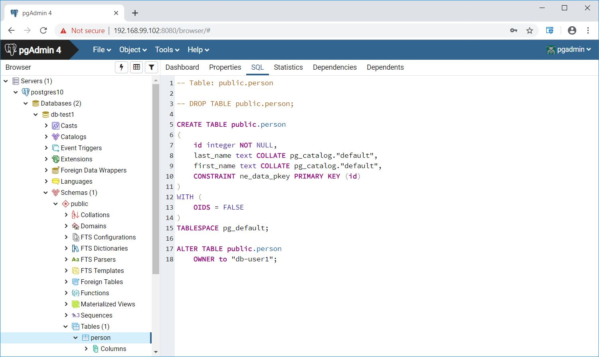

class: center, middle
# Section 9 - Persistent Data and Volumes
## 3 Persistent Data - LAB
---

## Objective:
 - In this LAB you are going to deploy a multi-container application compose from 2 services (**postgres DB** and **pgadmin**)
 - A named volume and a bind mount will be used to setup a postgres DB
  
## Configuration/Setup instructions:

 - postgres image: postgres:10 (official image)
 - DB name: "db-test1"
 - DB user: "db-user1"
 - DB password: "db-pw1"
 - Named volume: "db-data" to preserve the DB data after the container is deleted
 - Bind mount: `init.sql:/docker-entrypoint-initdb.d/init.sql` to init the DB
 - The `init.sql` file is available under the `resources/volume-lab-1` directory 
 - init.sql: This script is used to create a table "person" with the following columns: 
   - ID [int] 
   - last_name [text] 
   - first_name [text]
 - container "DNS" name: `postgres10`
 - virtual bridge network: `net-db`
 - Setup a second container `pgadmin` (DB web client) to access the postgres DB
 - Use the minimal configuration possible for the second `pgadmin` container
 - The postgres container should not be accessible from the Docker host
 - The `pgadmin` container should be accessible from the Docker host port 8080

## Key points:
 - From the official documentation of the postgres Docker image find:
    - Which are the environment variables to use to setup a default database, DB user and DB password.
    - Which is the data directory of postgres. This will be used for the named volume.  
    - Where to place a sql script to initialize the DB. This will be used for the bind mount.  
 - From Docker hub find the most popular pgadmin image. Follow the instructions from the related Docker Hub page to create a running container. The "pgadmin" container should have access to the postgres container.
 - From the WEB UI of pgadmin access the postgres DB.
 - [optionally] Execute a psql command on the postrges container to list the tables of the "db-test1" DB. 
 

## Solution 
```terminal
# cd  resources/volume-lab-1
# docker network create net-db
# docker container run -e POSTGRES_DB=db-test1 \
  -e POSTGRES_USER=db-user1 -e POSTGRES_PASSWORD=db-pw1 \
  -v db-data:/var/lib/postgresql/data \
  -v $(pwd)/init.sql:/docker-entrypoint-initdb.d/init.sql \
  --net net-db -d \
  --name postgres10 postgres:10

# docker run -p 8080:80 \
  -e PGADMIN_DEFAULT_EMAIL=pgadmin \
  -e PGADMIN_DEFAULT_PASSWORD=pgadmin \
  --net net-db -d \
  --name pgadmin4 dpage/pgadmin4:4.6

# docker exec postgres10  psql -U db-user1 -d db-test1 -c "\dt"
          List of relations
 Schema |  Name   | Type  |  Owner
--------+---------+-------+----------
 public | ne_data | table | db-user1
(1 row)

```

- 
- 
- 
