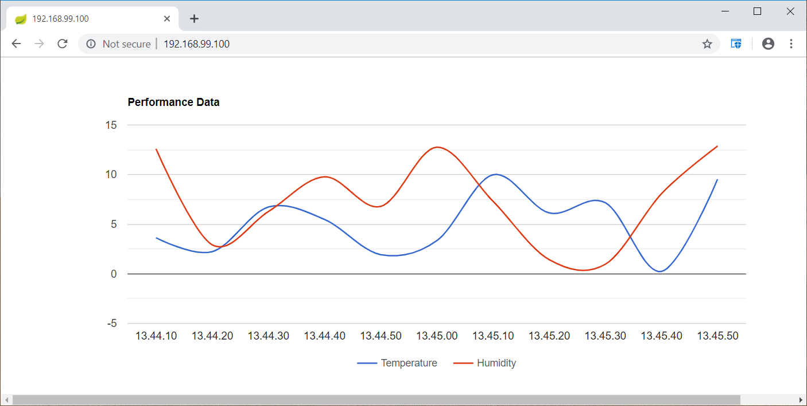

## iot-c spring boot multi-project
 - This is a spring boot multi-project **example** application named **iot-c**
 - The **iot-c** application is compose from 3 services:
    1. The **collector** service simulates the collection of performance data from IoT devices such as temperature/humidity sensors  
    2. The **collector-ui** service is the front end Web UI for the collector service.
    3. The **postgres-db** service is the DB where the performance data are stored
 - The 3 services are related to the following docker images:
    1. dgs19/iot-collector
    2. dgs19/iot-collector-ui
    3. postgres
 - The source code is available [here](https://github.com/gerassimos/dgs19/tree/master/resources/iot-c)    
     
##  Goals
 - The Goals of this example **iot-c** application are to see how to:
    1. Create a spring boot multi-project  
    2. Dockerizing a Spring Boot Application [Ref](https://spring.io/guides/gs/spring-boot-docker/) 
    3. Accessing Data with JPA [Ref](https://spring.io/guides/gs/accessing-data-jpa/)
    4. Build a RESTful Web Service [Ref](https://spring.io/guides/gs/rest-service/)
    5. others..

## Usage
 - Start the **iot-c** application using the [docker-compose.yml](https://github.com/gerassimos/dgs19/blob/master/resources/iot-c/docker-compose.yml) as follow:
```console
git clone https://github.com/gerassimos/dgs19.git
cd dgs19/resources/iot-c/
docker-compose up
```
- The Web application should be accessible on port 8093
   

## Development environment   
 - In development environment we need to start only the the DB service using the [docker-compose-dev.yml](https://github.com/gerassimos/dgs19/blob/master/resources/iot-c/docker-compose-dev.yml)
 ```console
git clone https://github.com/gerassimos/dgs19.git
cd dgs19/resources/iot-c/
docker-compose -f docker-compose-dev.yml up
```  
 - In development environment the [settings.gradle](https://github.com/gerassimos/dgs19/blob/master/resources/iot-c/settings.gradle) file can be imported from an IDE such as IDEA to setup the spring-boot multi-project
   
 
## environment variables 
 - **dgs19/iot-collector**
    1. `LOG_LEVEL`: to set the log level. Valid values are: *INFO*, *DEBUG* and *TRACE*
    2. `DB_HOST`: hostname of the database server. Default value is *192.168.99.100*
    3. `DB_PORT`: TCP port of the database server. Default value is *5432*
    4. `DB_NAME`: database name. Default value is *iotc* 
    5. `DB_USER`: username of the database server. Default value is *iotc*   
    6. `DB_PASSWORD`: password of the database server. Default value is *iotc*
    7. `JAEGER_HOST`: jaeger collector host name 
    8. `JAEGER_SAMPLING_RATE`: Where value is between 0.0 (no sampling) and 1.0 (sampling of every request)

 - **dgs19/iot-collector-ui**
   1. `LOG_LEVEL`: to set the log level. Valid values are: *INFO*, *DEBUG* and *TRACE*
   2. `COLLECTOR_HOST_NAME`: hostname of the collector (dgs19/iot-collector) server 
   3. `COLLECTOR_HOST_PORT`: TCP port of the collector (dgs19/iot-collector) server. Default value is 8092
   4. `JAEGER_HOST`: jaeger collector host name
   5. `JAEGER_SAMPLING_RATE`: Where value is between 0.0 (no sampling) and 1.0 (sampling of every request)

## TCP ports
 - TCP port 8092 is used from the **dgs19/iot-collector** service to expose the REST Endpoints.  
 - TCP port 8093 is used from the **dgs19/iot-collector-ui** service to serve the index.html web page.
  
## REST Endpoints examples
 - **dgs19/iot-collector**
    - http://localhost:8092/devices
    - http://localhost:8092/device/performance?deviceId=1
    - http://localhost:8092/actuator/prometheus
    - http://localhost:8092/actuator/health
    
## Build Notes
 - Reminder note gradle properties are set with the "-P prop-name=prop-value" in the Arguments field of the related gradle task
 - set the gradle property "-P IOTC_TAG=0.0.1" for the jar version and docker tag
 - set the gradle property "-P DOCKER_USERNAME=user" for docker-hub account username
 
## Build targets 
 - ./gradlew build
 - ./gradlew docker
 - ./gradlew dockerTagTag1 -P DOCKER_USERNAME=dgs19 -P IOTC_TAG=0.0.1
 - ./gradlew dockerPushTag1 -P DOCKER_USERNAME=dgs19 -P IOTC_TAG=0.0.1

## Prometheus Integration
 - The default spring boot prometheus metrics are enabled 
 - prometheus metrics are available at the endpoint /actuator/prometheus
 - The following labels are added to all the prometheus metrics 
   - instanceHostName: ${HOSTNAME:localhost}
   - application: iot-c
   - service: iot-c-collector

## Jaeger Integration
 - The application is configured to send traces to a jaeger collector
 - Use the env variables JAEGER_HOST and JAEGER_SAMPLING_RATE to configure the traces 
 - The traces generation can be disabled if we set JAEGER_SAMPLING_RATE=0.0
 - Do not set JAEGER_ENABLED=false as this will cause an error at start time
   - `JaegerTracerFactory Service name must not be null or empty`

## grpc Integration (common-grpc)
 - the common-grpc module has been added that contains the .proto files
 - from this module we can execute the generateProto gradle target to generate the java files needed
 - ref helper sites:
 - https://yidongnan.github.io/grpc-spring-boot-starter/en/server/getting-started.html
 - https://github.com/yidongnan/grpc-spring-boot-starter

## grpc Integration (collector)
 - the env variable `GRPC_SERVER_PORT` is to control the grpc server port (collector module)
 - the dependencies added in the build.gradle file of the collector module are
   - implementation(project(":common-grpc"))
   - implementation("net.devh:grpc-server-spring-boot-starter:xxx")

## grpc Integration (collector-ui)
 - the env variables `COLLECTOR_HOST_NAME` and `COLLECTOR_GRPC_PORT` are used to the grpc host:port for the greeting service implemented in the collector
 - to test the grpc communication between the client (collector-ui) and the server (collector) use:
   - `curl http://localhost:8093/grpc-greet-mitge`

## grpcurl grpc cmd history
```shell
# install grpcurl
brew install grpcurl

# grpcurl list
grpcurl --plaintext localhost:9091 list
com.gmos.iotc.proto.greeting.GreetingService
grpc.health.v1.Health
grpc.reflection.v1alpha.ServerReflection

# grpcurl service
grpcurl --plaintext -d '{"name": "test222"}' localhost:9091 com.gmos.iotc.proto.greeting.GreetingService/greeting
{
  "result": "Hello test222"
}
```